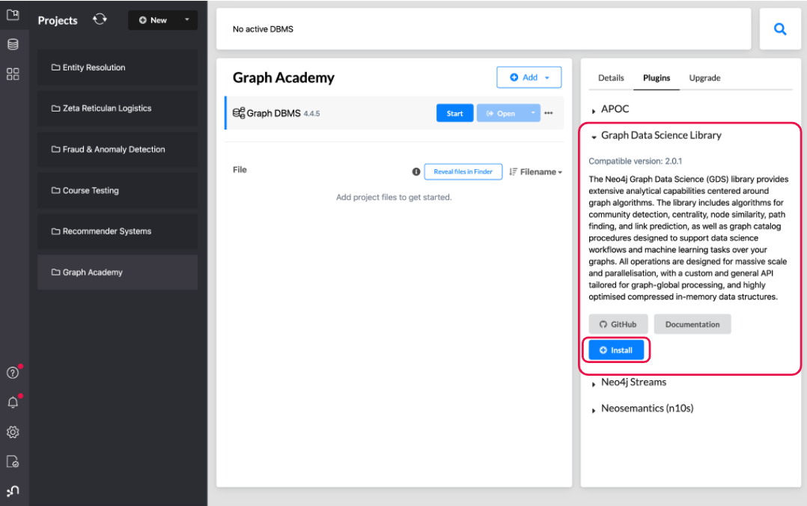

= GDS 製品概要
:type: quiz

[.transcript]
== はじめに

この最初のレッスンでは、Neo4j Graph Data Science（GDS）がどのようにパッケージ化されているか、どのようにインストールするか、そしてライセンスに関するいくつかの注意点を学びます。  グラフアカデミーのデータサイエンス・コースを受講するために、GDSをインストールすることは厳密には必要ではありません。これらのコースのインタラクティブな部分は、バックエンドでGDSを使用して自動的に準備されたサンドボックスと統合されています。  とはいえ、まずは製品としてのGDSを理解していただくために、ここからスタートしたいと思います。

=== GDSプラグインと互換性
GDSは、Neo4j Graph Databaseのライブラリおよびプラグインとして提供されます。つまり、設定の更新と合わせて、拡張機能としてインストールする必要があります。

GDSには、無料のCommunityライセンスと有料のEnterpriseライセンスがあり、パフォーマンスや企業向け機能に関して重要な違いがあります。しかし、グラフアルゴリズムや機械学習の手法を含むすべての分析機能は、両ライセンス間で同じです。

GDSライブラリとNeo4jの互換性マトリックスは、 https://neo4j.com/docs/graph-data-science/current/installation/supported-neo4j-versions/[こちら^] で見つけることができます。一般的に、GDSの最新バージョンはNeo4jの最新バージョンをサポートし、逆もまた然りで、我々はあなたが常にその組み合わせにアップグレードすることをお勧めします。

以下では、インストール手順とライセンスについて説明します。もちろん、 https://neo4j.com/docs/aura/aurads/[AuraDS^] を使用している場合、GDS Enterpriseはあらかじめパッケージされており、すぐに使用することができます。  インストール、セットアップ、ライセンスの選択について心配する必要はありません。

=== インストール
オンプレミスでのインストールでは、Neo4j Desktopが最もシンプルな手順でGDSをインストールすることができます。  我々は、最初にそこにGDSをインストールする方法について説明します。  全体として、デスクトップ上でローカルにGDSをテストすることを計画している場合、Neo4j Desktopは通常、最も簡単に開始する場所です。

Neo4j Desktopをインストールして開くと、データベースの**Plugins**タブにGDSがあります:

インストーラはGDSライブラリをダウンロードし、データベースの`plugins/`ディレクトリにインストールします。また、設定ファイルに以下のエントリを追加します:

----
dbms.security.procedures.unrestricted=gds.*
----

GDSライブラリはパフォーマンスを最大化するためにNeo4jの低レベルのコンポーネントにアクセスするため、この設定項目は必要です。

プロシージャー許可リストが設定されている場合、GDSライブラリからのプロシージャーも含めるようにします:

----
dbms.security.procedures.allowlist=gds.*
----

Neo4j Desktopでは、少なくとも最近のバージョンでは、この設定は無効にするか、デフォルトで含める必要があります。

スタンドアロン・サーバー、Docker、Causal Clusterなど、他のNeo4jデプロイメントタイプへのGDSインストールについては、 https://neo4j.com/docs/graph-data-science/current/installation/[Installation documentation^] を参照してください。  手順はデスクトップとほぼ同じですが、他の考慮事項が含まれており、ある側面は完全に自動化されていない可能性があります。  例えば、Neo4jサーバーの場合、ダウンロードセンターからプラグインを取得し、正しいディレクトリの場所に配置し、設定を手動で更新する必要があります。

=== ライセンシング

GDSには、コミュニティライセンスとエンタープライズライセンスの両方があります。どちらもすべてのアルゴリズムと機械学習メソッドにアクセスできますが、エンタープライズ版にはプロダクションユースケースを可能にする機能が追加されています:

//we ideally want a table here laying things out
* *パフォーマンス向上のためのエンタープライズ機能：* 計算時間を短縮する無制限の並列処理と、非常に大きなグラフへのデータサイエンスの適用を可能にする低メモリ分析グラフ形式へのアクセス

* *セキュリティとワークフローを実現するエンタープライズ機能:* きめ細かいセキュリティ、機械学習モデルの永続化と公開、インメモリグラフのバックアップとリストア、リードレプリカによるクラスタ互換性など。

エンタープライズライセンスの取得とインストール方法については、 https://neo4j.com/docs/graph-data-science/current/installation/installation-enterprise-edition/[Enterprise Edition Configuration documentation^]に詳細が記載されています。

== 理解度チェック
include::questions/1-gds-installation.adoc[leveloffset=+1]

include::questions/2-gds-licensing.adoc[leveloffset=+1]

[.summary]
== まとめ
このレッスンでは、GDSのインストールとライセンスについて説明しました。

次のレッスンでは、GDSがどのように機能するか、そしてグラフ・データ・サイエンスを行うためにNeo4jをより良く設定する方法について説明します。
