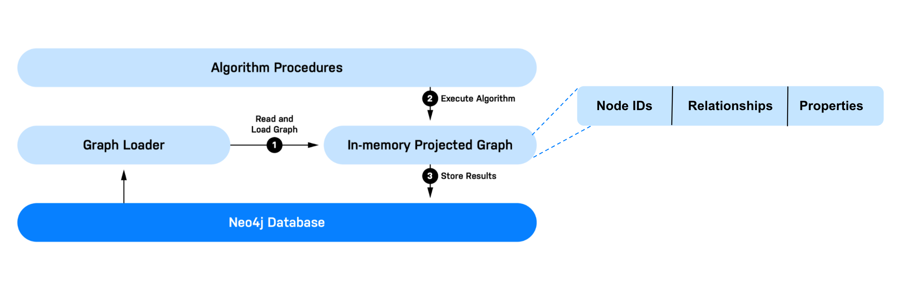
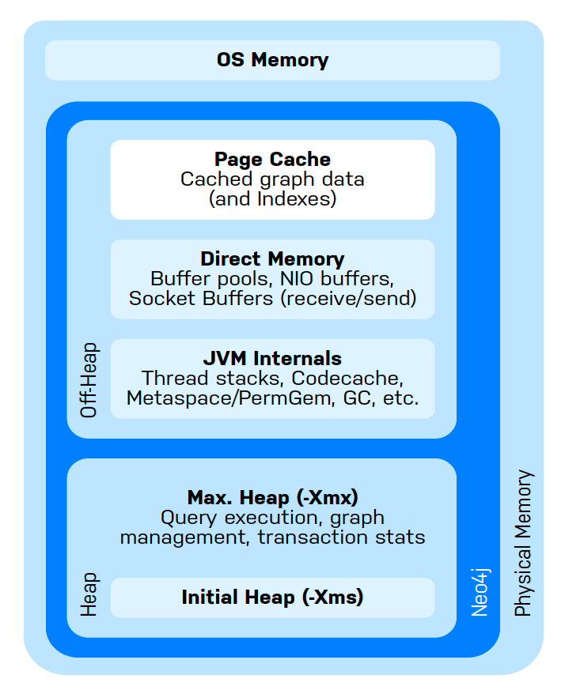

= GDSのしくみ
:type: quiz

[.transcript]
== はじめに

GDSは、高性能なグラフ解析に最適化されたインメモリフォーマットにデータを変換してロードすることで機能します。GDSは、このインメモリグラフフォーマット上で実行されるグラフアルゴリズム、特徴量エンジニアリング、および機械学習手法を提供します。これにより、グラフデータベース全体やその大部分を含む大規模なグラフに対して、データサイエンスを効率的かつスケーラブルに適用することができます。

このレッスンでは、GDSのハイレベルなワークフローと、そのワークフローをサポートするためのCPUとメモリの構成について説明します。

=== 一般的なワークフロー
以下は、GDSの一般的なワークフローを示す図であり、3つのハイレベルなステップに分かれています。

. *グラフの読み取りと読み込み*: GDSでは、Neo4jデータベースからデータを読み込み、変換し、インメモリグラフにロードする必要があります。GDS では、このプロセスを「グラフのプロジェクション」と呼び、インメモリグラフを「グラフプロジェクション」と呼びます。GDSは一度に複数のグラフプロジェクションを保持することができ、それらは「グラフカタログ」と呼ばれるコンポーネントによって管理されています。  グラフカタログとグラフプロジェクションの管理については、次のモジュールでより詳しく説明します。

. *アルゴリズムの実行*: これには、中心性、コミュニティ検出、パス検出などの古典的なグラフアルゴリズムが含まれます。また、ロバストなグラフ・フィーチャーエンジニアリングの一種であるエンベッディングや、機械学習パイプラインも含まれます。

. *結果の保存*: グラフアルゴリズムの出力/結果について、いくつかのことが考えられます。  GDSでは、結果をデータベースに書き戻したり、csv形式でディスクに書き出したり、他のアプリケーションや下流のワークフローに結果を流したりすることができます。

=== GDSの構成
GDSはシステムリソースに対して貪欲に実行されます。つまり、ユーザーが設定した制限を超えない範囲で、必要なだけメモリとCPUコアを使用します。

AuraDSを使用している場合、GDSの構成は完全に管理されているため、以下の情報は使用開始には関係ありません。  しかし、他のNeo4jのデプロイメントでは、利用可能なシステムリソースを最大限に活用するためにワークロードとメモリ割り当てを設定することは、パフォーマンスを最大化するために重要です。

==== CPUと並列処理
GDSは、グラフのプロジェクション、アルゴリズム、結果の書き込みに複数のCPUコアを使用します。これにより、GDSは計算を並列化し、処理時間を大幅に高速化することができます。  並列化のレベルは、プロジェクション、アルゴリズム、その他の操作方法において、_concurrency_ パラメータを介して実行ごとに設定されます。

GDSのほとんどの操作で使用されるデフォルトの同時実行数は4です。4は、コミュニティライセンスで使用できる最大同時実行数でもあります。GDS Enterpriseでは、同時実行数は無制限です。

==== Memory
GDS は Neo4j インスタンス内で実行されるため、一般的な Neo4j のメモリ構成が適用されます。以下は、Neo4j のメモリ管理に関する説明です。Neo4j は Java Virtual Machine（JVM）を使用しているため、メモリ管理は _Heap_ と _Off-Heap_ に分かれています。

上記のうち、設定で割り当てられるメモリは、主に次の2種類です。:

* *Heap Space:* インメモリグラフの保存、GDSアルゴリズムの実行、クエリの実行、トランザクションの状態に使用される

* *Page Cache:* インデックスと、ディスクに保存されたNeo4jのデータをキャッシュするために使用します。データベースへのクエリやグラフの投影のパフォーマンスを向上させる。

==== メモリ構成に関する推奨事項
データサイエンスコンピューティングは、メモリを大量に消費する傾向があり、GDSも例外ではありません。  一般的に、ヒープサイズを設定する際には、データをロードし、Cypherクエリをサポートするために十分なページキャッシュを提供しながらも、できるだけ多くのヒープを割り当てることをお勧めします。これは、Neo4j の設定にある `dbms.memory.heap.initial_size` と `dbms.memory.heap.max_size` を使って行うことができます。

また、ヒープサイズの必要性を早期に評価するために、*Memory Estimation* を使用することができます。Memory Estimation は、GDSの手続きで、実際に実行する前に、データに対してプエオジェクション、アルゴリズム、その他の操作を実行するために必要なメモリを推定することができます。Neo4jグラフデータサイエンス基礎講座では、メモリ推定に必要なコマンドを解説しています。

ページキャッシュだけを考えると、純粋に分析的な作業負荷に対しては、ヒープサイズを増やすことを優先して、ページキャッシュを減らすことが推奨されます。しかし、グラフをプロジェクションする際には、ページキャッシュの最小サイズを設定することが重要です。この最小値は、標準的でネイティブな投影の場合、およそ `8KB * 100 * readConcurrency` と見積もることができます。ページキャッシュのサイズは、Neo4j の設定にある `dbms.memory.pagecache.size` で設定することができます。

これらの構成のチューニングに関する詳細な情報およびガイダンスについては、 https://neo4j.com/docs/graph-data-science/current/installation/system-requirements/[システム要件ドキュメント^] を参照してください。

== 理解度チェック
include::questions/1-gds-workflow.adoc[leveloffset=+1]

include::questions/2-cpu-configuration.adoc[leveloffset=+1]

include::questions/3-memory-configuration.adoc[leveloffset=+1]

[.summary]
== まとめ
このレッスンでは、GDSの仕組みとGDSのハイレベルなワークフローについて学びました。  また、GDSの並行処理とGDSのワークロードをサポートするためのNeo4jのメモリ構成についても学びました。

次のモジュールでは、グラフ管理、グラフカタログ、グラフプロジェクションの操作について、より詳しく学びます。