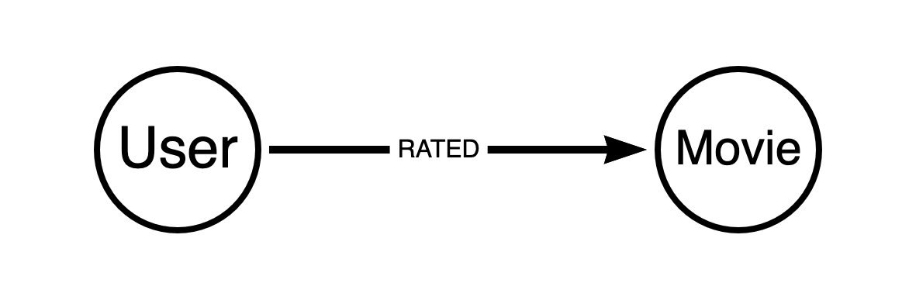
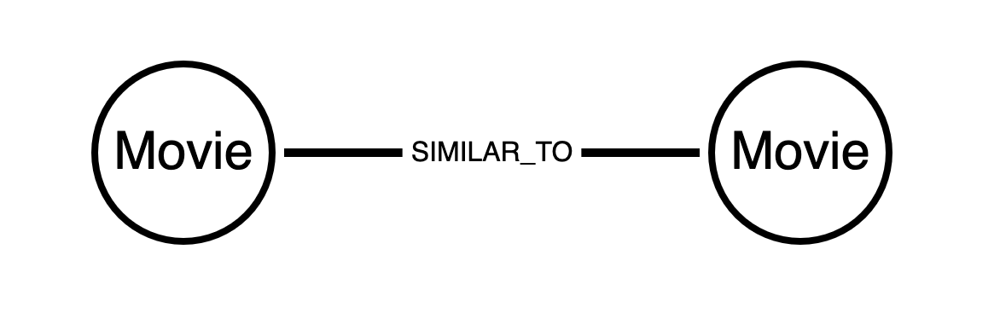
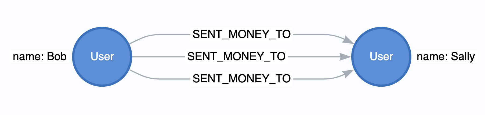
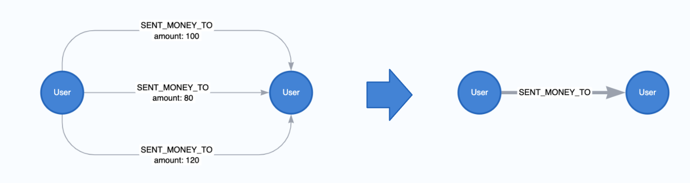
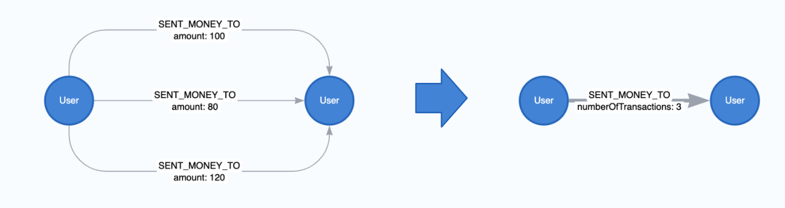
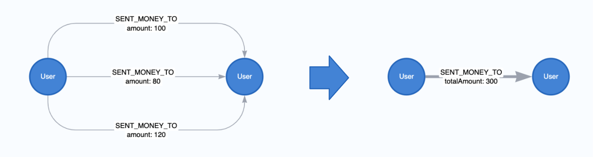

= nativeプロジェクション
:type: quiz

// [.video]
// video::xxxx[youtube,width=560,height=315]

[.transcript]
== はじめに
前回のレッスンでは、グラフカタログについて学びました。そこではグラフプロジェクションについて簡単に紹介しましたが、あまり深く掘り下げて説明することはありませんでした。グラフプロジェクションを理解することは、GDSで成功するための基礎となります。次の2つのレッスンでより詳細に説明します。

GDSのプロジェクションには、**nativeプロジェクション**と**Cypherプロジェクション**という2つの主要なタイプがあります。要約すると、nativeプロジェクションは、効率とパフォーマンスを最適化し、大規模なグラフ・データ・サイエンスをサポートします。Cypherプロジェクションは、柔軟性とカスタマイズ性に最適化されており、探索的分析、実験、および小規模なグラフ・プロジェクションをサポートします。

このレッスンでは、nativeプロジェクションとは何か、どのように使用するのかについて、具体的に説明します。次のレッスンでは、Cypherプロジェクションについても同じように説明します。

=== nativeプロジェクションについて

前回のレッスンでは、実際にnativeプロジェクションを使いました。  `gds.graph.project()` を呼び出すと、nativeプロジェクションを使用していることになります。  nativeプロジェクションは、Neo4jのストアファイルから直接読み込むことで、最高のパフォーマンスを発揮します。開発段階でも運用段階でも、nativeプロジェクションを使うことをお勧めします。

nativeプロジェクションは、ノードやリレーションシップの要素をデータベースからそのままプロジェクションするだけでなく、さまざまな機能を備えています。主な機能としては以下があります:

* ノードとリレーションシップのプロパティを数値で表現
* リレーションシップの方向性の変更
* 並列リレーションシップの集約

これらのオプションは、さまざまなタイプの分析ワークフローやアルゴリズムに対応するプロジェクションの準備するのに役立ちます。

以下では、nativeプロジェクションの基本的な構文について説明し、一般的な設定方法を紹介します。

=== 基本構文

nativeプロジェクションは3つの必須引数 :caption: `graphName` , `nodeProjection`, `relationshipProjection` の3つの引数を取る。さらに、オプションの `configuration` パラメータで、グラフの作成方法をさらに設定することができる。

[opts="header",cols="1,1,1, 4"]
|===
| Name                  | Type                | Optional | Description
| graphName             | String              | no       | グラフがカタログに保存されるときの名前
| nodeProjection        | String, List or Map | no       | ノードをプロジェクションするための設定
| relationshipProjection| String, List or Map | no       | リレーションシップをプロジェクションするための設定
| configuration         | Map                 | yes      | nativeプロジェクションを設定するための追加パラメータ
|===

`nodeProjection` と `relationshipProjection` には複数の異なるオプションがあります。  基本的なことを紹介するために、ユースケースごとに説明するのが便利です。

=== 基本的なnativeプロジェクション
まず、ノードとリレーションシップをプロパティなしでそのまま投影するという、非常に基本的なシナリオを考えてみましょう。ノードラベルとリレーションシップの両方を含めるには、リストのようなシンタックスを使用することができます。以下の例では、`User` と `Movie` のノードを `RATED` というリレーションシップで投影しています。  このような投影は、暗黙の協調フィルタリング（メモリベースの推薦手法）のバリエーションをサポートするため、グラフデータサイエンスに基づく推薦システムには非常に一般的です。

[source,cypher,role=nocopy]
----
CALL gds.graph.project('native-proj',['User', 'Movie'], ['RATED']);
----

また、様々な省略記法があります。 例えば、ノードラベルやリレーションシップの種類を1つだけ含める場合は、1つの文字列の値だけを使用することができます。例えば、 `relationshipProjection` に `RATED` という値を入力するだけで、同等のプロジェクションを得ることができます。

[source, cypher,role=nocopy]
----
CALL gds.graph.project('native-proj',['User', 'Movie'], 'RATED');
----

[NOTE]
.A graph with name 'native-proj' already exists.
====
もし、既に存在する名前で新しいグラフ投影を作成しようとすると、エラーが発生します。
続行するには、まず `gds.graph.drop()` プロシージャを実行して、既存のグラフプロジェクションを削除する必要があります。

.グラフの削除
[source,cypher]
----
CALL gds.graph.drop('native-proj');
----
====

ワイルドカード文字 `*` を使用すると、データベース内のすべてのノードやリレーションシップを含めることができます。以下は、すべてのノードとリレーションシップを投影します。

[source, cypher,role=nocopy]
----
CALL gds.graph.project('native-proj','*', '*');
----

=== リレーションシップの志向を変える

nativeプロジェクションでは、リレーションシップの向きも変更することができます。リレーションシップの向きと、それを変更する理由を説明するために、有向リレーションシップと無向リレーションシップの違いを説明する必要があります。

有向リレーションシップは、非対称です。下の画像に示すように、ソース・ノードからターゲット・ノードに向かう関係である。  このタイプの関係には、重み付けや強度インジケータなど、追加の修飾プロパティが含まれる場合があります。

無向関係は、方向性を持たない対称的な関係で、ソースとターゲットを持つ代わりに、単に2つのノード間に存在します。

neo4j データベースのすべてのリレーション湿布は、設計上、有向です。しかし、いくつかのグラフアルゴリズムは、無向性の関係で動作するように設計されています。他のアルゴリズムは有向ですが、我々が望む分析を得るために、データベース内の関係の方向を逆にする必要があるかもしれません。

これに対応するために、`relationshipProjection`のリレーションシップタイプに適用できる3つのオリエンテーションオプションが用意されています:

* `NATURAL`: データベースと同じ方向(デフォルト)
* `REVERSE`: データベースの方向と反対方向
* `UNDIRECTED`: 無指向性

先ほどプロジェクションしたグラフを例にとってみましょう。  例えば、各映画のユーザー評価の数を数えたい場合を考えてみましょう。  前回のレッスンでやったように次数の呼び出しを使おうとすると、すべてゼロになります。

[source, cypher]
----
CALL gds.graph.drop('native-proj', false);
CALL gds.graph.project('native-proj',['User', 'Movie'], ['RATED']);
CALL gds.degree.mutate('native-proj', {mutateProperty: 'ratingCount'});
----

[source, cypher]
----
CALL gds.graph.nodeProperty.stream('native-proj','ratingCount', ['Movie'])
YIELD nodeId, propertyValue
RETURN gds.util.asNode(nodeId).title AS movieTitle, propertyValue AS ratingCount
ORDER BY movieTitle DESCENDING LIMIT 10
----

[options="header"]
|==================================================
| movieTitle                          | ratingCount
| İtirazım Var                        | 0.0
| À nous la liberté (Freedom for Us)  | 0.0
| ¡Three Amigos!                      | 0.0
| xXx: State of the Union             | 0.0
| xXx                                 | 0.0
|==================================================

これはリレーションシップの方向と関係があります。このグラフを削除して、`RATED`リレーションシップの方向を逆にした新しいグラフをプロジェクションしてみましょう。

[source, cypher]
----
CALL gds.graph.drop('native-proj', false);

//replace with a project that has reversed relationship orientation
CALL gds.graph.project(
    'native-proj',
    ['User', 'Movie'],
    {RATED_BY: {type: 'RATED', orientation: 'REVERSE'}}
);

CALL gds.degree.mutate('native-proj', {mutateProperty: 'ratingCount'});
----

これで、次数アルゴリズムを使うと、必要な視聴率カウントを得ることができます。

[source, cypher]
----
CALL gds.graph.nodeProperty.stream('native-proj','ratingCount', ['Movie'])
YIELD nodeId, propertyValue
RETURN gds.util.asNode(nodeId).title AS movieTitle, propertyValue AS ratingCount
ORDER BY movieTitle DESCENDING LIMIT 5
----

[options="header"]
|==================================================
| movieTitle                          | ratingCount
| İtirazım Var                        | 1.0
| À nous la liberté (Freedom for Us)  | 1.0
| ¡Three Amigos!                      | 31.0
| xXx: State of the Union             | 1.0
| xXx                                 | 23.0
|==================================================

=== ノードとリレーションシップのプロパティを含める

ノードとリレーションシップの特性は、グラフ分析において考慮することが有用です。これらはグラフアルゴリズムにおける重みとして、また機械学習における特徴として使用することができます。

以下は、複数の映画のノードプロパティと、`rating`というリレーションシップ・プロパティを含む例です。

[source,cypher]
----
CALL gds.graph.drop('native-proj', false);

CALL gds.graph.project(
    'native-proj',
    ['User', 'Movie'],
    {RATED: {orientation: 'UNDIRECTED'}},
    {
        nodeProperties:{
            revenue: {defaultValue: 0}, // <1>
            budget: {defaultValue: 0},
            runtime: {defaultValue: 0}
        },
        relationshipProperties: ['rating'] // <2>
    }
);
----

**備考:**

1. `defaultValue` パラメータを使用すると、欠損値をデフォルト値で埋めることができます。  この場合、`0` を使用します。
2. データモデルによると、欠損値があってはならないので、デフォルト値なしでよりシンプルな構文にします。

このようなプロパティの活用方法については、Neo4j Graph Data Science Fundamentalsのコースで詳しく説明します。デフォルトの設定や、ノード・ラベルやリレーションシップ・タイプのプロパティを個別に設定する代わりに、すべてのノード・ラベルやリレーションシップ・タイプにプロパティを設定するなど、さまざまなオプションが用意されています。これらの詳細については、 https://neo4j.com/docs/graph-data-science/current/graph-project/#graph-project-native-syntax[GDSのドキュメント^] を参照してください。

=== 並列リレーションシップ・アグリゲーション

Neo4jデータベースでは、2つのノード間に同じタイプと方向の複数のリレーションシップを保存することができます。  これは「並列リレーションシップ」と呼ばれます。例えば、ユーザーが互いに送金し合う金融取引データのグラフを考えてみましょう。  もし、あるユーザーが同じユーザーに何度もお金を送れば、複数の並列関係を形成することができます。

グラフアルゴリズムや機械学習を実行する準備として、これらの並列関係を単一の関係に集約したい場合があります。これは、グラフアルゴリズムでは、2つのノード間に単一の関係が存在するかどうかだけを考慮すればよいのに、2つのノード間の各関係を別々にカウントすることがあるからです。また、より多くの並列関係が存在する場合、2つのノード間の接続をより高く重み付けしたい場合もありますが、使用するアルゴリズムによっては、最初に関係を集約しなければならないため、必ずしも簡単ではありません。

nativeプロジェクションでは、このような集計が可能です。リレーションシップの集計を行うと、並列リレーションシップ数、リレーションシッププロパティの合計や平均値などの集計統計も生成できるようになり、これらは重み付けとして使用することができます。 以下は、プロパティなしでリレーションシップを集約する例です：

[source, cypher, role=noplay]
----
CALL gds.graph.project(
  'user-proj',
  ['User'],
  {
    SENT_MONEY_TO: { aggregation: 'SINGLE' }
  }
);
----

リレーションシップの数を示すプロパティも同様に作成できます:

[source, cypher, role=noplay]
----
CALL gds.graph.project(
  'user-proj',
  ['User'],
  {
    SENT_MONEY_TO: {
      properties: {
        numberOfTransactions: {
          // the wildcard '*' is a placeholder, signaling that
          // the value of the relationship property is derived
          // and not based on Neo4j property.
          property: '*',
          aggregation: 'COUNT'
        }
      }
    }
  }
);
----

また、集約の際にリレーションシッププロパティのsum、min、maxを取ることができます。 以下は、sumを使った例である。

[source, cypher, role=noplay]
----
CALL gds.graph.project(
  'user-proj',
  ['User'],
  {
    SENT_MONEY_TO: {
      properties: {
        totalAmount: {
          property: 'amount',
          aggregation: 'SUM'
        }
      }
    }
  }
);
----

=== その他のnativeプロジェクションの構成と機能

ここでは基本的なことを説明しましたが、実際にはnativeプロジェクションで利用できる拡張構文や設定オプションが多数あり、 https://neo4j.com/docs/graph-data-science/current/graph-project/#graph-project-native-syntax[ドキュメント^] に詳しく説明されています。  一般に、nativeプロジェクションで何かをしようとしているときに、現在の構文では欲しいものをうまく表現できない場合は、ドキュメントをチェックして、サポートする追加設定や構文の拡張があるかどうかを確認します。

== 理解度チェック

include::questions/1-graph-native-projection.adoc[leveloffset=+1]

include::questions/2-native-projection-use-cases.adoc[leveloffset=+1]

[.summary]
== まとめ
このレッスンでは、GDSの主要なグラフ・プロジェクション・メカニズムであるnativeプロジェクションについて説明しました。  nativeプロジェクションは、グラフデータサイエンスを大規模にサポートするために、効率とパフォーマンスを最適化したものです。  nativeプロジェクションは、豊富な構文と設定オプションのセットを持っており、以下のことが可能になります。

ノードラベルと関係タイプによるグラフのフィルタリング
ノードおよびリレーションシップのプロパティを含む
. 関係の向きを変更する
. 並列関係の集約

次のレッスンでは、Neo4jサンドボックスに対して、nativeプロジェクションを実行します。
