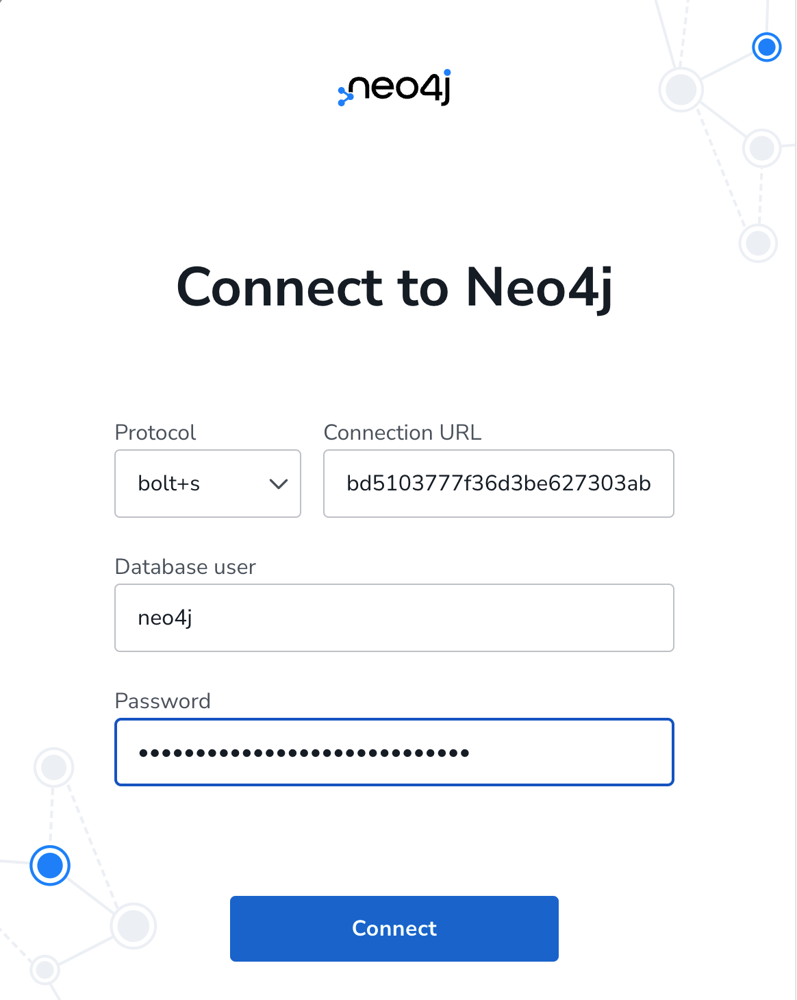
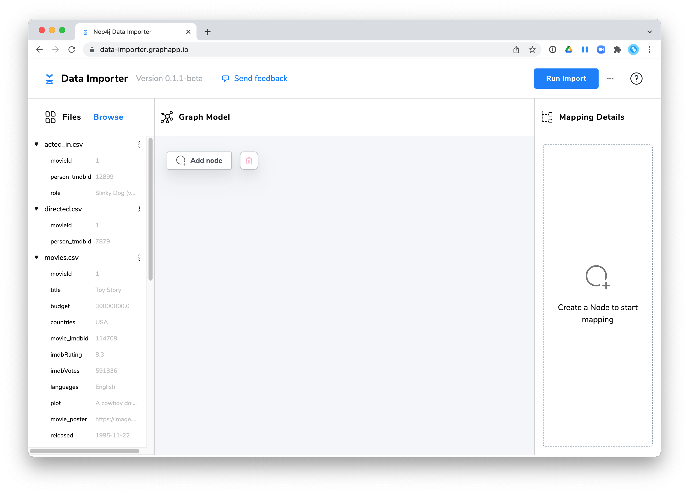
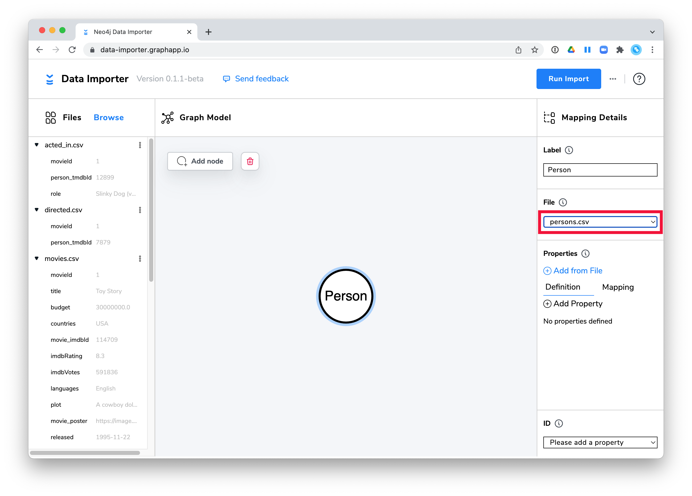
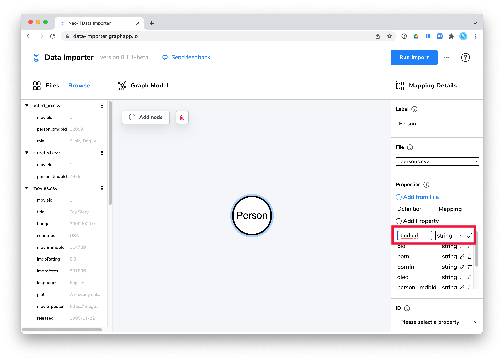

= Neo4j Data Importer 概要
:type: quiz

[.video]
video::veto-Rz979Q[youtube,width=560,height=315]
//https://youtu.be/veto-Rz979Q
== What is the Neo4j Data Importer?

Neo4j Data Importerは、link:https://data-importer.graphapp.io/?acceptTerms=true[here^]で確認することができます。:

[NOTE]
.Neo4j Data Importer ベータ
====
include::../../../../includes/importer-notice.adoc[]
====

これは、ローカルシステムからCSVファイルをグラフにインポートすることができるグラフアプリです。このグラフアプリで、CSV ファイルのヘッダーを調べ、Neo4j グラフのノードやリレーションシップにマッピングすることができます。
マッピングを定義した後、Neo4j DBMS に接続し、インポートを実行します。
Data Importerの利点は、データをロードするためにCypherを知る必要がないことです。

1M行未満の小・中規模のCSVファイルを読み込むのに便利です。

グラフにインポートされるデータは、文字列、整数、浮動小数点、ブーリアンデータとして解釈されることがあります。
行のフィールドを日付やリストとしてグラフに格納する必要がある場合、デフォルトでは文字列としてグラフに格納されるため、インポート後にグラフで後処理を行う必要があります。
これについては、このコースの後半で学習します。

=== Data Importerを使用するための要件

* インポートには CSV ファイルを使用する必要があります。
* CSV ファイルは、グラフアプリに読み込めるよう、ローカルシステム上に存在する必要があります。
* CSVデータはクリーンである必要があります（以前のレッスンで学習済み）。
* IDは、作成するすべてのノードで一意である必要があります。
* CSVファイルにはヘッダーが必要です。
* DBMSが起動している必要があります。

=== Data Importerの使用手順

インポートを行う前に、グラフデータモデルがどのように実装されるのかについて、まず考えておく必要があります。
Data ImporterのUIは、 https://arrows.app/[Arrows app^]で使われているものと同じUI要素を使用しています。

[IMPORTANT]
このレッスンでは、次のチャレンジで行う手順を説明します。このレッスンでは、これらのステップを**実行しない**でください。

==== Step 1: CSVファイルをローカルに置き、ヘッダがあり、クリーンであることを確認する

ファイルを調べ、以前のレッスンで学んだように、ヘッダーがあり、「クリーン」であることを確認します。

==== Step 2: Neo4j Data Importerを開く

Webブラウザーから、次のURLでData Importerアプリを開きます: https://data-importer.graphapp.io/?acceptTerms=true

[NOTE]
Neo4j Data ImporterのUIは常に進化していますので、UIに細かい違いが見られるかもしれません。

image::images/data-importer.png[Neo4j Data Importer,width=400,align=center]

Data Importerを開くと、動作中のDBMSに接続するように求められます。
ここで、本講座で使用するサンドボックスインスタンスのWebSocket Bolt URLとパスワードを指定します。

==== Step 3: ローカルシステム上のCSVファイルをグラフアプリに読み込む

CSVファイルを左のFilesペインにドラッグするか、このように *Browse* で選択します。

image::images/select-files.png[Select CSV files,width=400,align=center]

インポートするファイルを選択すると、次のような画面が表示されます。:

==== Step 4: CSVファイルで使用されているCSVヘッダー名を検証する

各CSVファイルの最初の行を調べて判断することになります。

* ノードを作成するために使用されるファイル
* リレーションシップを作成するために使用されるファイル
* データを一意に識別するためにIDがどのように使用されるか

==== Step 5: ノードを追加する

ここでは:

. UIで *Add Node* アイコンをクリックして、ノードを追加します。

image::images/add-node.png[Click add node,width=400,align=center]

[start=2]
. Mapping Details ペインで、ノードのラベルを指定します。

image::images/add-person-label.png[Add the node label,width=400,align=center]

[start=3]
. Mapping Details ペインで使用するCSVファイルを選択します。

==== Step 6: ノードのマッピングの詳細を定義する

ここでは:

. ノードのプロパティを指定します（すべてのフィールドを選択するファイルから追加を選択します）。

image::images/add-all-properties.png[Add all properties from file,width=400,align=center]

[start=2]
. プロパティに別の名前またはタイプを使用したい場合は、プロパティを編集します。

[start=3]
. ノードに固有の ID プロパティを指定します。

image::images/select-unique-id.png[Select unique ID,width=400,align=center]

プロパティをマッピングすると、左のパネルに緑色で表示されます:

image::images/person-properties-mapped.png[Person properties mapped,width=400,align=center]

==== Step 7: ノード間のリレーションシップを作成する

ここでは:

. ノードの端を自身や他のノードにドラッグすることで、UIにリレーションシップを追加します。

image::images/add-relationship.png[Add relationship,width=400,align=center]

[start=2]
. Mapping Details ペインで、リレーションシップのタイプを指定します。

image::images/add-DIRECTED-label.png[Add DIRECTED label,width=400,align=center]

[start=3]
. Mapping Details ペインで使用するCSVファイルを選択します。

image::images/add-DIRECTED-file.png[Add DIRECTED file,width=400,align=center]

==== Step 8: リレーションシップのマッピングの詳細を定義する

ここでは:

. Mapping Details ペインで、使用する一意のプロパティ ID を From と To に指定します。

image::images/DIRECTED-IDs.png[Select ID mapping,width=400,align=center]

[start=2]
. 該当する場合、ファイルからリレーションシップのプロパティを追加します（オプション）。
. 左のパネルにあるCSVがすべてインポート可能な状態になっていることを確認します。

image::images/confirm-DIRECTED-done.png[Confirm relationship mapping done,width=400,align=center]

==== Step 9: インポートを実行する

ここでは:

. データをインポートする。
. インポート結果を表示する。

==== Step 10: インポートしたデータをNeo4j Browserで表示する

インポートしたデータは、Neo4j Browserで表示されます。

正規化されていないデータがある場合、マルチパスインポートを実行する必要があります。つまり、1つのCSVファイルから複数のノードやリレーションシップタイプを作成することはできません。

[IMPORTANT]
このレッスンのビデオをご覧ください。次のChallengeでは、自分でインポートすることになります。

=== Neo4j Data Importerのその他の機能

マッピングをJSONファイルにインポートまたはエクスポートしたり、CSVファイルも含める場合はZIPファイルにエクスポートすることができます。

== 理解度チェック

include::questions/1-importer-features.adoc[leveloffset=+1]
include::questions/2-importer-files.adoc[leveloffset=+1]

[.summary]
== まとめ

このレッスンでは、Neo4j Data Importerとは何か、そしてその使用手順を学びました。
次の課題では、Data Importerを使用してCSVデータをインポートします。