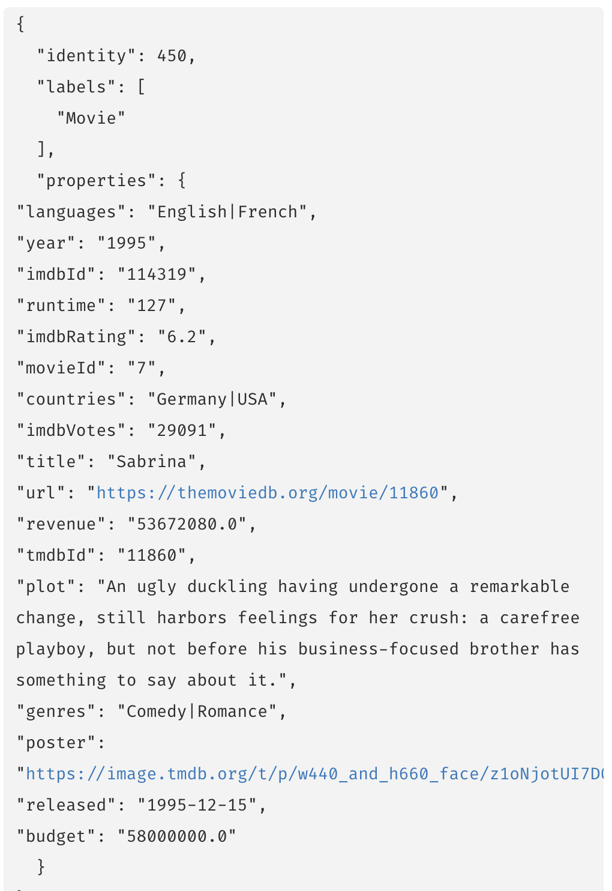

= インポート後の手順
:type: quiz

[.video]
video::B2DsbOIox2M[youtube,width=560,height=315]

[.transcript]
== Data Importer の結果

Data Importerのインポートを実行した後は、グラフの結果を確認することが重要です。

データインポーターの最も重要な動作に関して、プロパティ値が文字列、Long（整数値）、Doubles（小数値）、Booleanのいずれかで記述されるということを理解する必要があります。

さらに、データインポーターは、各ノードに指定した一意のIDに基づいて、すべてのノードに一意性制約を作成します。

=== ターゲットデータモデルへの移行

もう一度、最終的に完成目標のデータモデルを示します:

image::images/movie-data-model.png[Movie data model,width=600,align=center]

このターゲットデータモデルでは、以下のようになります:

* いくつかのプロパティは、日付または文字列のリストのタイプである必要があります。
* グラフにはGanreのノードが必要です。
* ActorとDirectorのラベルが必要です。

例えば、現在のMovieノードのプロパティは、Data Importerの結果、以下のように表示されます:

目的のモデルに関して、これらのプロパティを _Movie_ ノードのグラフに格納する方法を変更したいと考えています:

* *languages* を文字列 ["English", "French:"] のリストに変換します。
* *countries* を文字列 ["Germany", "USA"] のリストに変換する。
* *genres* は存在せず、GenreノードとMovieノードとのリレーションシップを作成するために使用されます。

さらに、_Person_ ノードのグラフにこれらのプロパティが格納される方法を変更する必要があります:

* *born* を日付に変更
* *died* を日付に変更

=== 次のステップ

Data Importerを使ってデータをインポートした後、Cypherを使ってインポートデータをリファクタリングします。
このデータモデルのリファクタリングは、以下のような内容です:

* 文字列から日付または文字列の複数値リストへのデータ型の変換
* PersonノードにActorとDirectorのラベルを追加
* グラフ データ モデルごとに制約を追加
* MovieノードのデータからGenreノードを作成

次のモジュールでは、グラフをリファクタリングするためのCypherの書き方を学びます。

== 理解度チェック

include::questions/1-post-processing.adoc[leveloffset=+1]

[.summary]
== まとめ

このレッスンでは、Data Importerを使用した後、プロパティを文字列、整数、フロート、ブーリアン以外のものにしたい場合、グラフの後処理が必要であることを学びました。

このモジュールでは、対象となるデータモデルに適合するようにグラフをリファクタリングする方法を学びます。