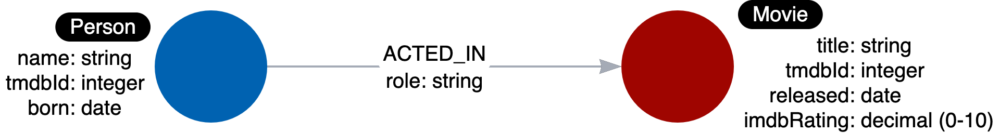

= モデルの目的
:type: quiz
:order: 3

[.video]
video::0rutKWQloZg[youtube,width=560,height=315]

[.transcript]
== モデルの種類

アプリケーションのグラフデータモデリングを行う場合、少なくとも2種類のモデルが必要になります。

* データモデル
* インスタンスモデル

=== データモデル

データモデルは、グラフのラベル、リレーションシップ、プロパティを記述します。
グラフの中に作成される具体的なデータは含まれていません。

ここでは、データモデルの一例を紹介します。

与えられたラベルでノードを一意に識別するものはありません。
しかし、グラフデータモデルは、グラフを作成し、アプリケーションで使用する際に、ラベル、リレーションシップタイプ、プロパティに使用する名前を定義するため、重要です。

=== モデリングに関するスタイルガイドライン

グラフデータのモデリングを始めるにあたり、ラベル、リレーションシップタイプ、プロパティ・キーの命名方法について合意しておくことが重要である。
ラベル、リレーションシップタイプ、プロパティ・キーは、Cypherのキーワードが大文字と小文字を区別しないのとは異なり、大文字と小文字を区別します。

Neo4jのベストプラクティスは、グラフの要素に名前を付けるときに以下を使用することです。しかしながら、あなたのアプリケーションのために任意の慣例を使用するのは自由です。

* ラベルは、大文字で始まり、 https://en.wikipedia.org/wiki/Camel_case[PascalCase^]とすることができる単一の識別子である。
** 例: Person, Company, GitHubRepo
* リレーションシップタイプは、すべて大文字でアンダースコア文字を含む単一の識別子である。
** 例: FOLLOWS, MARRIED_TO
* ノードまたはリレーションシップのプロパティキーは、小文字で始まる単一の識別子で、 https://en.wikipedia.org/wiki/Camel_case[camelCase^]とすることができる。
** 例: deptId, firstName

*備考*: プロパティキー名は一意である必要はありません。例えば、__Person__ノードと__Movie__ノードは、それぞれ__tmdbId__というプロパティキーを持つことができる。

=== インスタンスモデル

グラフデータのモデリングプロセスの重要な部分は、ユースケースに対してモデルをテストすることです。
これを行うには、ユースケースがモデルで答えられるかどうかを確認するためのサンプルデータのセットが必要です。

以下は、インスタンスモデルの例です:

image::images/sample-data-instance-model.png[Instance model,width=400,align=center]

このインスタンスモデルでは、PersonノードとMovieノード、およびそれらのリレーションシップのインスタンスを作成しました。
このようなインスタンスモデルがあると、ユースケースのテストに役立ちます。

== 理解度チェック

include::questions/1-purpose.adoc[leveloffset=+1]

[.summary]
== まとめ

このレッスンでは、グラフデータモデルとインスタンスモデルの違いと、アプリケーションで使用するグラフを開発する際に、それらが重要である理由を学びました。
次のモジュールでは、ドメイン内のエンティティをノードとしてモデル化することについて学びます。