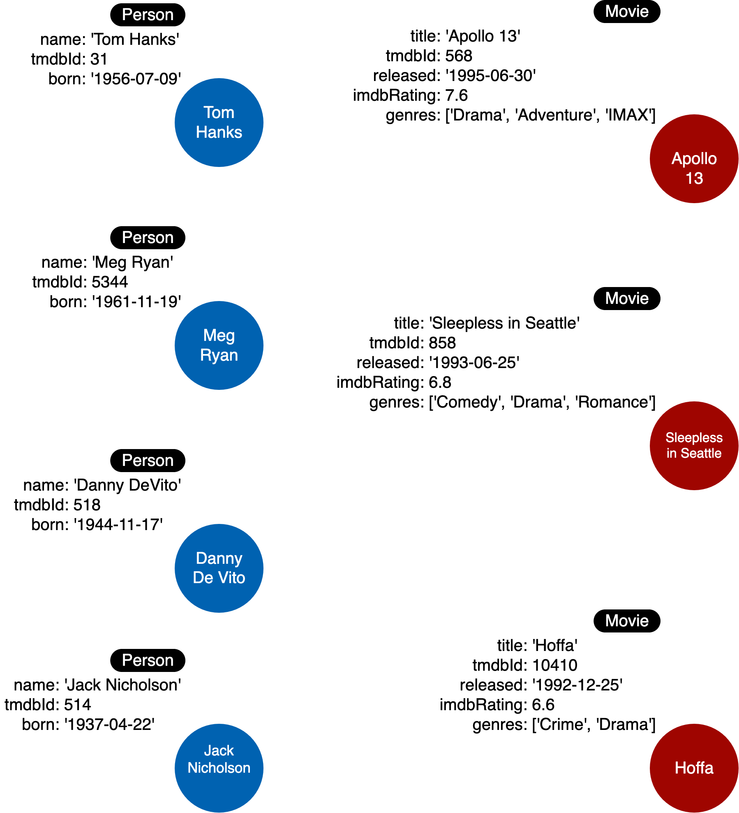

= ノードの作成
:type: challenge
:order: 2
:sandbox: true
:updated-at: 2022-05-02 T 13:00:00 Z

ここでは、最初に扱うインスタンスモデルを紹介します。

以下のCypherコードを実行して、PersonとMovieのノードをグラフに追加し、最初のインスタンスモデルとします。

[TIP]
コードサンプルの右上にある**Run in Sandbox**ボタンをクリックすると、右側にサンドボックスが開き、クエリが実行されます。

[source,cypher]
----
include::solution.cypher[tags="delete,merge"]
----

このコードでは、ラベル（CamelCase）とプロパティ（camelCase）の命名に、Neo4jのベストプラクティスのガイドラインを使用しています。

このコードを実行することで、ノードが作成されたことを確認することができます。

[source,cypher]
----
MATCH (n) RETURN n
----

グラフには7つのノードがあるはずです。

include::./questions/verify.adoc[leveloffset=+1]

[.summary]
== まとめ

この課題では、コースで扱う最初のインスタンスモデルを表現するために、グラフにノードを配置しました。

次の課題では、グラフのデータモデルの新しいノードをモデリングします。
