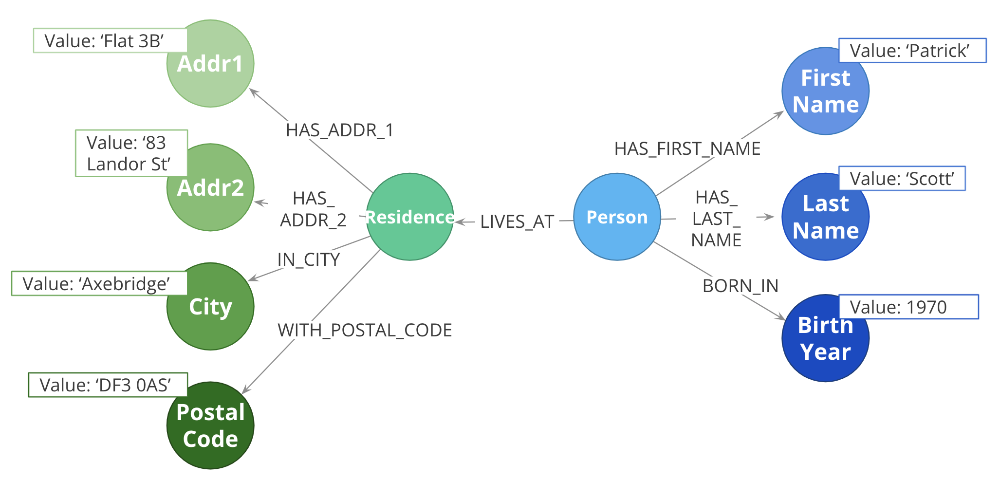
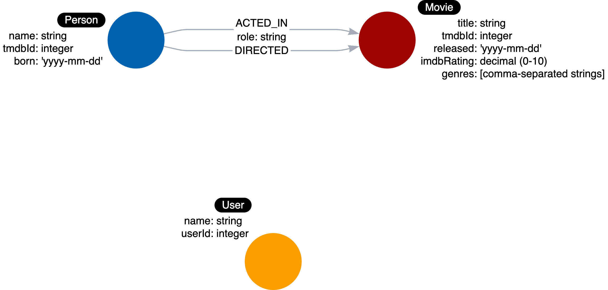

= リレーションシップのモデリング
:type: quiz
:order: 1
:updated-at: 2022-04-25 T 21:00:00 Z

[.video]
video::zJrI7QAzzGQ[youtube,width=560,height=315]

[.transcript]
== リレーションシップは、エンティティ間の接続

コネクションとは、ユースケースにおける**動詞**のことです。

* レシピに**使われている**材料は何ですか？
* この方と**結婚している**のは誰ですか？

一見すると、接続は単純なものですが、そのミクロおよびマクロの設計は、グラフのパフォーマンスにおいて最も重要な要素であると言っても過言ではありません。

「コネクションは動詞である」というのは、使い始めには良い略語ですが、このコースの後半で学ぶ他の重要な検討事項があります。

=== リレーションシップの命名

グラフ内のリレーションシップ関に良い名前（タイプ）を選ぶことは重要です。
リレーションシップのタイプは、関係者や開発者が直感的に理解できるものでなければなりません。
リレーションシップのタイプは、エンティティ名と混同してはなりません。

したがって、この使用例では、これらの関係タイプを定義することができます。

* USES （使われている）
* MARRIED （結婚している）

ここで、Neo4jのベストプラクティスとして、リレーションシップの名前にすべて大文字および小文字を使用することに注意してください。

=== リレーションシップの方向

Neo4jでリレーションを作成する場合、方向は明示的に指定するか、指定したパターンの左から右への方向によって推測されます。

クエリ実行時、方向は必須でありません。

上記の使用例では、Recipe ノードから Ingredient ノードへ移動するために *USES* リレーションシップを作成する必要があります。

image::images/uses.png[Uses relationship,width=400,align=center]

このタイプの関係は対称的であるため、*MARRIED*関係はどちらのノードでも開始できるように作成される可能性があります。

image::images/married.png[Married relationship,width=400,align=center]

[NOTE]
リレーションシップは、通常、2つの異なるノード間のものであるが、同じノードに対するものである場合もあります。

=== ファンアウト

ここでは、エンティティ（Person、Residence）を単一のノードとしてではなく、ネットワークやリンクされたノードとして表現しています。

これはファンアウトの極端な例であり、現実のソリューションとしては行き過ぎであることはほぼ間違いないですが、ある程度のファンアウトは非常に有用であることは確かです。

たとえば、姓を別のノードに分割すると、「Scottという姓の人は誰ですか」という質問に答えるのに役立ちます。
同様に、都市を別のノードにすると、「パトリック・スコットと同じ都市に住んでいるのは誰ですか」という質問に答えるのに役立ちます。

ファンアウトの主なリスクは、非常に高密度なノード、つまりスーパーノードにつながる可能性があることです。このようなノードには、何十万もの出入りするリレーションシップがあります。

=== ムービーグラフ内のリレーションシップ

では、これらのユースケースのリレーションシップを明らかにすることを見てみましょう。

* 映画の中では誰が**出演した**か？
* 映画を**監督した**のはだれか？
* 特定の人が**出演した**映画は？

このようなユースケースを想定し、関係性に名前をつけています。

* ACTED_IN (出演した)
* DIRECTED (監督した)

さらに、これらのリレーションシップタイプはどちらも__Person__ノードで始まり、__Movie__ノードで終わります。

以下は、上記に関連するグラフのデータモデルです。

image::images/adding-first-relationships.png[Starting movie relationships,width=400,align=center]

そして、このグラフデータモデルに基づいたインスタンスモデルがこちら:

image::images/adding-first-relationships-instance.png[Starting movie relationships instances,width=400,align=center]

トム・ハンクスは2作品に出演。メグ・ライアンとジャック・ニコルソンは、それぞれ1作品に出演。Danny DeVitoは、同じ映画に出演し、監督もしました。

このインスタンスモデルで関係を探ってみると、映画「アポロ13」のグラフには俳優が1人ですが、他の2つの映画にはそれぞれ俳優が2人いることがわかります。

=== リレーションシップに関するプロパティ

リレーションシップのプロパティは、2つのノードの関係性をより豊かにするために使用されます。
リレーションシップのプロパティを定義することにより、ユースケースは2つのノードが単に関連しているというだけでなく、どのように関連しているかについて特定の情報を付加します。

例えば、_Neo4j基礎 (Fundamentals)_ のコースで、プロパティを追加してリレーションシップを記述することができることを確認しました。

image::images/relationship-properties.jpg[Loves strength,width=400,align=center]

ここでは、_MARRIED_ リレーションシップに _date_ プロパティがあり、MichaelとSarahの関係をより具体的に記述していることがわかります。
さらに、_WORKS_AT_ リレーションシップに _roles_ プロパティがあり、MichaelがGraph社での役割を記述しています。

これらのプロパティは、2つのノード間の関係に固有のものです。

=== ムービーグラフのリレーションシップ・プロパティ

ネーミングラベル、リレーションシップタイプ、ノードプロパティなどのユースケースを分析するように、ユースケースを使ってリレーションシップのプロパティを考えていきます。

ここではいくつかユースケースを紹介します：

[start=6]
. *映画の中で、その人はどんな役割を担っていたのか？*

このユースケースのランタイムオペレーションは、次のとおりです：

. 名前を取得する。
. ACTED_INのリレーションシップを映画までたどる。
. 映画をタイトルで絞り込む。
. 2つのノードの間のACTED_INリレーションシップから**role**を返す。

このユースケースでは、特定の _ACTED_IN_ リレーションシップの _role_ が必要であることがわかっています。
そこで、このリレーションシップに _role_ プロパティを追加します。

以下はデータ・モデルです：

これから作成するインスタンスモデルはこちらです:

image::images/before-challenge1-instance-model.png[Instance model,width=400,align=center]

ここでの _ACTED_IN_ リレーションシップは、それぞれ _role_ プロパティに異なる値をもちます。

== 理解度チェック

include::questions/1-connections.adoc[leveloffset=+1]

include::questions/2-relationships.adoc[leveloffset=+1]

[.summary]
== まとめ

このレッスンでは、ユースケースに基づいてグラフデータモデルに追加するリレーションシップ（およびそのプロパティ）を特定する方法を学びました。
次の課題では、インスタンスモデルの初期のリレーションシップを作成します。