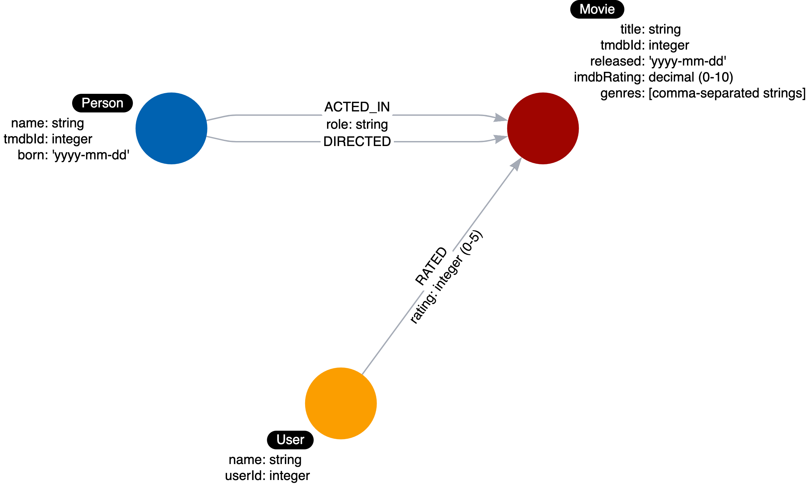

= 新たなリレーションシップを見出す
:order: 3
:type: challenge
:updated-at: 2022-04-25 T 21:00:00 Z

さて、もうひとつの挑戦です。

[TIP]
--
新しいユースケースのために、モデルをリファクタリングする必要があります。

**ユースケース#9: どのユーザーが映画に5点の評価をつけたか？**
--

ユースケースとして、_Person_ と _Movie_ ノード、_ACTED_IN_ と _DIRECTED_ のリレーションシップを既に確認済みです。

* 映画に出演したのは誰か？
* だれが映画を監督したか？
* だれがどの映画に出演したか？

image::images/before-challenge1-data-model.png[Model thus far,width=400,align=center]

さらに、映画を評価したユーザーについて質問するユースケースをモデル化する必要があります。
映画のレビューや評価を行ったユーザーを表すために、_User_ というラベルを定義しました。

include::./questions/1-rated-relationship.adoc[leveloffset=+1]
include::./questions/2-property.adoc[leveloffset=+1]

[.summary]
== まとめ

あなたデータモデルは以下のような形になっているはずです：

この課題では、ドメインのエンティティ間の接続を識別し、グラフデータモデルのリレーションシップを定義するスキルを示しました。
次の課題では、インスタンスモデルのグラフに新しいリレーションシップを作成します。
