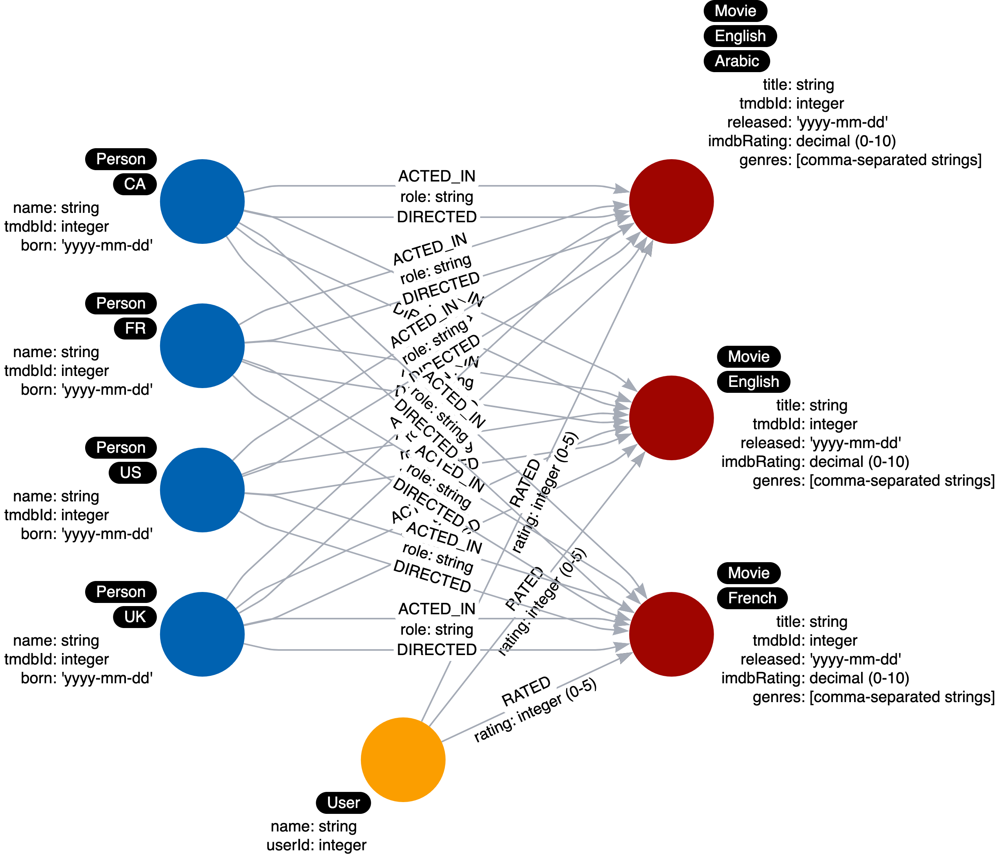

= グラフ内のラベル
:type: quiz
:order: 2
:updated-at: 2022-04-25 T 21:00:00 Z

[.video]
video::sp4SjLiDnq8[youtube,width=560,height=315]

[.transcript]
== 実行時のラベル

ノードラベルは、クエリのアンカーポイントとして機能します。
ラベルを指定することは、クエリを開始する1つまたは複数のノードのサブセットを指定することになります。
ラベルを使用することで、検索されるデータ量を減らすことができます。

例えば:

`MATCH (n) RETURN n` returns all nodes in the graph.

`MATCH (n:Person) RETURN n` returns all _Person_ nodes in the graph.

モデリングにおけるゴールは、クエリーが触れるグラフのサイズを小さくすることであるはずです。

Cypherでは、クエリ中にどのような処理が行われるかを示すクエリプランを作成することができます。

この図は、すべての _Person_ ノードを取得するクエリのDBヒット数を含むクエリプランを表しています。

image::images/query-plan.png[Example Query Plan,width=400,align=center]

このレッスンの後半では、クエリプランを作成する方法について学びます。

もし、_Person_ ノードに出身国のラベルがあれば、このCypherコードを使って、アメリカ出身の人物をすべて取得することができます。

`MATCH (n:US) RETURN n` returns all _US_ nodes in the graph which happen to be _Person_ nodes.

しかし、このように具体的なラベルを持つことは、特にクエリができる場合は、やりすぎかもしれません。

`MATCH (n:Person) WHERE n.country = 'US' RETURN n`

Cypherでは、ラベルをパラメータ化できないので、国をプロパティにしておくと、Cypherのコードの柔軟性が高まります。

しかし、1つのノードに複数のラベルを付ける強いユースケースがある場合は、そうすべきです。

=== ラベルの使いすぎに注意

データモデルでは、ラベルを賢く使うべきです。
ラベルは、ほとんどのユースケースで役立つ場合に使用されるべきです。
ベストプラクティスは、1つのノードのラベルの数を4つに制限することである。

データモデルでラベルを多用しすぎた例を紹介します。

ここでは、_Person_ ノードがあり、先ほど説明したように、Personの出身国を表すラベルを持っています。

さらに、_Movie_ ノードには複数のラベルが表示されます。
このラベルは、Movieで利用可能な言語を表しています。

これも似たようなシナリオで、重要なユースケースが映画の言語に関連しているかどうかを判断する必要があります。
ここでも、ノードのプロパティの使用で十分な場合は、ラベルをつけないほうがよいです。

===  新しいユースケース

ここでは、ラベルを追加することで、実行時にクエリーを助けることができる例を示します。

新しいユースケースが追加されたらどうでしょうか。

*ユースケース#10: 1950年以前に生まれた俳優とは？*

このユースケースをテストするためのCypherステートメントを以下に示します:

[source,cypher,role=nocopy noplay]
----
MATCH (p:Person)-[:ACTED_IN]-()
WHERE p.born < '1950'
RETURN p.name
----

このCypherステートメントが行うことは以下の通りです:

. ラベル・スキャンにより、すべての _Person_ ノードを取得する。
. 取得したノードに対して、born プロパティをテストし、フィルタリングする。
. フィルタリングされたノードのうち、どのノードが発信する _ACTED_IN_ リレーションシップを持つかを判定する。
. name プロパティの値を返す。

=== クエリのプロファイリング

`PROFILE` キーワードを使用すると、クエリのパフォーマンスを確認することができます。

[source,cypher,role=nocopy noplay]
----
PROFILE MATCH (p:Person)-[:ACTED_IN]-()
WHERE p.born < '1950'
RETURN p.name
----

以下は、プロファイルの結果です:

image::images/initial-profile.png[Initial profile,width=400,align=center]

キャッシュは自動的に取り込まれるため、小さなデータセットでは性能の測定が困難な場合があります。
つまり、dbヒット数と経過時間は比較できないかもしれません。
しかし、見ることができるのは、クエリで取得された行の数であり、この数は比較することができます。

このクエリの最初のステップでは、5つの行が返されることがわかります。
これが何百万ものノードを持つ全量のグラフであれば、ステップ1において、多くの _Person_ ノードを取得する必要があり、その中にはActorではないものもあることが想像できるだろう。
この検索を最適化する方法の1つは、PersonノードにActorラベルを含めるようにデータモデルを変更することです。

=== モデルのリファクタリング

リファクタリングすると、最初のラベルによるノードスキャンでは、アクターノードしか取得できなくなる。

以下は、グラフで作成するリファクタリング後のインスタンスモデルです。

image::images/added-actor-label-instance.png[Added Actor label,width=400,align=center]

=== グラフのリファクタリング

Cypherを使うと、グラフを簡単に変換することができます。
次のチャレンジで実行するこのコードでは、_ACTED_IN_ のリレーションシップを持つすべての _Person_ ノードを見つけます。
そして、そのノードにラベルを設定します。

[source,cypher,role=nocopy noplay]
----
MATCH (p:Person)
WHERE exists ((p)-[:ACTED_IN]-())
SET p:Actor
----

次のChallengeでは、グラフをリファクタリングして、_Actor_ ラベルを追加します。

== 理解度チェック

include::questions/1-why-add-labels.adoc[leveloffset=+1]

include::questions/2-num-labels.adoc[leveloffset=+1]

//include::questions/3-profile-query.adoc[leveloffset=+1]

[.summary]
== まとめ

このレッスンでは、ラベルを追加するメリットと、`PROFILE`を使用してメリットを測定する方法について学びました。
次の課題では、グラフをリファクタリングして、_Actor_ ラベルを追加します。