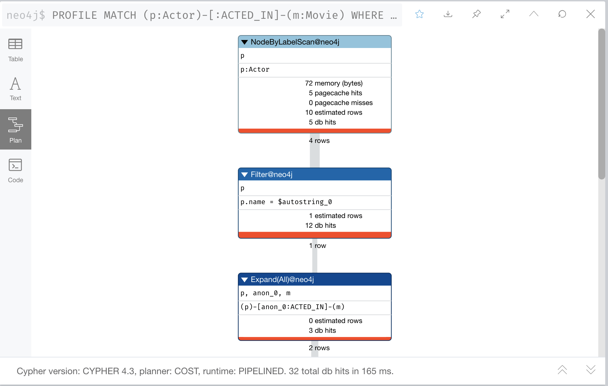

= リファクタリング後の再テスト
:type: quiz
:order: 4
:updated-at: 2022-04-25 T 21:00:00 Z

[.video]
video::QisAdQ68aDs[youtube,width=560,height=315]

[.transcript]

== リファクタリング後の再テスト

グラフをリファクタリングした後、ユースケースに対するすべてのクエリを再検討する必要があります。

まず、リファクタリングをするために書き換える必要があるクエリがあるかどうかを判断する必要があります。

次に、リファクタリングを利用するために、いくつかのクエリを書き換えます。

実際のアプリケーションでテストを行う際、特に完全にスケーリングされたグラフを使用して、新しいクエリのプロファイルを作成し、パフォーマンスが向上するかどうかを確認することもできます。

今回使用する小規模なインスタンスモデルでは、大幅な改善は見込めませんが、取得される行数に違いが見られるかもしれません。

=== ユースケース#1: 映画で誰が演じたか?

このクエリを書き換えて、_Actor_ ラベルを使用するようにします。

オリジナルコード:

[source,cypher,role=nocopy noplay]
----
MATCH (p:Person)-[:ACTED_IN]-(m:Movie)
WHERE m.title = 'Sleepless in Seattle'
RETURN p.name AS Actor
----

新しいコード:

[source,cypher,role=nocopy noplay]
----
MATCH (p:Actor)-[:ACTED_IN]-(m:Movie)
WHERE m.title = 'Sleepless in Seattle'
RETURN p.name AS Actor
----

=== プロファイリングクエリ

_Person_ ラベルを使用したクエリでは、まず5つの _Person_ ノードを取得した結果が次のように表示されます:

image::images/profile-retrieve-person.png[Example Query Plan,width=400,align=center]

_Actor_ ラベルを使ったクエリでは、まず4つの _Actor_ ノードを取得する結果が得られ、この小さなグラフではわずかな改善となりました。:

=== ユースケース#3: だれがどの映画に出演したのか？

このクエリを書き換えて、_Actor_ ラベルを使用するようにします。

オリジナルコード:

[source,cypher,role=nocopy noplay]
----
MATCH (p:Person)-[:ACTED_IN]-(m:Movie)
WHERE p.name = 'Tom Hanks'
RETURN m.title AS Movie
----

新しいコード:

[source,cypher,role=nocopy noplay]
----
MATCH (p:Actor)-[:ACTED_IN]-(m:Movie)
WHERE p.name = 'Tom Hanks'
RETURN m.title AS Movie
----

=== ユースケース#5: 最年少で映画に出演したのは誰か？

このクエリを書き換えて、_Actor_ ラベルを使用するようにします。

オリジナルコード:

[source,cypher,role=nocopy noplay]
----
MATCH (p:Person)-[:ACTED_IN]-(m:Movie)
WHERE m.title = 'Hoffa'
RETURN  p.name AS Actor, p.born as `Year Born` ORDER BY p.born DESC LIMIT 1
----

新しいコード:

[source,cypher,role=nocopy noplay]
----
MATCH (p:Actor)-[:ACTED_IN]-(m:Movie)
WHERE m.title = 'Hoffa'
RETURN  p.name AS Actor, p.born as `Year Born` ORDER BY p.born DESC LIMIT 1
----

=== ユースケース#6: 映画の中で、人はどんな役割を担っていたのか。

このクエリを書き換えて、_Actor_ ラベルを使用するようにします。

オリジナルコード:

[source,cypher,role=nocopy noplay]
----
MATCH (p:Person)-[r:ACTED_IN]-(m:Movie)
WHERE m.title = 'Sleepless in Seattle' AND
p.name = 'Meg Ryan'
RETURN  r.role AS Role
----

新しいコード:

[source,cypher,role=nocopy noplay]
----
MATCH (p:Actor)-[r:ACTED_IN]-(m:Movie)
WHERE m.title = 'Sleepless in Seattle' AND
p.name = 'Meg Ryan'
RETURN  r.role AS Role
----

=== ユースケース#8: 俳優が出演したドラマ映画とは？

このクエリを書き換えて、_Actor_ ラベルを使用するようにします。

オリジナルコード:

[source,cypher,role=nocopy noplay]
----
MATCH (p:Person)-[:ACTED_IN]-(m:Movie)
WHERE p.name = 'Tom Hanks' AND
'Drama' IN m.genres
RETURN m.title AS Movie
----

新しいコード:

[source,cypher,role=nocopy noplay]
----
MATCH (p:Actor)-[:ACTED_IN]-(m:Movie)
WHERE p.name = 'Tom Hanks' AND
'Drama' IN m.genres
RETURN m.title AS Movie
----

=== ユースケース#10: 1950年以前に生まれた俳優とは?

テストの完成度を高めるために、この新しいユースケースを追加します。

このクエリを書き換えて、_Actor_ ラベルを使用するようにします。

オリジナルコード:

[source,cypher,role=nocopy noplay]
----
MATCH (p:Person)
WHERE p.born < '1950'
RETURN p.name
----

新しいコード:

[source,cypher,role=nocopy noplay]
----
MATCH (p:Actor)
WHERE p.born < '1950'
RETURN p.name
----

=== クエリのプロファイリング

スケーリングされたグラフ (このコースで使用したものよりも多くのノード/リレーションシップがある) を使用している場合は、`PROFILE` キーワードも使用して、リファクタリング後のクエリのパフォーマンスを比較する必要があります。

== 理解度チェック

include::questions/1-retest.adoc[leveloffset=+1]

[.summary]
== まとめ

このレッスンでは、リファクタリング後の再テストを行う前に、ユースケースをサポートするCypherを書き換える必要がある場合があることを学びました。
次の課題では、グラフに _Actor_ ラベルを追加したので、すべてのユースケースを再テストすることになります。