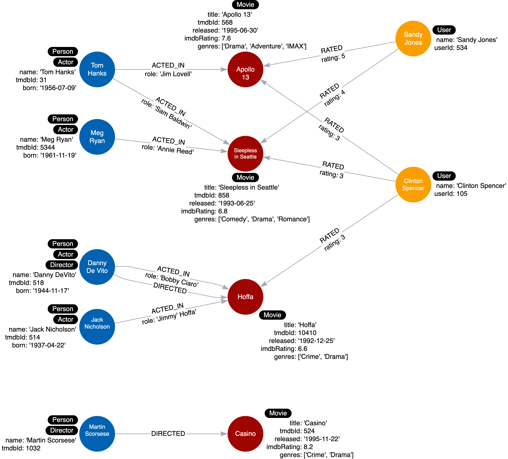

= Director ラベルの追加
:type: challenge
:order: 6
:sandbox: true
:updated-at: 2022-04-25 T 21:00:00 Z

前回のチャレンジでは、グラフ内のノードに_Actor_ ラベルを追加しました。

サンドボックスのクエリーペインで、_DIRECTED_ の送信リレーションシップを持つ _Person_ ノードに _Director_ というラベルを付けるようにクエリーを修正します。

[TIP]
--
新しいラベルは「 _Director_ 」となります。あなたのコードでは、グラフに2つのラベルが追加されているはずです。
--

グラフをリファクタリングした後、影響を受けるユースケースをテストする必要があります。

== ユースケース#2: だれが映画を監督したのか？

このクエリをクエリペインにコピー、_Director_ ラベルを使用するように変更し、映画「Hoffa」を使用してこのユースケースをテストします。

[source,cypher, role=noplay]
----
MATCH (p:Person)-[:DIRECTED]-(m:Movie)
WHERE m.title = 'Hoffa'
RETURN  p.name AS Director
----

ダニー・デビートを返すはずです。

include::./questions/verify.adoc[leveloffset=+1]

[.summary]
== まとめ

この課題では、グラフをリファクタリングして、いくつかのノードに _DIRECTOR_ ラベルを追加し、関連するユースケースを再テストできることを示しましたね。

インスタンスモデルは次のようになります:

次のレッスンでは、グラフデータモデルのラベルでやってはいけないことについて、いくつかのヒントを学びます。
