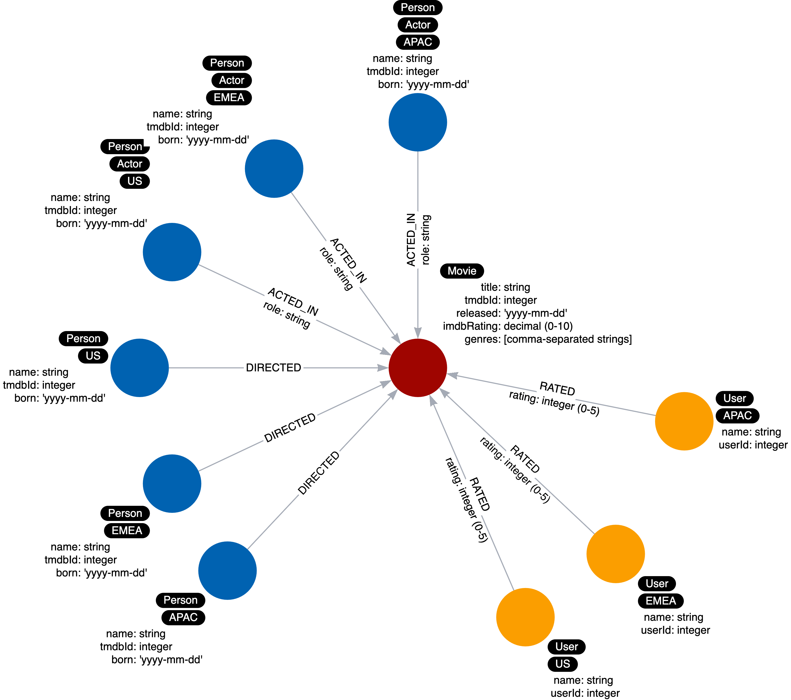
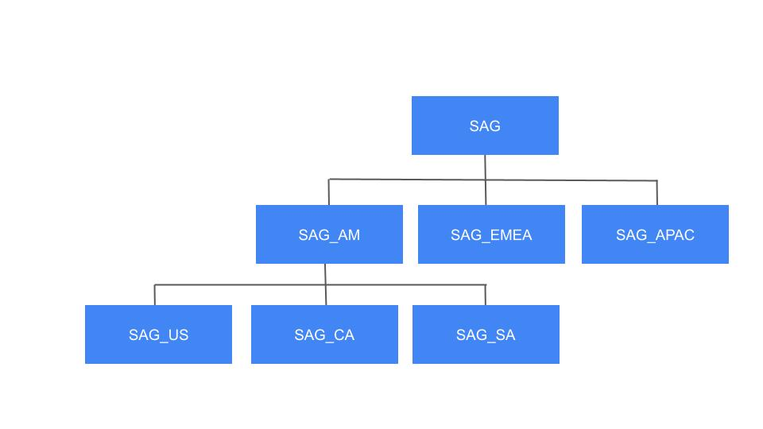

= これらのラベルを避ける
:type: quiz
:order: 7
:updated-at: 2022-04-25 T 21:00:00 Z

[.video]
video::b5hJ6L60yTM[youtube,width=560,height=315]

[.transcript]

== 意味的に直交する(Semantically orthogonal)ラベル

「意味的に直交」とは、ラベル同士が何の関係もないことを意味する空想上の用語です。
同じ種類のラベルを異なる文脈で使用しないように注意する必要があります。
たとえば、すべてのタイプのノードにリージョンを使用することは、ほとんどのクエリで役に立ちません。

ここでは、_Person_ ノードと _User_ ノードの両方にリージョンが付けられている例を示します。
もし、両方のタイプのノードでリージョンが重要であるユースケースがない場合、
_Person_ ノードと _User_ ノードに同じラベルを使用することは、有益ではありません。

避けるべきこと:

=== クラス階層の表現

また、階層を表現するためにノードにラベルを付けることも避けるべきです。

例えば、Screen Actors Guild のメンバーシップの階層があるとします。

これは、しばしば「継承」または「IS-A」関係と呼ばれます。
ノードがこのような階層を表す複数のラベルを持っている場合には、このようなことはしない方がよいでしょう。

image::images/SAG-nodes.png[Hierarchy of labels,width=400,align=center]

その代わりに、次のようにします:

image::images/SAG-membership.png[Membership instead,width=400,align=center]

== 理解度チェック

include::questions/1-avoid.adoc[leveloffset=+1]

[.summary]
== まとめ

このレッスンでは、モデルで避けるべきラベルの使用方法をいくつか学びました。
次のモジュールでは、重複するデータを排除するためのリファクタリングについて学びます。