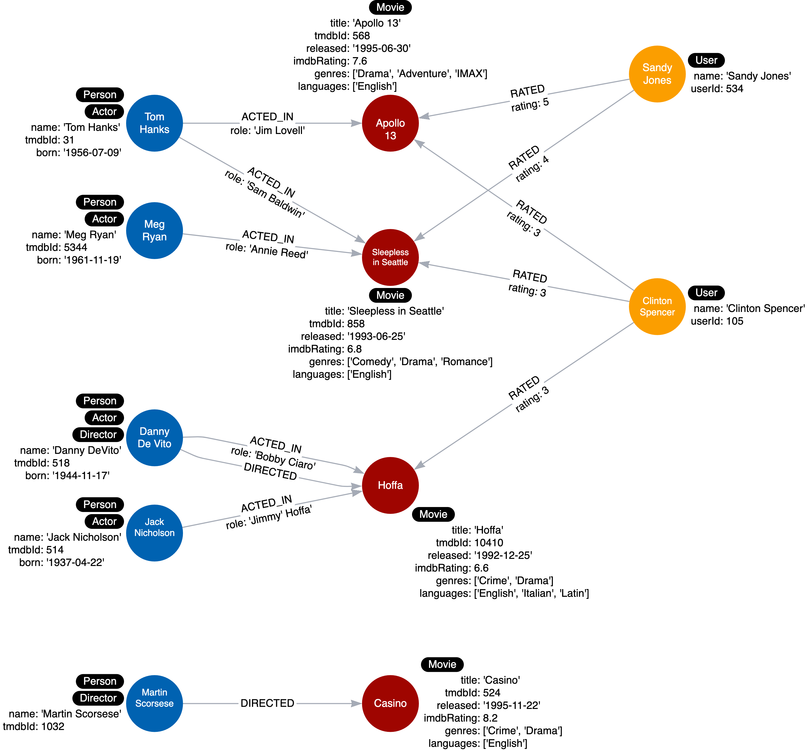
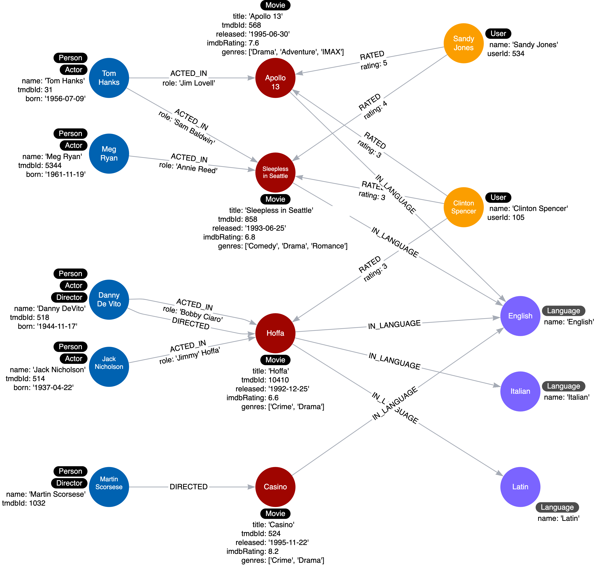

= 重複データのリファクタリング
:type: quiz
:order: 3
:updated-at: 2022-04-25 T 21:00:00 Z

[.video]
video::031EBK550eE[youtube,width=560,height=315]

[.transcript]

== 重複データをクエリ

以下は現在のインスタンスモデルで、各 _Movie_ ノードが languages プロパティを持ちます。:

最新のユースケースについて:

*ユースケース#11: どの言語で何の映画が見られるのですか？*

このクエリは _Italian_ の映画をすべて検索します:

[source,cypher, role=noplay nocopy]
----
MATCH (m:Movie)
WHERE 'Italian' IN m.languages
RETURN m.title
----

このクエリが行うのは、すべての _Movie_ ノードを取得し、languagesプロパティに _Italian_ が含まれているかどうかをテストすることです。
データモデルには2つの問題があり、特にグラフがスケーリングする場合:

* 多くの _Movie_ ノードで言語名が重複している.
* クエリを実行するには、すべての _Movie_ ノードを取得する必要があります。

ここでの解決策は、プロパティをノードとしてモデル化することです。

=== プロパティをノードとしてリファクタリング

以下は、リファクタリングに使用する手順です:

. 各 _Movie_ ノードのプロパティ値を取り出し、_Language_ ノードを作成します。
. 次に、その _Movie_ ノードと _Language_ ノードの間に _IN_LANGUAGE_ リレーションシップを作成します。
. 最後に、_Movie_ ノードから languages プロパティを削除します。

以下は、グラフをリファクタリングして、プロパティ値をノードに変換するコードです。:

[source,cypher, role=noplay nocopy]
----
MATCH (m:Movie)
UNWIND m.languages AS language
WITH  language, collect(m) AS movies
MERGE (l:Language {name:language})
WITH l, movies
UNWIND movies AS m
WITH l,m
MERGE (m)-[:IN_LANGUAGE]->(l);
MATCH (m:Movie)
SET m.languages = null
----

このコードは、すべての _Movie_ ノードを繰り返し、見つかった言語ごとに _Language_ ノードを作成し、_Movie_ ノードと_Language_ ノードの間に _IN_LANGUAGE_ リレーションシップを作成します。
これは、Cypherの`UNWIND`句を使用して、_languages_ プロパティリストの各要素を、クエリの後半で処理される個別の行の値に分離しています。

リファクタリング後のインスタンスモデルはこのようになります。:

languageの値が _English_ のノードは1つだけとなり、すべての _Movie_ ノードからlanguagesプロパティを削除します。
これにより、グラフの重複が大幅に解消されます。

== 理解度チェック

include::questions/1-unwind.adoc[leveloffset=+1]

[.summary]
== まとめ

このレッスンでは、値のリストを含むプロパティからノードを作成し、重複を排除する方法を学びました。
次の課題では、_languages_ プロパティから _Language_ ノードを作成するリファクタリングを実行します。