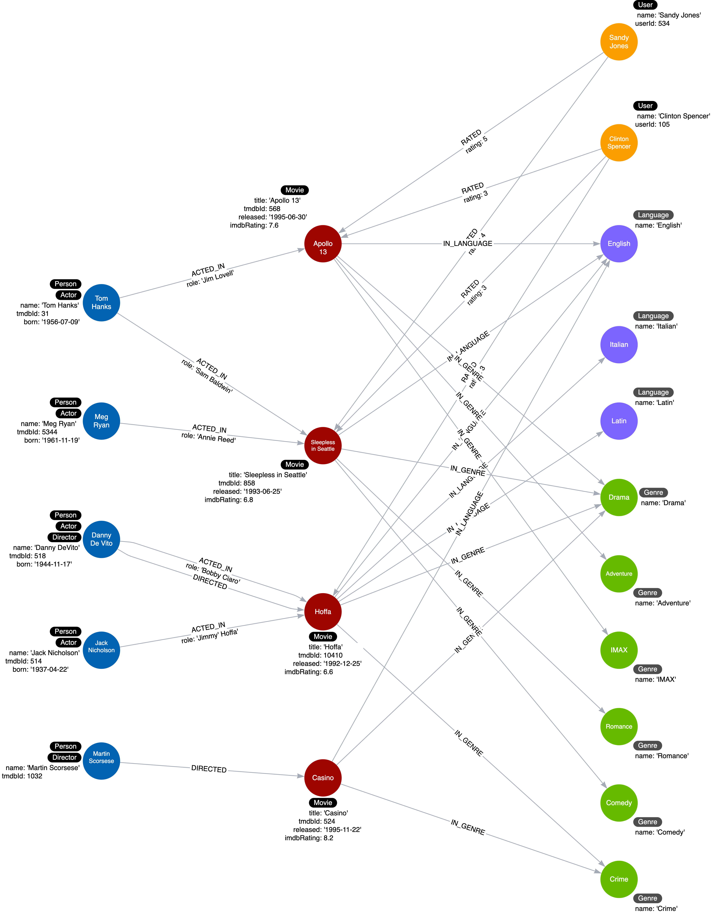

= ジャンルノードの追加
:type: challenge
:order: 5
:sandbox: true
:updated-at: 2022-05-02 T 13:00:00 Z

前回のChallengeでは、_languages_ プロパティにデータを取り込み、映画に関連する _Language_ ノードを作成することで重複を排除しました。

このチャレンジには3つのステップがあります。:

. サンドボックスのクエリーペインで、_Movie_ ノードに _genres_ プロパティのデータを使用し、_Movie_ ノードと _Genre_ ノードを接続する _IN_GENRE_ 関係を使用して _Genre_ ノードを作成するようにクエリーを修正して実行する
. _Movie_ ノードから _genres_ プロパティを削除する
. ユースケースに合わせてクエリを書き換える:  *ある俳優が出演したドラマ映画とは？*

このクエリをサンドボックスのクエリペインにコピーし、書き換えて、このCypherステートメントをテストして、Tom Hanksという人物でこのユースケースをテストしてください。

[source,cypher, role=noplay]
----
MATCH (p:Actor)-[:ACTED_IN]-(m:Movie)
WHERE p.name = 'Tom Hanks' AND
'Drama' IN m.genres
RETURN m.title AS Movie
----

映画『Apollo 13』や『Sleepless in Seattle』を返すはずです。

== クエリの実行

サンドボックスウィンドウを使用して、各Movieの `genres` プロパティを `UNWIND` し、新しいノードとリレーションシップを作成します。

実行後、**Check Database** をクリックして、グラフが正しくリファクタリングされたことを確認します。

// [TIP]
// .Your Query
// --
// The first query should create 6 nodes and 10 relationships.

// The second query should update 4 nodes (use SET m.genres=null to remove the property).

// For the third query, you must use the pattern `(p:Actor)-[:ACTED_IN]-(m:Movie)-[:IN_GENRE]-(g:Genre)` and test the _name_ property of the _Genre_ node.
// --

// == Verifying the Database

// Once you have written and execute the query to create

include::./questions/verify.adoc[leveloffset=+1]

[.summary]
== まとめ

この課題では、グラフをリファクタリングしてノードを追加し、プロパティの重複を置き換えることができることを示しました。

インスタンスモデルは次のようになります。:

次のレッスンでは、複雑なデータの重複を排除するためのリファクタリングのヒントをいくつか学びます。
