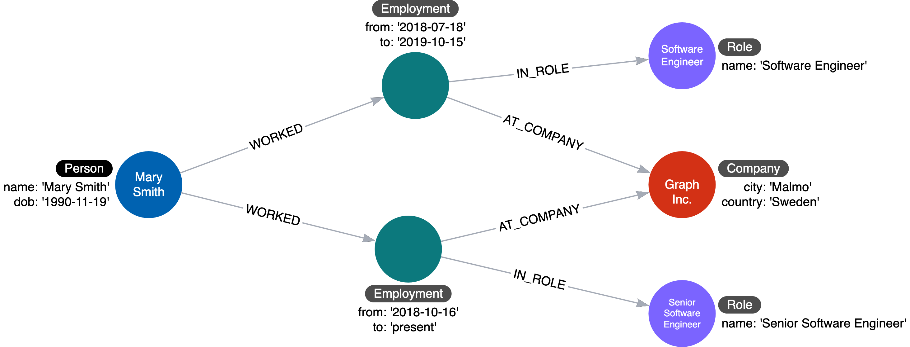
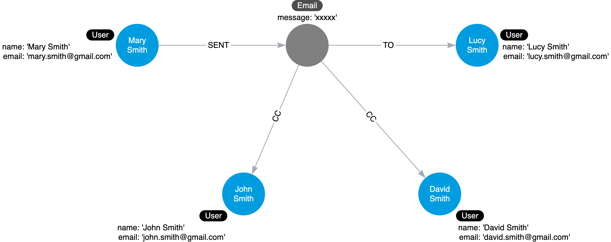

= 中間ノード
:type: quiz
:order: 1
:updated-at: 2022-04-25 T 21:00:00 Z

[.video]
video::JLFqmW9Erbw[youtube,width=560,height=315]

[.transcript]
== 中間ノード

あるリレーションシップに、プロパティで完全に把握できる以上のデータを接続する必要があるケースを見かけることがあります。
つまり、2つ以上のノードを接続するリレーションシップが必要なのである。
数学では、ハイパーレッジという概念で、これを可能にします。
Neo4jでは不可能ですが、中間ノードを作成することで解決できます。

以下のような場合に中間ノードを作成します:

* 1つのコンテキストで2つ以上のノードを接続
** ハイパーエッジ（n-ary関係）
* 何かを関係づけ
* グラフ内のデータをエンティティ間で共有

これら3つのユースケースを利用して、グラフの関係性をより意味のあるものにし、ノード間で共有できるようにしています。

=== 例: 中間ノードの必要性

以下はインスタンスモデルの例です:

ここでは、fromとtoのプロパティを持つ _WORKS_AT_ ハイパーエッジありますが、この雇用期間と役割を関連付ける必要があります。
Neo4jでは、リレーションシップを第3のノードに接続するリレーションシップを作成する方法はありません。
Neo4jのリレーションは、2つのノードしか接続できません。

==== モデルへの中間ノードの追加

解決策は、ハイパーレッジを接続点としてのノードに置き換えることです。
ノードは接続点なので、ハイパーレッジの中間ににノードを作ることになります。

この例では、_WORKS_AT_ ハイパーレッジをEmployment中間ノードに置き換えています。
これは、MaryのAcmeでの雇用期間とあらゆる情報を結びつけることができる接続ポイントを提供します。
さらに、Personノードは共有のRoleまたはCompanyを持つことができ、一人の人のキャリアの全詳細または異なる個人間の重複を非常に簡単にトレースすることができるようになります。

=== 例: データ共有のための中間ノード

多くの場合、リレーションシップはデータを共有できるため、グラフに含まれる重複データを少なくすることができます。

以下は、リファクタリング前のグラフです:

image::images/before-email.png[Sharing data before ,width=600,align=center]

中間ノードでは、情報の重複排除も可能です。
ファンアウトについて説明したときにも同様の原理を述べましたが、プロパティをそれ自身のノードに分割することで、プロパティを繰り返すのではなく、リレーションシップを介して参照することができるようになります。

この場合、中間ノード「Email」を利用することで、リレーションシップごとにメールの内容を繰り返す必要がなくなります。

=== ムービーグラフの中間ノード？

以下は、私たちが現在扱っているムービーグラフのインスタンスモデルです:

image::images/instance-specialize-rated.png[Current instance model ,width=600,align=center]

データを見ると、もし _ACTED_IN_ リレーションシップの _roles_ プロパティをさらに分析することができれば、同じ役割が複数の映画でどのように使用されているかについての質問に答えることができそうです。
さらに、異なる映画間でさえ、異なる役割がどのように相互作用するかを分析したいと思うかもしれません。

== 理解度チェック

include::questions/1-why-intermediate-nodes.adoc[leveloffset=+1]

[.summary]
== まとめ

このレッスンでは、中間ノードがグラフ内のデータの接続方法をより明確に定義し、データの共有に役立つ理由を学びました。
次の課題では、中間ノードである _Role_ を追加するリファクタリングを実行します。