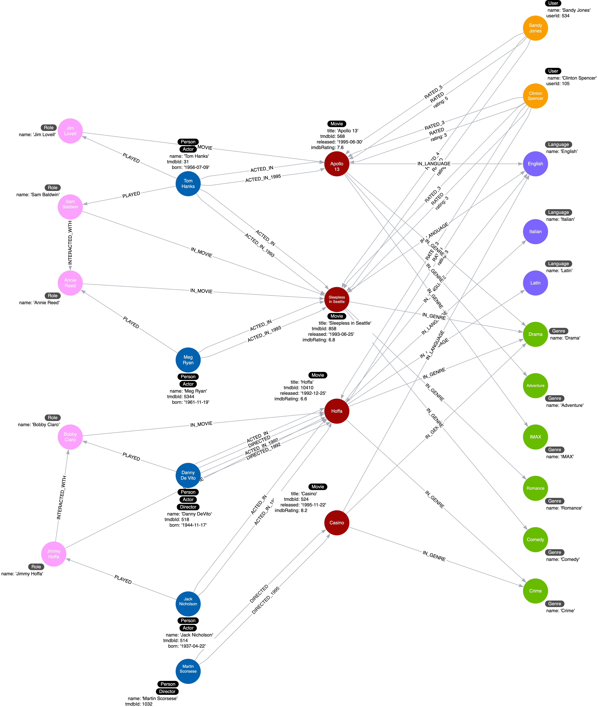

= Roleノードの追加
:type: challenge
:order: 2
:sandbox: true
:updated-at: 2022-05-02 T 13:00:00 Z

ある俳優が映画で演じた役柄から、より多くのことを推論したい。
同じ役が複数の映画で繰り返される可能性もある。
さらに、同じ映画の中で、あるいは映画と映画の間で、異なる役柄がどのように相互作用するかを追加したいかもしれません。

現在のインスタンスモデルに関して:

image::images/instance-specialize-rated.png[Current instance model ,width=600,align=center]

_ACTED_IN_ リレーションシップの _role_ プロパティを表す中間ノードを追加するには、グラフをどのようにリファクタリングすればよいでしょうか。

以下は、提案するインスタンスモデルです:

_ACTED_IN_ リレーションシップの _role_ プロパティを使用して、_Role_ ノードを追加します。

このインスタンスモデルでは、いくつかの _Role_ ノードが _INTERACTED_WITH_ リレーションシップで互いに関連付けられることも示していますが、あなたは_INTERACTED_WITH_ リレーションシップを実装しない*でしょう。

リファクタリングコードを実行します:

. 映画に出演した俳優を探す  (`MATCH (a:Actor)-[r:ACTED_IN]->(m:Movie)`)
. _Role_ ノードを作成し、その名前を _ACTED_IN_ リレーションシップのロールに設定する (`MERGE` を使用) 
. _Actor_ と _Role_ ノードの間に _PLAYED_ リレーションシップを作成する (`MERGE` を使用)
. _Role_ と _Movie_ ノードの間に _IN_MOVIE_ リレーションシップを作成する (`MERGE` を使用)
// . Remove the _role_ property from the _ACTED_IN_ relationship (set it to null)

5つのノードと10のリレーションシップが作成されるはずです。

include::./questions/verify.adoc[leveloffset=+1]

[.summary]
== まとめ

この課題では、グラフをリファクタリングして中間ノードを追加できることを示しました。

おめでとうございます！ あなたはこのコースを完了しました。
