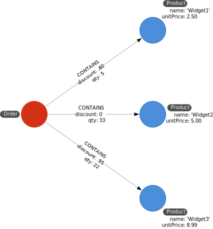

= 非グラフデータベースからグラフへ
:type: video
:order: 3

[.video]
video::8x4resrNeJI[youtube,width=560,height=315]

[.transcript]
== リレーショナルに対するNeo4jのメリット

前回のレッスンで述べたように、インデックスフリー隣接関係はリレーショナルデータベースとグラフデータベースの大きな差別化要因です。
グラフデータベースでは、リレーションシップは書き込み時に保存されますが、リレーショナルデータベースで行われる結合は、読み込み時に計算されます。
つまり、リレーショナルデータベースのレコード数が増えれば増えるほど、クエリの速度が遅くなるということです。
グラフデータベースにおけるクエリ時間は、クエリ中に実際に触れるデータのサイズとほぼ一定に保たれます。

また、リレーションシップが第一級の市民として扱われることも利点となります。
グラフでリレーションシップを表現することは、多対多のリレーションシップを表現するためにピボットテーブルを作成するよりも自然です。

=== Northwind RDBMS からグラフへ

Northwind RDBMS のデータモデルを見てみましょう。

image::images/northwind.jpg[Northwind RDBMS model]

この例では、1つの注文は1つ以上の製品を含むことができ、1つの製品は1つ以上の注文に表示されることができます。
リレーショナル・データベースでは、多対多の関係を処理するために _Order Details_ テーブルが必要です。
注文の数が増え、_Order Details_ テーブルが大きくなればなるほど、注文のクエリーは遅くなります。

グラフでは、_Order_ ノードから各 _Product_ ノードへの _CONTAINS_ リレーションシップを単純にモデル化することができます。「Product」ノードには単価のプロパティがあり、「 _CONTAINS_ 」リレーションシップには数量と割引を表すプロパティがあります。

=== グラフ化するNoSQLデータストア

NoSQLデータベースは、多くの問題を解決しますし、書き込みスループットに優れています。

しかし、データのクエリ方法には問題があります。最も一般的なNoSQLデータベースは、キー/バリューストアとドキュメントを表す2つがあげられます。

// NOTE: taken directly from the Developer Guide

==== キー・バリュー・ストア

image::images/key_value_model.jpg[Key-Value model,role=left]

**Key-Value**モデルは、膨大な量の単純な値や複雑な値のルックアップに最適で、高いパフォーマンスを発揮します。
典型的なKey-Valueストアの構造は次のとおりです。

==== グラフとしてのキーバリュー

image::images/key_value_as_graph.jpg[Key-Value as graph,role=right]

しかし、値そのものが相互に接続されている場合、グラフができあがります。
Neo4jを使えば、つながっているすべての値の間を素早くたどり、関係性の中に洞察を見出すことができます。

グラフとして見てみると、各キーが1つの値にどのように関連しているか、また、異なる値同士がどのように関連づけられるかがわかります（リレーションシップによって互いに接続されたノードのようなもの）。

==== ドキュメントストア

image::images/document_model.jpg[Document model,role=left]

**Document**モデルの構造化された階層は、多くのスキーマに依存しないデータを収容し、簡単にツリーとして表現することができます。
ツリーはグラフの一種ですが、ツリーはデータの1つの投影や視点のみを表します。
このように、ドキュメントストアの階層は、より大きなコンポーネントの中の断片として構造化されています。

==== グラフとしてのドキュメントモデル

image::images/document_as_graph.jpg[Document model as graph,role=right]

そのツリーの中で他のドキュメント（または含まれる要素）を参照すれば、同じデータをより表現豊かに表現することができ、グラフを使って簡単に移動できるようになります。
グラフデータモデルでは、必要に応じて複数の自然な表現を動的に出現させることができます。

グラグとしてみてみた場合、このデータをグラフ構造に移行することで、ツリーのさまざまなレベルや詳細をさまざまな組み合わせで見ることができることを実証しています。

== 理解度チェック

include::questions/1-nosql-to-neo4j.adoc[leveloffset=+1]

[.summary]
== まとめ

このレッスンでは、いくつかの非グラフデータモデルがどのようにグラフとして表現されるかを学びました。
次に、多くのGraphAcademyのコースで使用されているMovieグラフについて学びます。

