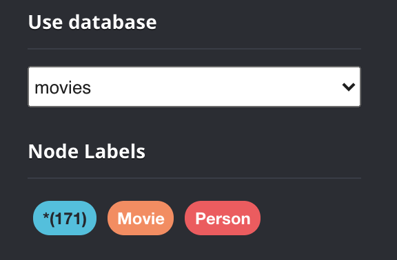
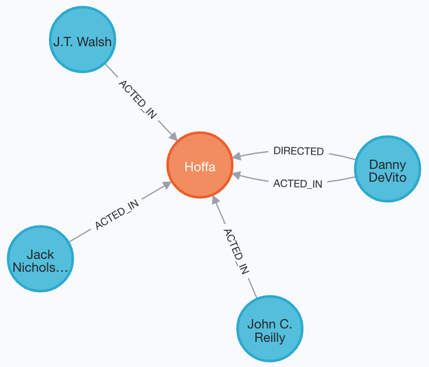
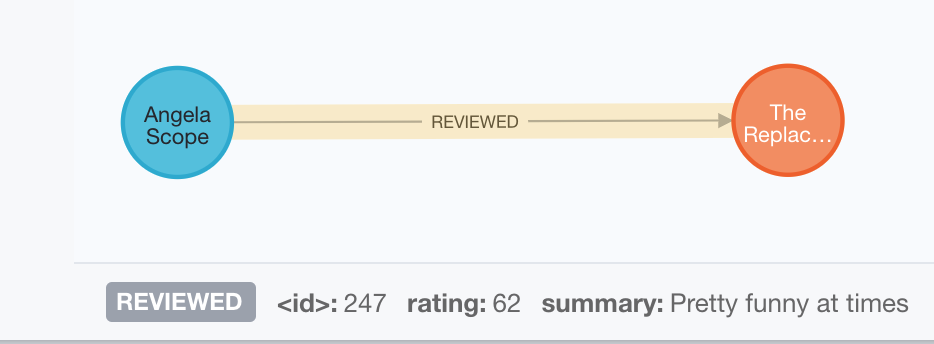

= The Movie Graph
// :type: video
:type: quiz
:order: 1

// [.video]
// // old video video::FGFUX4ee9Fg[youtube,width=560,height=315]
// video::xP7T-fkJCFU[youtube,width=560,height=315]

[.transcript]
== The Movie graph

GraphAcademyのコースを通して、Neo4jの経験を積むために、何らかのバージョンのMovieデータベースを使用することになります。
このレッスンでは、初めてCypherを学習するときに使用する「スターター」Movieデータベースのデータについて学びます。

=== ノード

映画データベースのノードは、人物、映画、そしていくつかのバージョンでは映画のジャンルを表します。

スターター版のMovieデータベースには171のノードが含まれています。

38 Movieノード（Movieのラベルを持つノード） * 133 Personノード（Personのラベルを持つノード
* 133 Personノード（Personのラベルを持つノード）。

これは、Cypherを最初に学習するときに使用するデータベースです。

==== ノードのプロパティ

image::images/movie-properties.png[Properties of Movie nodes, role=right]

すべての _Movie_ ノードは、ムービーを一意に識別するために _title_ というプロパティを持ちます。
このプロパティは、すべての_Movie_ノードに存在します。

その他、_Movie_ ノードが持つ可能性のあるプロパティは以下の通りです。

* _released_: 映画が公開された年。
* _tagline_、映画を説明するためのフレーズ。

例えば、2つのMovieノードでは、どちらも_title_と_released_プロパティを持っていますが、_tagline_プロパティは1つしか持っていないことがわかります。

image::images/person-properties.png[Properties of Person nodes, role=left]

すべての _Person_ ノードは、人を一意に識別するために使用される _name_ というプロパティを持ちます。
一部の _Person_ ノードは _born_ というプロパティを持ちますが、すべてではありません。

=== 人間関係

グラフデータベースの最も重要な要素は、リレーションシップであることはおわかり いただけたと思う。
リレーションシップは型と方向を持ち、特定の2つのノード間の関係を表す。

映画「スターター」グラフのリレーションシップには、以下のようなものがあります。
////
* _ACTED_IN_: Used to represent that a specific person acted in a specific movie. (172 relationships)
* _DIRECTED_: Used to represent that a specific person directed a specific movie. (44 relationships)
* _WROTE_: Used to represent that a specific person wrote a specific movie. (10 relationships)
* _PRODUCED_: Used to represent that a specific person produced a specific movie. (15 relationships)
////

[cols="25,45,20", options="header"]
|====
|*Relationship type*
|*Description*
|*Number in graph*
|ACTED_IN
|A Person acted in a Movie
|172
|DIRECTED
|A Person directed a Movie
|44
|WROTE
|A Person wrote a Movie
|10
|PRODUCED
|A Person produced a Movie
|15
|====

1人の人が1つの映画に対して複数の関係を持つことができます。例えば、ある人は、ある映画で俳優と監督の両方になることができます。
映画グラフでは、これらの関係から、人々は俳優、監督、脚本家、プロデューサーであることがわかります。

例えば、「映画」のグラフにある「Hoffa」という映画は、このような関係になっているわけです。
俳優が4人、監督が1人です。Danny DeVitoは、この映画で監督と俳優を務めました。
スターター "のMovieグラフでは、この映画には脚本家やプロデューサーが定義されていません。

グラフ内の他の関係は以下の通りです。
////
* _REVIEWED_: Used to represent that a specific person reviewed a specific movie. (9 relationships)
* _FOLLOWS_: Used to represent that a specific person follows another specific person. (3 relationships)
////

[cols="25,45,20", options="header"]
|====
|*Relationship type*
|*Description*
|*Number in graph*
|REVIEWED
|A Person reviewed a Movie
|9
|FOLLOWS
|A Person follows another Person
|3
|====

これらの関係を利用して、人々はレビュアー、フォロワー、またはフォロワーになることができます。
映画のグラフでは、映画のレビューや他の人をフォローする人は、俳優、監督、脚本家、プロデューサーでは *ありません*。

以下は、「スターター」ムービーグラフのレビュアーです。

image::images/reviewers.png[Some movie reviewers]

ここには、映画をレビューした人のための_Person_ノードが3つあります。
この3人はいずれも映画「The Replacements」をレビューしています。
ここでは2人がJessica Thompsonをフォローしています。

==== 関係プロパティ

ACTED_IN_リレーションシップは、俳優が特定の映画に出演したときの役割を表す_roles_プロパティを持つ場合があります。

例えば、"starter" Movie データベースでは、俳優の Hugo Weaving は、これらの映画に対する _ACTED_IN_ 関係のそれぞれに、これらのプロパティを定義しています。

image::images/hugo-weaving-roles.png[Hugo Weaving roles]

映画評論家の場合、_REVIEWED_リレーションは_rating_と_summary_のプロパティを持ちます。

== 理解度の確認

include::questions/1-nodes.adoc[leveloffset=+1]
include::questions/2-relationships.adoc[leveloffset=+1]

[.summary]
== まとめ

このレッスンでは、Movieグラフのデータモデルとデータについて学びました。
