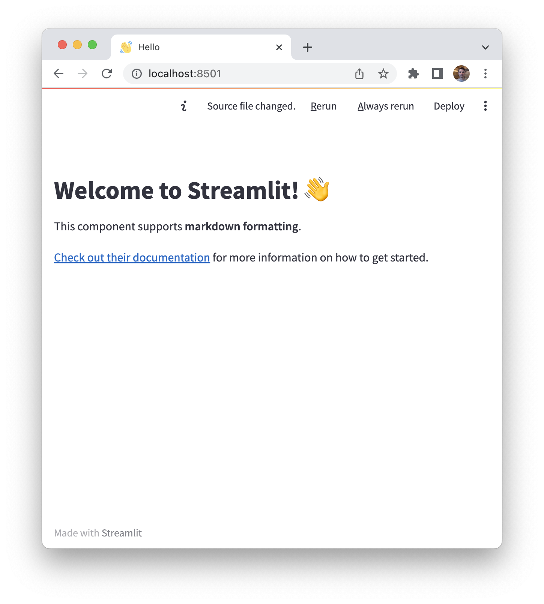

= Introduction
:type: lesson
:order: 1

You will update a link:https://github.com/neo4j-graphacademy/llm-chatbot-python[starter project^] to create your chatbot.

As you progress through the course, you will build the functionality to turn the Chatbot into an _intelligent_ movie recommendation assistant.
It will use the data in a Neo4j database to improve the responses generated by an LLM.

In this lesson, you will learn about the components you will work with.

== Streamlit

link:https://streamlit.io/[Streamlit] is an open-source Python library that allows developers to create web applications for data-centric projects with minimal effort.

With minimal code, developers and data scientists can convert data scripts into functional web applications without writing front-end-specific code.
Its simple API and compatibility with existing Python-based projects and tools means seamless integration, reducing the overhead typically associated with web application development.

Streamlit provides methods to create link:https://docs.streamlit.io/library/api-reference/chat[Chat elements^], making it trivial to build a chatbot interface.

// TODO - I dont think this is needed. I also worry it gives the impression you need to do these tasks now.

// Streamlit is link:https://pypi.org/project/streamlit/[available on PyPI^] and can be installed using the `pip install` command.

// .Installing Streamlit
// [source,sh]
// pip install streamlit

// Once the dependencies are installed, you can start accessing components through the `st` object.

// .app.py
// [source,python]
// ----
// import streamlit as st

// st.set_page_config(
//     page_title="Hello",
//     page_icon="👋",
// )

// st.write("# Welcome to Streamlit! 👋")

// st.markdown("""
// This component supports **markdown formatting**, which is handy.

// [Check out their documentation](https://docs.streamlit.io) for more information on how to get started.
// """)
// ----

// To run the app, execute the `streamlit run` command.

// [source,sh]
// streamlit run app.py

// Running this command will start a server listening on http://localhost:8501.

// image::images/streamlit-helloworld.png[Streamlit Hello World Example]

// If you take a look at the top right corner of the screenshot, you will see a notification saying  _Source file changed_.
// This menu will appear when you make changes to the source code.
// To reload the changes once, you can click the **[.underline]#R# erun** button, or to hot-reload changes as they are saved, you can click **[.underline]#A# lways rerun**.

// [TIP]
// .Deploying your app
// You can quickly link:https://docs.streamlit.io/streamlit-community-cloud/deploy-your-app[share your app with others through the Streamlit Community Cloud^] by clicking the  **Deploy** button.

== LLM Integration with Langchain

You will write code to integrate the chatbot with a Large Language Model (LLM).
At the start of the course, the AI assistant simply _repeats_ the user input.

If you have complete the link:/courses/genai-integration-langchain/[Neo4j & LLM Fundamentals course^], you will be familiar with LangChain.
link:https://langchain.com[LangChain^] is an open-source framework designed to accelerate the development of LLM applications.
Langchain provides a flexible base for testing LLMs and out-of-the-box chains for complex tasks.

You can use the LLM integration components with any framework that supports Python, such as Flask, FastAPI, or Django. 

== LLMs from OpenAI

The course contains instructions for using link:https://openai.com[OpenAI's] Large Language Models.

You are not restricted to OpenAI, however.
The hands-on challenges in this course are LLM-agnostic, and you are free to use any of the link:https://python.langchain.com/v0.1/docs/integrations/llms/[LLMs supported by Langchain^].

== Ready to get started?

In the next lesson, you will setup and run the starter project.

read::Lets go![]

[.summary]
== Summary

In this lesson, you learned about the components you will use in the course.

In the next lesson, you will setup and run the starter project.
