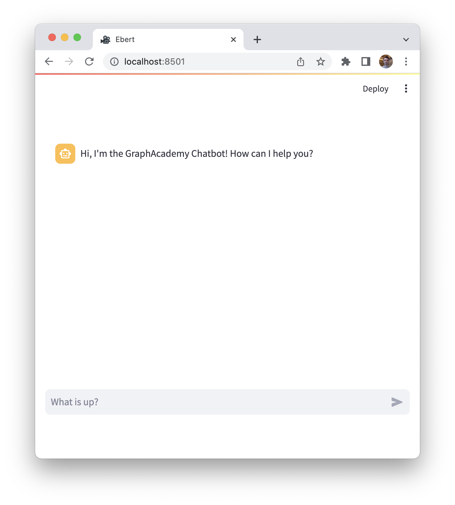

= Project Setup
:type: lesson
:order: 2
:disable-cache: true
:lab-filename: bot.py
:lab: {repository-blob}/main/{lab-filename}

Let's start by getting the project up and running.

If you plan to complete the course using the online IDE, you can skip to link:#explore[Exploring `bot.py`].

== Local install

To run the project locally, you need to install the project dependencies.

[TIP]
.Online Labs
====
If you prefer, you can use the buttons on each lesson to complete the code in an Online IDE provided by link:https://gitpod.io[GitPod^].
To use GitPod, you will need to register with a Github, Gitlab or BitBucket account.

lab::Explore Repository in GitPod[]
====

=== Python

To run the project, you will need Python setup locally.
We have designed the project to work with Python **v3.11**.

If you do not have Python installed, you can link:https://www.python.org/downloads/[follow the installation instructions on Python.org^].

[IMPORTANT]
.Python v3.12+
As of writing, link:https://github.com/langchain-ai/langchain/issues/11479[Langchain doesn't support Python v3.12 or above^]. You can download Python v3.11 from link:https://www.python.org/downloads/[python.org/downloads^].

You can verify your Python version by running the following command.

[source,sh]
.Verify Python Version
python --version

=== Setting up the Project

The link:https://github.com/neo4j-graphacademy/llm-chatbot-python[project repository is hosted on Github^].

You can use the GitHub UI or CLI to clone the repository or link:https://github.com/neo4j-graphacademy/llm-chatbot-python/archive/refs/heads/main.zip[download a ZIP archive^].
We recommend https://github.com/neo4j-graphacademy/llm-chatbot-python/fork[forking the repository] so you have a personal copy for future reference.

To clone the repository using the `git` CLI, you can run the following command.

[source,sh]
.Clone the Repository
----
git clone https://github.com/neo4j-graphacademy/llm-chatbot-python
----

=== Installing Dependencies

The project has four dependencies, `streamlit`, `langchain`, `openai` and `neo4j-driver`.
To install the dependencies, you can run the `pip install` command.

[source,sh]
.Install Depencencies
pip install -r requirements.txt

=== Starting the App

The `bot.py` file in the root folder contains the main application code.

To start the app, run the `streamlit run` command.

[source,sh]
.Run the Streamlit app
----
streamlit run bot.py
----

This command command will start a server on http://localhost:8501.
Once you have run the command, you should see the following interface.

When you send a message, the message will be rendered with a red icon to represent a _user_ message.
The app will wait for one second, and then render the same message next to an orange robot icon, which represents an _assistant_ message.

[#explore]
== Exploring `bot.py`

We have purposely kept the code simple, so you can focus on the LLM integration.

If you are interested in _how_ to build the Chat interface from scratch, check out the link:https://docs.streamlit.io/knowledge-base/tutorials/build-conversational-apps[Build conversational apps documentation].

The majority of the code is link:{repository-blob}/main/bot.py[contained in the `bot.py` file^].

Let's take a look at `bot.py` in more detail.

[%collapsible]
.View the contents of `bot.py`
====

[source,python]
----
include::{repository-raw}/main/bot.py[tag=**]
----
====

=== Page Config

The code sets out by calling the `st.set_page_config()` to configure the title and icon used on the page.

.Page Config
[source,python]
----
include::{repository-raw}/main/bot.py[tag=setup]
----

=== App Session State

The next block of code checks the link:https://docs.streamlit.io/library/api-reference/session-state[session state^] for the current user.
The session is used to save a list of messages between the user and the LLM.

If an array of messages has not already been set, a list of messages containing a default greeting from the _assistant_ message is set.

.Session
[source,python]
----
include::{repository-raw}/main/bot.py[tag=session]
----

The session state will persist for as long as the user keeps their browser tab open.

As the app state changes, certain sections of the UI may be re-rendered.
Storing a list of messages to the session state ensures that no information is lost during the re-rendering.

=== Chat Messages

Within a container, any messages held in the session state are written to the screen using the `write_message()` helper function.

.Message List
[source,python]
----
include::{repository-raw}/main/bot.py[tag=session]
----

For berevity, the `write_message()` helper function has been link:{repository-blob}/main/bot.py[abstracted into the `utils.py` file^].

.Write Message Helper Function
[source,python]
----
include::{repository-raw}/main/utils.py[tag=write_message]
----

The function accepts two positional arguments; the `role` of the author, either `human` or `assistant`, and the message.
An additional `save` parameter can be passed to instruct the function to append the message to the session state.

The block concludes by setting a `prompt` variable that will contain the user input.
When the user sends their message, the `write_message()` function is used to save the message to the session state and render the message in the UI.

=== Handling Submissions

The `handle_submit()` mocks an interaction by calling the `sleep()` method to pause for a second, before repeating the user's input.

.Stop copying me!
[source,python]
----
include::{repository-raw}/main/bot.py[tag=submit]
----

video::./images/working-app.mp4[role=cdn,width=610,height=410]

You will modify this function to add interactions with the LLM.

== Check Your Understanding

include::questions/1-server.adoc[leveloffset=+1]

[.summary]
== Summary

In this lesson, you obtained a copy of the course code, installed the dependency and used the `streamlit run` command to start the app.

In the next module, you will start writing the code to interact with the LLM.
