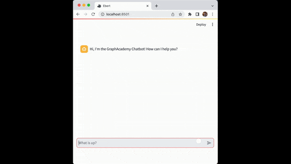

= Project Setup
:type: lesson
:order: 2
:disable-cache: true
:lab-filename: bot.py
:lab: {repository-blob}/main/{lab-filename}
:branch: main

Let's start by getting the project up and running.

== Get the code

You can use link:https://gitpod.io[Gitpod^] as an online IDE and workspace for this workshop.
It will automatically clone the workshop repository and set up your environment.

lab::Open `Gitpod workspace`[]

[NOTE]
You will need to login with a Github, Gitlab, or Bitbucket account.

Alternatively, you can clone the repository and set up the environment yourself.

[%collapsible]
.Develop on your local machine
====
You will need link:https://python.org[Python] installed and the ability to install packages using `pip`.

You may want to set up a virtual environment using link:https://docs.python.org/3/library/venv.html[`venv`^] or link:https://virtualenv.pypa.io/en/latest/[`virtualenv`^] to keep your dependencies separate from other projects.

Clone the link:{repository-link}[github.com/neo4j-graphacademy/llm-chatbot-python] repository:

[source,bash]
----
git clone https://github.com/neo4j-graphacademy/llm-chatbot-python
----

[TIP]
.Fork the repository
You can https://github.com/neo4j-graphacademy/llm-chatbot-python/fork[fork the repository] and have a copy for future reference.

Install the required packages using `pip`:

[source,bash]
----
cd llm-chatbot-python
pip install -r requirements.txt
----
====

You do not need to create a Neo4j database; you will use the provided sandbox instance.

== Starting the App

Open the `bot.py` file containing the main application code.

[%collapsible]
.bot.py
====
[source,python]
----
include::{repository-raw}/{branch}/bot.py[tag=**]
----
====

You can start the application using the `streamlit run` command.

[source,sh]
.Run the Streamlit app
----
streamlit run bot.py
----

Streamlit will start a server on http://localhost:8501.

Open the link to see the app running.

When you send a message, the app will display a red icon representing a _user_ message.
The app will wait for one second and then display the same message with an orange robot icon representing an _assistant_ message.

[#explore]
== Exploring `bot.py`

The code is as simple as possible so you can focus on the LLM integration.

[TIP]
If you are interested in _how_ to build the Chat interface from scratch, check out the link:https://docs.streamlit.io/knowledge-base/tutorials/build-conversational-apps[Streamlit build conversational apps documentation].

Let's take a look at `bot.py` in more detail.

=== Page Config

The code sets the `st.set_page_config()` to configure the title and icon used on the page.

.Page Config
[source,python]
----
include::{repository-raw}/{branch}/bot.py[tag=setup]
----

=== App Session State

The following code block checks the link:https://docs.streamlit.io/library/api-reference/session-state[session state^] for the current user.
The session saves the list of messages between the user and the LLM.

The code creates a default list of messages if the session is empty.

.Session
[source,python]
----
include::{repository-raw}/{branch}/bot.py[tag=session]
----

The session state will persist for as long as the user keeps their browser tab open.

As the app state changes, certain sections of the UI may be re-rendered.
Storing a list of messages to the session state ensures the app recreates the messages when the app its re-rendered.

=== Chat Messages

Within a container, any messages held in the session state are written to the screen using the `write_message()` helper function.

.Message List
[source,python]
----
include::{repository-raw}/{branch}/bot.py[tag=session]
----

The `write_message()` helper function has been link:{repository-blob}/main/utils.py[abstracted into the `utils.py` file^].

.Write Message Helper Function
[source,python]
----
include::{repository-raw}/{branch}/utils.py[tag=write_message]
----

The function accepts two positional arguments - the `role` of the author, either `human` or `assistant`, and the message.
You can pass an additional `save` parameter to instruct the function to append the message to the session state.

The block concludes by setting a `question` variable containing the user's input.
When the user sends their message, the `write_message()` function saves the message to the session state and displays the message in the UI.

=== Handling Submissions

The `handle_submit()` mocks an interaction by sleeping for one second before repeating the user's input.

.Stop copying me!
[source,python]
----
include::{repository-raw}/{branch}/bot.py[tag=submit]
----

You will modify this function to add interactions with the LLM.

== Check Your Understanding

include::questions/1-server.adoc[leveloffset=+1]

[.summary]
== Summary

In this lesson, you obtained a copy of the course code, installed the dependency and used the `streamlit run` command to start the app.

In the next module, you will start writing the code to interact with the LLM.
