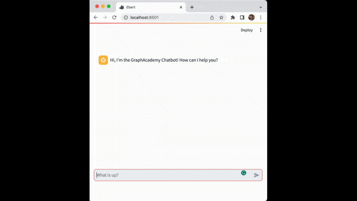

= Creating an Agent
:type: challenge
:order: 3
:lab: {repository-link}/
:branch: lc-0.2

Your app will interact with the LLM through an _Agent_.

Agents are objects that use an LLM to identify and execute actions in response to a user's input.
You can learn more in the link:/courses/llm-fundamentals/3-intro-to-langchain/4-agents/[Agents lesson in the Neo4j & LLM Fundamentals course^].

In this lesson, you will create and integrate a new agent into the chatbot.

You will need to:

. Create a chat chain as a _tool_ for the agent.
. Create a new agent.
. Create a handler function that instructs the agent to handle messages.
. Call the new handler function from `bot.py`

Open the `agent.py` file.
The code already imports the `llm` and `graph` instances you created in previous lessons.

.agent.py
[source,python]
----
include::{repository-raw}/{branch}/agent.py[]
----

== Create a tool

Tools are components that the Agent can use to perform actions. 

During this course, you will create multiple tools for the Agent to perform specific tasks. 
A tool is also required for "general chat" so the agent can respond to a user's input when no other tool is available.

Create a new `movie_chat` chain for the agent to use for general chat:

[source,python]
----
include::{repository-raw}/{branch}/solutions/agent-chat.py[tag=import_movie_chat]

include::{repository-raw}/{branch}/solutions/agent-chat.py[tag=movie_chat]
----

When you initialize the agent, you must pass a list of tools to the agent.

Add the `movie_chat` tool to a `tools` list:

[source,python]
----
include::{repository-raw}/{branch}/solutions/agent-chat.py[tag=import_tool]

include::{repository-raw}/{branch}/solutions/agent-chat.py[tag=tools]
----

When creating a tool, you specify three arguments:

1. The name of the tool, in this case, `General Chat`.
2. A description that the agent LLM will use when deciding which tool to use for a particular task.
3. The function to call once the agent has selected the tool. This tool, `movie_chat.invoke`, will return a response from the LLM.

== Conversation memory

The agent will need to be able to store and retrieve recent messages, allowing the agent to have a _conversation_, not simply respond to the last message.

You will use the `Neo4jChatMessageHistory` class to store and retrieve messages from your Neo4j sandbox.

When initializing the agent, you must specify a callback function to return the memory component.
The agent will pass a `session_id` to the callback, which you can use to retrieve the specific conversation for that session.

Add a callback `get_memory` function that returns a `Neo4jChatMessageHistory` object:

[source,python]
----
include::{repository-raw}/{branch}/solutions/agent-chat.py[tag=import_memory]

include::{repository-raw}/{branch}/solutions/agent-chat.py[tag=get_memory]
----

The `graph` object you created in the last lesson connects the `Neo4jChatMessageHistory` object to your Neo4j sandbox.

== Initializing an Agent

Langchain provides functions for creating a new Agent.
There are different link:https://python.langchain.com/docs/modules/agents/agent_types/[types of agents^] that you can create. 
You will use the `create_react_agent()` function to create a _ReAct_ - Reasoning and Acting) agent type.

You run an agent using an `AgentExecutor` object, which is responsible for executing the actions returned by the Agent.

Finally, you will wrap the agent in a `RunnableWithMessageHistory` object to handle the conversation history.

Add the code to initialize the agent:

[source,python]
----
include::{repository-raw}/{branch}/solutions/agent-chat.py[tag=import_agent]

include::{repository-raw}/{branch}/solutions/agent-chat.py[tag=agent]
----

=== Agent prompt

An agent requires a prompt. You could create a prompt, but in this example, the program pulls a pre-existing prompt from the link:https://smith.langchain.com/hub/[Langsmith Hub^].

The link:https://smith.langchain.com/hub/hwchase17/react-chat?organizationId=d9a804f5-9c91-5073-8980-3d7112f1cbd3[`hwcase17/react-chat`^] prompt instructs the model to provide an answer using the tools available in a specific format.

In the next lesson, you will modify the agent prompt.

== Verbose Output

The `verbose` argument of the `AgentExecutor` is set to `True` - this will output the agent's reasoning to the console.

Verbose output is helpful when debugging the agent's behavior and understanding how it makes decisions.

[%collapsible]
.An example output
====
    > Entering new AgentExecutor chain...
    Thought: Do I need to use a tool? Yes
    Action: General Chat
    Action Input: "Input": "tell me about a movie"Title: "Inception"

    "Inception" is a 2010 sci-fi thriller directed by Christopher Nolan, known for his work on "The Dark Knight" trilogy and "Interstellar." The film features a star-studded cast including Leonardo DiCaprio, Joseph Gordon-Levitt, Ellen Page, Tom Hardy, and Marion Cotillard.

    > Finished chain.
====

== Add a Handler Function

The `chat_agent` object is callable and will expect two parameters:

. The user's input
. A `session_id` to identify the conversation

Streamlit will pass the user input from `bot.py`.

You can use the `get_session_id()` function in the `util.py` module to retrieve a session ID from Streamlit.

Add a new `generate_response()` function to the `agent.py` file to handle the user's input:

[source,python]
----
include::{repository-raw}/{branch}/solutions/agent-chat.py[tag=import_get_session_id]

include::{repository-raw}/{branch}/solutions/agent-chat.py[tag=generate_response]
----

Review the code and note that:

. The function takes a single string, `user_input`.
. The `user_input` is passed to `chat_agent.invoke` method
. A `session_id` is retrieved using the `get_session_id()` function
. The function returns a single string - the final response, `output`, from the LLM.

[%collapsible]
.View the complete agent.py code
====
[source]
----
include::{repository-raw}/{branch}/solutions/agent-chat.py[tag=**]
----
====

== Calling the new Handler function

You can now update `bot.py` to call the new `generate_response()` function by modifying the `handle_submit()`

Open `bot.py` and import the `generate_response()` function from `agent.py`:

[source,python]
----
include::{repository-raw}/{branch}/solutions/bot.py[tag=import_agent]
----

Modify the `handle_submit()` function to call `generate_response()` and write the `response`:

[source,python]
----
include::{repository-raw}/{branch}/solutions/bot.py[tag=submit]
----

[%collapsible]
.View the complete bot.py code
====
[source]
----
include::{repository-raw}/{branch}/solutions/bot.py[tag=**]
----
====

== Receiving a Response

You now have the start of an intelligent LLM-integrated chatbot.

Run the Streamlit app and test the chatbot:

[source, sh]
----
streamlit run bot.py
----

Once you have received a response from the LLM, click the button below to mark the challenge as completed.

read::It works![]

[.summary]
== Summary

In this lesson, you created a Conversation agent capable of communicating with an LLM.
However, it is a good idea to specify what type of questions the LLM can respond to.

In the next lesson, you will define the agent's scope and restrict the type of responses it provides.
