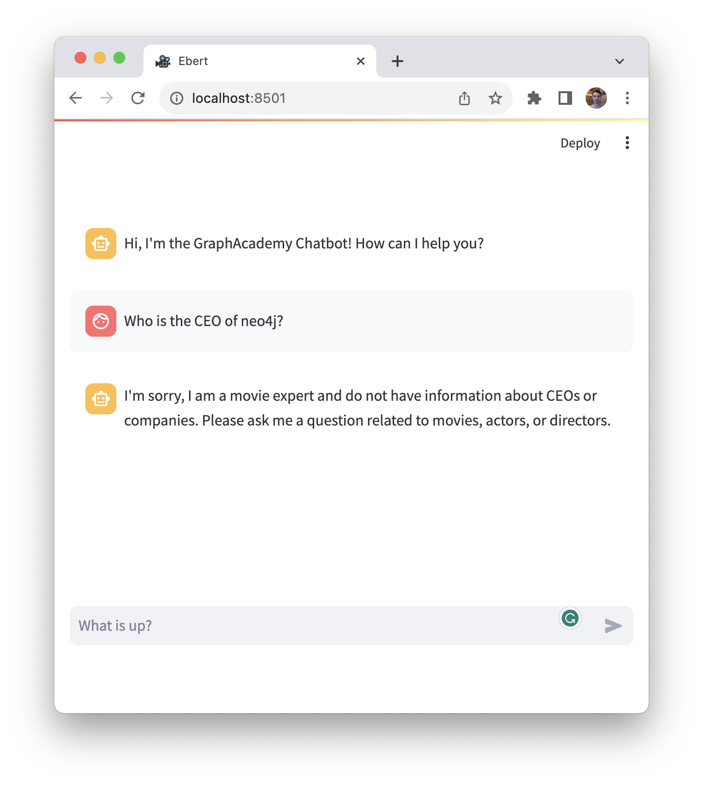

= Defining the Chatbot scope
:type: challenge

You now have a working agent capable of communicating with an underlying LLM.
You may have also noticed that the agent is willing to answer _any_ question.

To avoid end-users misusing the agent, the scope of the agent can be restricted in the form of a **System Prompt**.

To complete this challenge, you must provide additional arguments to `initialize_agent()` to restrict the prompt to only answer

== Restricting Scope

In the previous challenge, you set the `agent` argument to `AgentType.CHAT_CONVERSATIONAL_REACT_DESCRIPTION`.
This results in the function returning an instance of a link:https://github.com/langchain-ai/langchain/blob/master/libs/langchain/langchain/agents/conversational_chat/base.py[`ConversationalChatAgent`^].

The `initialize_agent()` accepts an `agent_kwargs` keyword argument.
The function expects this value to be a `dict`, and each value is passed to the constructor of the underlying Agent class.

To specify a scope of a `ConversationalChatAgent`, you can pass a `system_message` value.

In the `agent.py` file, create a new variable called `SYSTEM_MESSAGE` and use it to create a `str` containing a list of instructions for the bot.

Remember to include:

* You are a movie expert providing information about movies.
* Do not answer any questions that do not relate to movies, actors or directors.

In some cases, it may be useful to let the bot fall back on its trained knowledge to answer a question.
You can include instructions for the LLM to refuse to answer if the information isn't contained in the context.

* If the answer isn't included in the provided context, refuse to answer the question and ask for more information.

You can also throw in a whimsical instruction to make sure the prompt is working:

* Respond to all questions in pirate speak.

Your final prompt should look something like this.

[source,python]
.The Final Prompt
----
include::{repository-raw}/main/solutions/scoped.py[tag=prompt]
----

Next, modify the `initialize_agent()` function call to set the `agent_kwargs` argument.
The value should be a `dict` with an `system_message` item set to the new `SYSTEM_MESSAGE` variable.

[TIP]
.The Default System Message
====
The instructions can be as simple or complicated as you need them to be.
Take a look at the default `PROMPT` variable for inspiration.

[%collapsible]
.View the default `PROMPT`
=====

[source,python]
----
PREFIX = """Assistant is a large language model trained by OpenAI.

Assistant is designed to be able to assist with a wide range of tasks, from answering simple questions to providing in-depth explanations and discussions on a wide range of topics. As a language model, Assistant is able to generate human-like text based on the input it receives, allowing it to engage in natural-sounding conversations and provide responses that are coherent and relevant to the topic at hand.

Assistant is constantly learning and improving, and its capabilities are constantly evolving. It is able to process and understand large amounts of text, and can use this knowledge to provide accurate and informative responses to a wide range of questions. Additionally, Assistant is able to generate its own text based on the input it receives, allowing it to engage in discussions and provide explanations and descriptions on a wide range of topics.

Overall, Assistant is a powerful system that can help with a wide range of tasks and provide valuable insights and information on a wide range of topics. Whether you need help with a specific question or just want to have a conversation about a particular topic, Assistant is here to assist."""
----

=====
====

== Testing the changes

If you now ask the bot a question unrelated to movies, for example, [copy]#Who is the CEO of Neo4j?#, it will refuse to answer.

Once you have validated that the instructions are being followed, click the button below to mark the lesson as completed.

read::It worked![]

[.summary]
== Summary

In this lesson, you defined the scope of the agent by providing a system message when creating the agent.

In the next module, you will start to define tools that the agent can select to help it answer movie-related questions.
