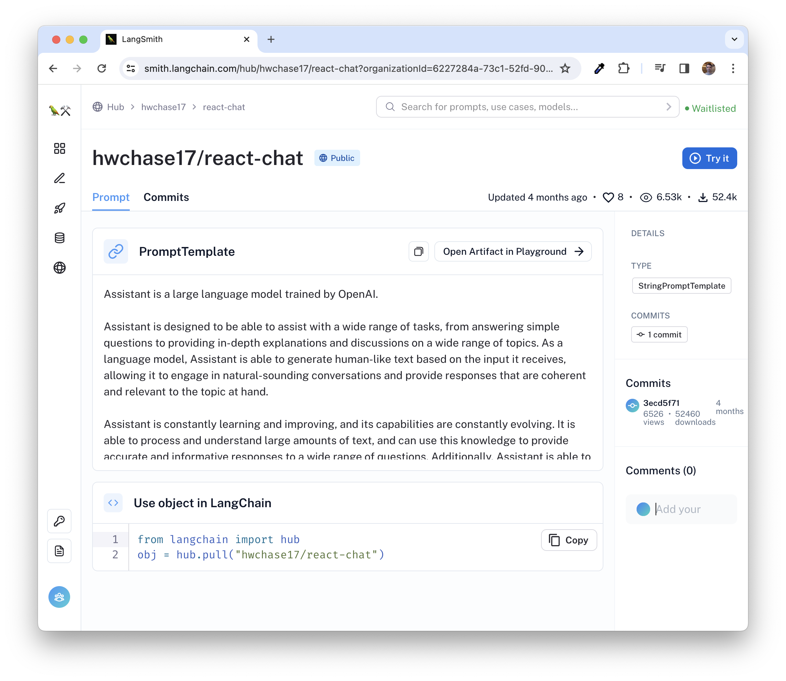

= Defining the Chatbot scope
:type: challenge
:order: 4

You now have a working agent capable of communicating with an underlying LLM.
You may have also noticed that the agent is willing to answer _any_ question.

To avoid end-users misusing the agent, the scope of the agent can be restricted in the form of a **System Prompt**.

To complete this challenge, you must provide specific instructions in the `prompt` argument.

== Restricting Scope

In the previous challenge, you used the Langchain hub to download the link:https://smith.langchain.com/hub/hwchase17/react-chat?organizationId=d9a804f5-9c91-5073-8980-3d7112f1cbd3[`hwchase17/react-chat` prompt^] for ReAct Agents.

You can link:https://smith.langchain.com/hub/hwchase17/react-chat?organizationId=d9a804f5-9c91-5073-8980-3d7112f1cbd3[view the prompt in the LangChain hub^]  and experiment with the instructions by clicking **Open Artifact in Playground**.

== Existing Instructions

The prompt itself is quite verbose, but the important elements included are:

* An instruction to use the list of tools to perform an action
* A placeholder for listing descriptions of the available tools (`{tools}`) and their names (`{tool_names}`)
* Instructions on how to instruct the LLM on which tool to use
* The previous chat history (`{chat_history}`)
* The user's current input (`{input}`)
* A _scratchpad_ of previous thoughts (`{agent_scratchpad}`)

[%collapsible]
.View the full prompt
====
[source,text]
----
include::./includes/original-prompt.txt[]
----

====

=== Updating the Instructions

You can leave everything from `Tools:` and below and update the opening instructions to reflect the role of the chatbot.

Your opening statements may look something like this:

[source,text]
.New Instructions
----
include::./includes/opening-instructions.txt[]
----

Remember to include:

* You are a movie expert providing information about movies.
* Do not answer any questions that do not relate to movies, actors or directors.

In some cases, letting the bot fall back on its trained knowledge to answer a question may be useful.
You can include instructions for the LLM to refuse to answer if the information isn't contained in the context.

* If the answer isn't included in the provided context, refuse to answer the question and ask for more information.

You can also throw in a whimsical instruction to make sure the prompt is working:

* Respond to all questions in pirate speak.

[%collapsible]
.View the updated prompt in full
====

[source,text]
----
include::./includes/updated-prompt.txt[]
----

====

=== Create a `PromptTemplate`

Add the new prompt to the agent by creating a new `PromptTemplate` using the `PromptTemplate.from_template()` method.

[source,python]
.Import PromptTemplate
----
include::{repository-raw}/main/solutions/scoped.py[tag=importprompt]
----

Then replace the `agent_prompt` variable with the updated instructions.

[source,python]
.Define the Agent Prompt
----
include::{repository-raw}/main/solutions/scoped.py[tag=prompt]
----

The agent initialization code will stay the same.

[source,python]
.Agent initialization
----
include::{repository-raw}/main/solutions/scoped.py[tag=agent]
----

== Testing the changes

If you now ask the bot a question unrelated to movies, for example, [copy]#Who is the CEO of Neo4j?#, it will refuse to answer.

image::images/refuse-to-answer.png[The Bot refusing to answer non-movie related question.]

Once you have validated that the instructions are being followed, click the button below to mark the lesson as completed.

read::It worked![]

[.summary]
== Summary

In this lesson, you defined the scope of the agent by providing a system message when creating the agent.

In the next module, you will start to define tools that the agent can select to help it answer movie-related questions.
