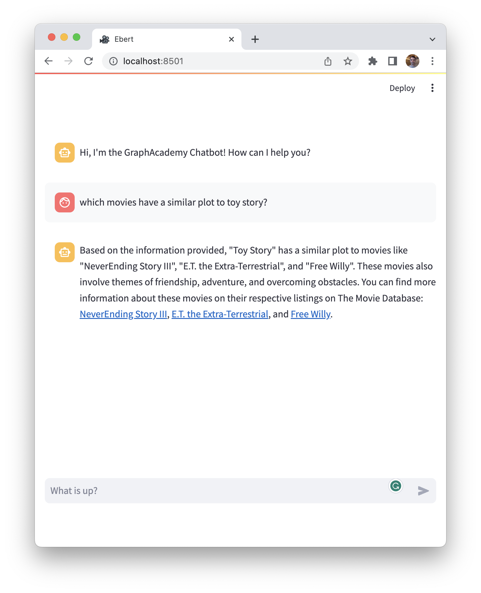

= Neo4j Retriever Tool
:type: challenge
:order: 1

In the link:/courses/llm-fundamentals/2-vectors-semantic-search/[Vectors & Semantic Search module of the Neo4j & LLM Fundamentals course^], you learned that unstructured content is often converted to vector embeddings to make them easy to compare and contrast, in an approach called Semantic Search.

In the link:/3-intro-to-langchain/6-retrievers/[Retrievers lesson^], you also learned how to create an instance of the `Neo4jVector` Store.

In this challenge, you will use that knowledge to create and register a tool that will use a Vector Search Index created on embeddings of the  `.plot` property of each movie to find similar movies.

You will need to:

1. Create an instance of a Neo4j Vector Store
2. Use the Neo4j Vector Store to create a Retriever
3. Create a Retrieval QA Chain that will handle the user input, create an embedding and use that to find similar documents in the Neo4j Vector Store
4. Register the Retrieval Chain as a tool in `agent.py`.

== Creating a Neo4j Vector Store

In Langchain, a Vector Store is a special type of store that handles the interaction between the application and a Vector database.

To interact with link:https://neo4j.com/docs/cypher-manual/current/indexes-for-vector-search/[Neo4j Vector Search Indexes^], you must create an instance of the `Neo4jVector` store.

In the project root, create a new folder called `tools`. 
This is where you will store the code for new tools you create.

In the `tools/` folder, create a new file called `vector.py`.

Add the following code to import `streamlit`, the `Neo4jVector` class, and the `llm` and `embeddings` objects created earlier in the course.

.Importing the Neo4jVector class
[source,python]
----
include::{repository-raw}/main/solutions/tools/vector.py[tags=importst]
include::{repository-raw}/main/solutions/tools/vector.py[tags=importvector]
include::{repository-raw}/main/solutions/tools/vector.py[tags=importllm]
----

Because link:/courses/llm-fundamentals/2-vectors-semantic-search/2-vector-index/[the index already exists in the database^], you can call the `from_existing_index` static method.

.Creating a Neo4jVector
[source,python]
----
include::{repository-raw}/main/solutions/tools/vector.py[tag=vector]
----

In the above call, the method is passed the following parameters:

1. The `embeddings` object that will be used to embed the user input.
2. The full URI of the Neo4j Instance, as set in `.streamlit/secrets.toml`.
3. The username required to connect to the database as set in `.streamlit/secrets.toml`.
4. The password required to authenticate the Neo4j user, as set in `.streamlit/secrets.toml`.
5. The name of the index.  The index created in the link:/courses/llm-fundamentals[Neo4j & LLM Fundamentals course] was named  `moviePlots`.
6. The label of node used to populate the index, in this case, `Movie`.
7. The name of the property that holds the original plain-text value, in this case, `plot`.
8. The name of the property that holds the embedding of the original text, in this case, `plotEmbedding`.

=== Modifying the Retrieval Query

The last parameter passed, `retrieval_query`, is an optional parameter that allows you to define which information is returned by the Cypher statement, loaded into each `Document` and subsequently passed to the LLM.
This value is appended to the end of the query after the index has been searched, and should always contain a `RETURN` clause.

The final statement should return a `text` value and a map of `metadata`, although what you specify in the `metadata` is up to you.

By default, this generates a list of properties, but in this example, the parameter is used to return specific information about the Movie node, including a link to the original movie listing on link:https://www.themoviedb.org/[themoviedb.org^].

The `directors` and `actors` fields provide information about the `(:Person)` nodes linked to the movie via `:DIRECTED` and `:ACTED_IN` relationships.

// TODO: Provide an example result

[TIP]
.Vector Creation Options
====
The `Neo4jVector` class also holds static methods for link:https://api.python.langchain.com/en/latest/vectorstores/langchain.vectorstores.neo4j_vector.Neo4jVector.html#langchain.vectorstores.neo4j_vector.Neo4jVector.from_documents[creating a new index from a list of documents^], or link:https://api.python.langchain.com/en/latest/vectorstores/langchain.vectorstores.neo4j_vector.Neo4jVector.html#langchain.vectorstores.neo4j_vector.Neo4jVector.from_embeddings[a list of embeddings^].
====

== Creating a Retriever

In Langchain applications, **Retrievers** are classes that are designed to retrieve documents from a **Store**.
Vector Retrievers are a specific type of retriever that are designed to retrieve documents from a **Vector Store** based on similarity.

All Store instances have an `as_retriever()` method which returns a Retriever configured to get documents from the store itself.

To create an instance of the `Neo4jVectorRetriever`, call the `as_retriever()` method.

.Creating a Neo4jVector
[source,python]
----
include::{repository-raw}/main/solutions/tools/vector.py[tag=retriever]
----

== Retrieval QA Chain

The `RetrievalQA` chain will be responsible for creating an embedding from the user's input, calling the Retriever to identify similar documents, and passing them to an LLM to generate a response.

Start by importing the `RetrievalQA` chain class.

.Importing the RetrievalQA class
[source,python]
----
include::{repository-raw}/main/solutions/tools/vector.py[tags=importretrievalqa]
----

Call the static `.from_llm()` method on the `RetrievalQA` to create a new chain, passing the following parameters:

1. The LLM that used to process the chain
2. A *Stuff* chain is a relatively straightforward chain that _stuffs_, or inserts, documents into a prompt and passes that prompt to an LLM.
3. The Chain should use the `Neo4jVectorRetriever` created in the previous step.

.Creating a new RetrievalQA Chain
[source,python]
----
include::{repository-raw}/main/solutions/tools/vector.py[tags=qa]
----

[TIP]
.More Complex 'Stuff' Retrieval Chains
====
We have chosen to use the `.from_llm()` method here because the `.plot` properties in the database are relatively short.
The function returns an instance with default prompts.

// TODO: Link? Reference?
If you find that you hit token limits, can also define chains with custom prompts that summarize the content before sending the information to the LLM.
====

== Registering the Retrieval QA Chain as a Tool

Now the Retrieval QA Chain is ready to register as a tool.

You may recall in the previous module, that you created a "General Chat" tool in `agent.py`.

Import the `kg_qa` Retrieval QA Chain from the `tools.vector` module.

.Importing the `kg_qa` chain
[source,python]
----
include::{repository-raw}/main/solutions/tools/vector.py[tags=importkgqa]
----

Add the tool to the `tools` array using the `.from_function()` static method.

.Registering the Tool
[source,python]
----
include::{repository-raw}/main/solutions/tools/vector.py[tags=tool]
----

[TIP]
.The @tool Decorator
====
You can either use the Tool using a static function or annotate the function with the `@tool` decorator.
However, do note that to use the `@tool` decorator, the function must accept a single `str` input and return a single `str` output.
====

== Testing the Tool

To test the tool, ask the bot to list movies with a similar **plot** to another film.
The bot should respond with a message starting with something along the lines of _"Based on the information provided..."_.

In this case, the response generated by the LLM also included links to the movie listings returned by the query as part of the `metadata` map.

In your console, you should see that the Agent has executed the **Vector Search Index** action with the name of the movie you mentioned.

[%collapsible]
.Executor Chain Output
====
    > Entering new AgentExecutor chain...
    {
        "action": "Vector Search Index",
        "action_input": "toy story"
    }
    Observation: {'question': 'toy story', 'answer': 'Based on the information provided, "Toy Story" is a movie about a cowboy doll who feels threatened and jealous when a new spaceman figure becomes the top toy in a boy\'s room. It is a heartwarming animated film that explores themes of friendship, loyalty, and acceptance. You can find more information about "Toy Story" on its listing on The Movie Database: [Toy Story](https://www.themoviedb.org/movie/862)', 'sources': '', 'source_documents': [Document(page_content="A cowboy doll is profoundly threatened and jealous when a new spaceman figure supplants him as top toy in a boy's room.", metadata={'tmdbId': '862', 'title': 'Toy Story', 'source': 'https://www.themoviedb.org/movie/862', 'actors': [['Jim Varney', 'Slinky Dog (voice)'], ['Tim Allen', 'Buzz Lightyear (voice)'], ['Tom Hanks', 'Woody (voice)'], ['Don Rickles', 'Mr. Potato Head (voice)']], 'directors': ['John Lasseter']}), Document(page_content='A young boy must restore order when a group of bullies steal the magical book that acts as a portal between Earth and the imaginary world of Fantasia.', metadata={'tmdbId': '27793', 'title': 'NeverEnding Story III, The', 'source': 'https://www.themoviedb.org/movie/27793', 'actors': [['Jack Black', 'Slip'], ['Melody Kay', 'Nicole'], ['Carole Finn', 'Mookie'], ['Jason James Richter', 'Bastian Bux']], 'directors': ['Peter MacDonald']}), Document(page_content='A troubled child summons the courage to help a friendly alien escape Earth and return to his home-world.', metadata={'tmdbId': '601', 'title': 'E.T. the Extra-Terrestrial', 'source': 'https://www.themoviedb.org/movie/601', 'actors': [['Peter Coyote', 'Keys'], ['Robert MacNaughton', 'Michael'], ['Henry Thomas', 'Elliott'], ['Dee Wallace', 'Mary']], 'directors': ['Steven Spielberg']}), Document(page_content='When a boy learns that a beloved killer whale is to be killed by the aquarium owners, the boy risks everything to free the whale.', metadata={'tmdbId': '1634', 'title': 'Free Willy', 'source': 'https://www.themoviedb.org/movie/1634', 'actors': [['Lori Petty', 'Rae Lindley'], ['Jayne Atkinson', 'Annie Greenwood'], ['August Schellenberg', 'Randolph Johnson'], ['Jason James Richter', 'Jesse']], 'directors': ['Simon Wincer']})]}
    Thought:{
        "action": "Final Answer",
        "action_input": "Based on the information provided, \"Toy Story\" has a similar plot to movies like \"NeverEnding Story III\", \"E.T. the Extra-Terrestrial\", and \"Free Willy\". These movies also involve themes of friendship, adventure, and overcoming obstacles. You can find more information about these movies on their respective listings on The Movie Database: [NeverEnding Story III](https://www.themoviedb.org/movie/27793), [E.T. the Extra-Terrestrial](https://www.themoviedb.org/movie/601), and [Free Willy](https://www.themoviedb.org/movie/1634)."
    }

    > Finished chain.
====

Once you have tested the bot, click the button below to mark the challenge as completed.

read::It works![]

[.summary]
== Summary

In this lesson, you added a new tool that uses the Vector Search Index to identify movies with similar plots to the user's input.

In the next lesson, you will create a tool that uses the LLM to generate a Cypher statement and executes it against the database.
