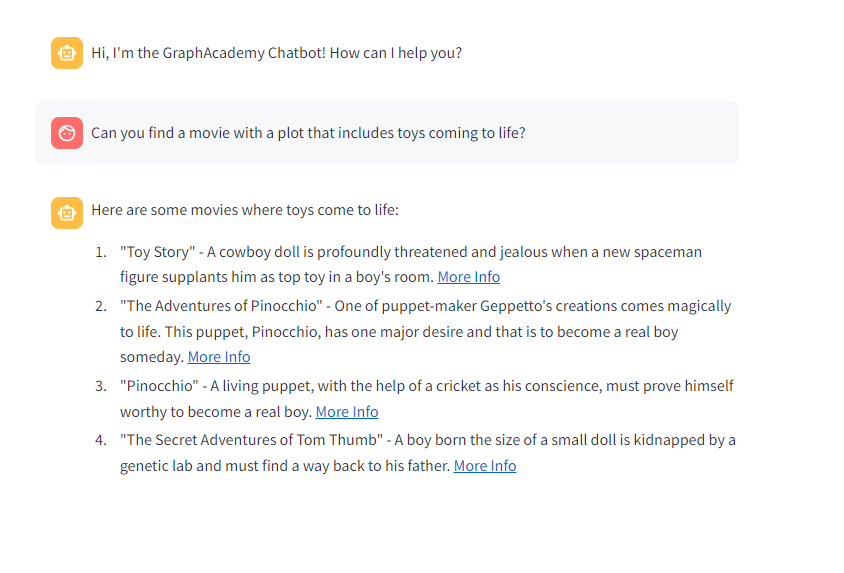

= Neo4j Retriever Tool
:type: challenge
:order: 1
:branch: main

In the link:/courses/llm-fundamentals/2-vectors-semantic-search/[Vectors & Semantic Search module of the Neo4j & LLM Fundamentals course^], you learned that unstructured content is often converted to vector embeddings to make them easy to compare and contrast, in an approach called Semantic Search.

In the link:/courses/llm-fundamentals/3-intro-to-langchain/6-retrievers/[Retrievers lesson^], you also learned how to create an instance of the `Neo4jVector` Store.

In this challenge, you will use that knowledge to create and register a tool that will use a Vector Search Index created on embeddings of the  `.plot` property of each movie to find similar movies.

You will need to:

1. Create an instance of a Neo4j Vector Store
2. Use the Neo4j Vector Store to create a retriever
3. Create a retriever chain that will handle the user input, create an embedding, and use that to find similar documents in the Neo4j Vector Store
4. Register the retriever chain as a tool in `agent.py`.

== Creating a Neo4j Vector Store

In Langchain, a Vector Store handles the interaction between the application and a Vector database.

To interact with link:https://neo4j.com/docs/cypher-manual/current/indexes-for-vector-search/[Neo4j Vector Search Indexes^], you must create an instance of the `Neo4jVector` store.

Open the `tools/vector.py` file in the `tools` directory.
The `tools` directory is where you will store the code for new tools you create.

.tools/vector.py
[source,python]
----
include::{repository-raw}/{branch}/tools/vector.py[tag=**]
----

The `streamlit` library and the `llm`, `embeddings`, and `graph` objects you created are already imported.

A `plotEmbedding` property, containing the vector embeddings of the `plot`, has been added to the `Movie` nodes in the database, and a vector index, `moviePlots`, has been created.

[%collapsible]
.View the plot embedding
====

Run the following Cypher to view the `plotEmbedding` property of the movie "Toy Story".

[source,cypher]
----
MATCH (m:Movie {title: "Toy Story"})
RETURN m.plot, m.plotEmbedding
----

====

As the index already exists in the database, you can use the `Neo4jVector.from_existing_index` static method.

.Creating a Neo4jVector
[source,python]
----
include::{repository-raw}/{branch}/solutions/tools/vector.py[tag=import_vector]

include::{repository-raw}/{branch}/solutions/tools/vector.py[tag=vector]
----

In the above call, the method is passed the following parameters:

. The `embeddings` object to embed the user input.
. The `graph` object to interact with the database.
. The name of the index, in this case `moviePlots`
. The label of node used to populate the index, in this case, `Movie`.
. The name of the property that holds the original plain-text value, in this case, `plot`.
. The name of the property that holds the embedding of the original text, in this case, `plotEmbedding`.

=== Modifying the Retrieval Query

The last parameter passed, `retrieval_query`, is an optional parameter that allows you to define which information is returned by the Cypher statement, loaded into each `Document` and subsequently passed to the LLM.
This value is appended to the end of the query after searching the index, and should always contain a `RETURN` clause.

The final statement should return a `text` value and a map of `metadata`, although what you specify in the `metadata` is up to you.

By default, this generates a list of properties, in this example, the parameter returns specific information about the Movie node, including a link to the original movie listing on link:https://www.themoviedb.org/[themoviedb.org^].

The `directors` and `actors` fields provide information about the `(:Person)` nodes linked to the movie via `:DIRECTED` and `:ACTED_IN` relationships.

[TIP]
.Vector Creation Options
====
The `Neo4jVector` class also holds static methods for link:https://api.python.langchain.com/en/latest/vectorstores/langchain_community.vectorstores.neo4j_vector.Neo4jVector.html#langchain_community.vectorstores.neo4j_vector.Neo4jVector.from_documents[creating a new index from a list of documents^], or link:https://api.python.langchain.com/en/latest/vectorstores/langchain_community.vectorstores.neo4j_vector.Neo4jVector.html#langchain_community.vectorstores.neo4j_vector.Neo4jVector.from_embeddings[a list of embeddings^].
====

== Creating a Retriever

In Langchain applications, you can use **Retrievers** classes to retrieve documents from a **Store**.
Vector Retrievers are a specific type of retriever that retrieve documents from a **Vector Store** based on similarity.

All store instances have an `as_retriever()` method, which returns a retriever configured to get documents from the store.

To create an instance of the `Neo4jVectorRetriever`, call the `as_retriever()` method.

.Creating a Neo4jVector
[source,python]
----
include::{repository-raw}/{branch}/solutions/tools/vector.py[tag=retriever]
----

== Retrieval Chain

The retrieval chain creates an embedding from the user's input, calls the retriever to identify similar documents, and passes them to an LLM to generate a response.

The chain will need a prompt that accepts the documents as `{context}` and the user input as `{input}`:

.Create the prompt
[source,python]
----
include::{repository-raw}/{branch}/solutions/tools/vector.py[tag=import_chat_prompt]

include::{repository-raw}/{branch}/solutions/tools/vector.py[tag=prompt]
----

Create a retrieval chain that uses the `llm`, `prompt`, and `retriever` objects:

.Create the chain
[source,python]
----
include::{repository-raw}/{branch}/solutions/tools/vector.py[tag=import_chain]

include::{repository-raw}/{branch}/solutions/tools/vector.py[tag=chain]
----

The code first creates a QA (question/answer) chain using `create_stuff_documents_chain`.
A *Stuff* chain is a relatively straightforward chain that _stuffs_, or inserts, documents into a prompt and passes that prompt to an LLM.

The retrieval chain is then created from the retriever and QA chain using `create_retrieval_chain`.

[TIP]
.More Complex 'Stuff' Retrieval Chains
====
You can modify the prompt to include more information about how to process the documents.
For example, if you were hitting token limits, you could add a step to summarize the content before sending it to the LLM.
====

Finally, you must add a function that can be used as a tool and invokes the chain when called.

[source,python]
----
include::{repository-raw}/{branch}/solutions/tools/vector.py[tag=get_movie_plot]
----

[%collapsible]
.View the complete code
====
.tools/vector.py
[source,python]
----
include::{repository-raw}/{branch}/solutions/tools/vector.py[tag=**]
----
====

== Registering the Retriever as a Tool

You can now use the retrieval chain as a tool in your agent.

This tool will be in addition to the "General Chat" tool you created in the previous module.

Open the `agent.py` file and import the `get_movie_plot` function from the `tools.vector` module:``

.agent.py
[source,python]
----
include::{repository-raw}/{branch}/solutions/agent-vector.py[tag=import_get_movie_plot]
----

Add the `get_movie_plot` function to the `tools` array:

[source,python]
----
include::{repository-raw}/{branch}/solutions/agent-vector.py[tag=tools]
----

The agent will use the tool's `name` and `description` to identify what tool to use.

[%collapsible]
.View the complete code
====
.agent.py
[source,python]
----
include::{repository-raw}/{branch}/solutions/agent-vector.py[tag=**]
----
====

[TIP]
.The @tool Decorator
====
You can create the tool using the static function `Tool.from_function` or annotate the function with the `@tool` decorator.
However, note that to use the `@tool` decorator, the function must accept a single `str` input and return a single `str` output.
====

== Testing the Tool

To test the tool, ask the bot to find movies with a particular **plot**.
The bot should respond with a message starting with a film based on that plot.

In this case, the response generated by the LLM also included links to the movie listings returned by the query as part of the `metadata` map.

In your console, you should see that the Agent has executed the **Movie Plot Search** action with the query.

[%collapsible]
.Executor Chain Output
====
    > Entering new AgentExecutor chain...

    Thought: The user is asking for a movie with a specific plot. I need to use a tool to find this information.
    Action: Movie Plot Search
    Action Input: Toys coming to life{'input': 'Toys coming to life', 'context': [Document(page_content="A cowboy doll is profoundly threatened and jealous when a new spaceman figure supplants him as top toy in a boy's room.", metadata={'title': 'Toy Story', 'tmdbId': '862', 'source': 'https://www.themoviedb.org/movie/862', 'actors': [['Jim Varney', 'Slinky Dog (voice)'], ['Tim Allen', 'Buzz Lightyear (voice)'], ['Tom Hanks', 'Woody (voice)'], ['Don Rickles', 'Mr. Potato Head (voice)']], 'directors': ['John Lasseter']}), Document(page_content="One of puppet-maker Geppetto's creations comes magically to life. This puppet, Pinocchio, has one major desire and that is to become a real boy someday. In order to accomplish this goal he ...", metadata={'title': 'Adventures of Pinocchio, The', 'tmdbId': '18975', 'source': 'https://www.themoviedb.org/movie/18975', 'actors': [['Martin Landau', 'Geppetto'], ['Udo Kier', 'Lorenzini'], ['Geneviève Bujold', 'Leona'], ['Jonathan Taylor Thomas', 'Pinocchio']], 'directors': ['Steve Barron']}), Document(page_content='A living puppet, with the help of a cricket as his conscience, must prove himself worthy to become a real boy.', metadata={'title': 'Pinocchio', 'tmdbId': '10895', 'source': 'https://www.themoviedb.org/movie/10895', 'actors': [['Mel Blanc', 'Gideon (hiccup) (voice) (uncredited)'], ['Don Brodie', 'Carnival Barker (voice) (uncredited)'], ['Walter Catlett', "'Honest John' Worthington Foulfellow (voice) (uncredited)"], ['Marion Darlington', 'Birds (voice) (uncredited)']], 'directors': ['Ben Sharpsteen', 'Hamilton Luske', ' T. Hee', 'Norman Ferguson']}), Document(page_content='A boy born the size of a small doll is kidnapped by a genetic lab and must find a way back to his father in this inventive adventure filmed using stop motion animation techniques. Tom meets...', metadata={'title': 'Secret Adventures of Tom Thumb, The', 'tmdbId': '18242', 'source': 'https://www.themoviedb.org/movie/18242', 'actors': [['Nick Upton', 'Pa Thumb'], ['Deborah Collard', 'Ma Thumb'], ['Frank Passingham', 'Man']], 'directors': ['Dave Borthwick']})], 'answer': 'No, the context does not discuss toys coming to life.'}The tool has provided several movies where toys come to life, including Toy Story, The Adventures of Pinocchio, Pinocchio, and The Secret Adventures of Tom Thumb.
    Final Answer: Here are some movies where toys come to life:
    1. "Toy Story" - A cowboy doll is profoundly threatened and jealous when a new spaceman figure supplants him as top toy in a boy's room. [More Info](https://www.themoviedb.org/movie/862)
    2. "The Adventures of Pinocchio" - One of puppet-maker Geppetto's creations comes magically to life. This puppet, Pinocchio, has one major desire and that is to become a real boy someday. [More Info](https://www.themoviedb.org/movie/18975)
    3. "Pinocchio" - A living puppet, with the help of a cricket as his conscience, must prove himself worthy to become a real boy. [More Info](https://www.themoviedb.org/movie/10895)
    4. "The Secret Adventures of Tom Thumb" - A boy born the size of a small doll is kidnapped by a genetic lab and must find a way back to his father. [More Info](https://www.themoviedb.org/movie/18242)

    > Finished chain.
====

Once you have tested the bot, click the button below to mark the challenge as completed.

read::It works![]

[.summary]
== Summary

In this lesson, you added a new tool that uses the Vector Search Index to identify movies with similar plots to the user's input.

In the next lesson, you will create a tool that uses the LLM to generate a Cypher statement and execute it against the database.
