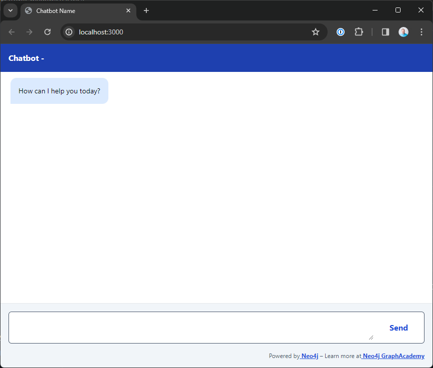

= Project Setup
:type: lesson
:order: 2
:disable-cache: true
:lab-filename: bot.py
:lab: {repository-blob}/main/{lab-filename}

Let's start by getting the project up and running.

If you plan to complete the course using the online IDE, you can skip to link:#explore[Exploring the `src/` folder].

== Local install

To run the project locally, you need to install the project dependencies.

[TIP]
.Online Labs
====
You can use the buttons on each lesson to complete the code in an Online IDE provided by link:https://gitpod.io[GitPod^].
To use GitPod, you must authenticate with a Github, Gitlab, or BitBucket account.

lab::Explore Repository in GitPod[]
====

=== Node.js

To run the project, you will need Node.js installed locally.
We have designed the project to work with Node.js **v20.11.x0 LTS**.

To install Node.js, follow the link:https://nodejs.org/[installation steps on nodejs.org^].

You can verify your Node.js version by running the following command.

[source,sh]
.Verify Node.js Version
node --version

=== Setting up the Project

The link:https://github.com/neo4j-graphacademy/llm-chatbot-typescript[project is hosted in a Github repository^].

You can use the GitHub UI or CLI to clone the repository or link:https://github.com/neo4j-graphacademy/llm-chatbot-typescript/archive/refs/heads/main.zip[download a ZIP archive^].
We recommend https://github.com/neo4j-graphacademy/llm-chatbot-typescript/fork[forking the repository] so you have a personal copy for future reference.

To clone the repository using the `git` CLI, you can run the following command.

[source,sh]
.Clone the Repository
----
git clone https://github.com/neo4j-graphacademy/llm-chatbot-typescript
----

=== Installing Dependencies

You can review the dependencies required to run the project in the link:{repository-blob}/main/package.json[`package.json`] file in the project root.

Run the `npm install` command to install the dependencies.

[source,sh]
.Install Depencencies
cd llm-chatbot-typescript
npm install --include=dev

=== Setting Environment Variables

To connect to Neo4j, you must set your Neo4j Sandbox credentials as environment variables.

To set environment variables in a Next.js application, you can create a `.env.local` file.
You can link:https://nextjs.org/docs/pages/building-your-application/configuring/environment-variables[read more about Next.js Environment Variables in the Next.js documentation^].

We have included an example `.env.example` file in the project root with the variables you must set to use Neo4j and OpenAI.

Copy the `.env.example` file to `.env.local` and append the following variables:

.env.local
[source,env,subs="attributes+"]
----
NEO4J_URI="bolt://{sandbox_ip}:{sandbox_boltPort}"
NEO4J_USERNAME="{sandbox_username}"
NEO4J_PASSWORD="{sandbox_password}"
----

You must also set your OpenAI API key.
You can find link:https://help.openai.com/en/articles/4936850-where-do-i-find-my-openai-api-key[instructions on generating an API key on openai.com^].

Replace the `OPENAI_API_KEY` value with your OpenAI API key.

.env.local
[source,env]
----
OPENAI_API_KEY="sk-..."
----

[WARNING]
.Keep your secrets safe
====
Never share your API keys.
We have added the `.env.local` file to `.gitignore` so the contents are not unintentionally committed to Github.
====

=== Starting the App

To start the app, run the `npm run dev` command.

[source,sh]
.Run the Next.js app
----
npm run dev
----

This command command will start a server on http://localhost:3000.
Once you have run the command, you should see the following interface.

When the user sends a message, the app will render the message in a box aligned to the right of the screen, similar to other chat apps.
The app will display any messages returned by the API to the left of the screen.

[#explore]
== Exploring the `src/` folder

We have purposely kept the code simple so you can focus on the LLM integration.

The `app/` folder contains the general application code, plus some custom CSS.
The `components/` folder contains React components that display the chat interface, including the form, message, and a _thinking_ indicator.

The `hooks/` folder contains the React hook that holds the chatbot's state and enables the chat interface.
When the form is submitted, the application state is updated to show the loading indicator and send an HTTP POST request to the `/api/chat/` endpoint, where it will generate a response.
When a response is received, the message is stored in the state and appended to the chat interface.

=== Handling Submissions

A link:{repository-blob}/main/src/pages/api/chat.ts[route handler in the `src/pages/api/chat.ts` file^] extracts the user's input and the current Session ID from the request.

Then, it passes the input and Session ID to link:{repository-blob}/main/src/modules/agent/index.ts[the `call()` function in the `src/modules/agent/index.ts` file^]. For now, the `call()` function simply returns the user's input after a short delay, but it will eventually provide an interface to the LLM.

// TODO: video?

== Check Your Understanding

include::questions/1-server.adoc[leveloffset=+1]

[.summary]
== Summary

In this lesson, you obtained a copy of the course code, installed the dependency and used the `npm run dev` command to start the app.

In the next lesson, you will set the scope for the project.
