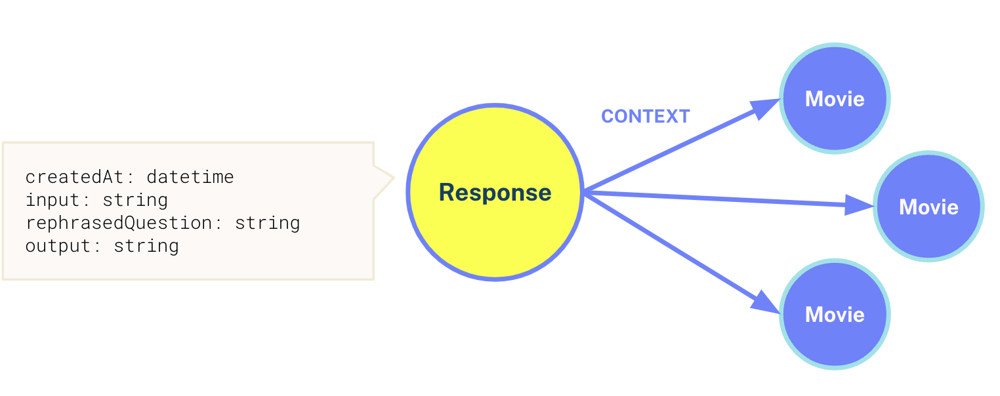
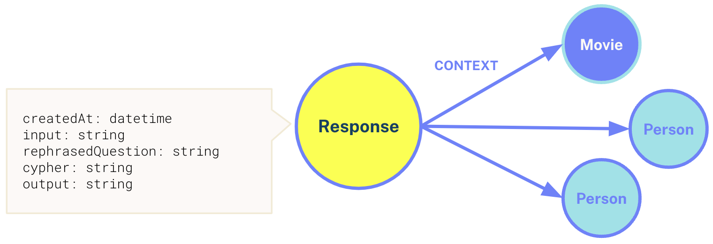
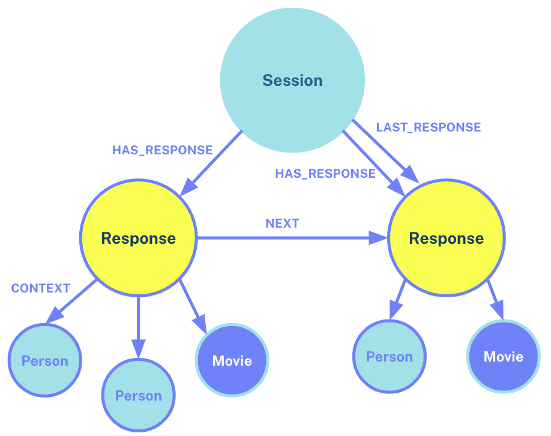

= The Conversation Model
:type: quiz

Before going any further, it is worth pausing to think about how we will store the conversation history in the graph.

We have two chains that use different methods to retrieve information from the graph, but both need to store memory consistently.
As the particular implementation may change based on the method of data retrieval, the chains themselves will be responsible for persisting the memory, keeping the logic close to the chain.

Let's walk through an example conversation with a user asking for a recommendation.

// TODO: Image>

* **Human:** Can you recommend me a movie about robots?
* **AI:** Sure, _iRobot_ is a 2004 sci-fi film where a homicide detective with a distrust of robots investigates a homicide with the help of a robopsychologist.
* **Human:** That doesn’t sound very age appropriate, can you recommend a film suitable for children?
* **AI:** Oh, sorry. _WALL-E_  is a 2008 animated film where a waste-cleaning robot falls in love and saves the world.  It has a 4.2 star rating.
* **Human:** That sounds interesting, tell me more…
* **AI:** The film is a _Disney Pixar_ production directed by _Andrew Stanton_.  _Ben Burtt_ voices WALL-E, while __Jeff Garlin__ plays Captain B. McCrea.

== Retrieval Tool

When the human asks for a recommendation based on its plot, the chatbot will use the rephrased version of the question to identify similar documents using the Retrieval tool.
The original text that the embedding has been derived from will be passed to the LLM, which will be used to generate a natural language answer.

At the same time, the chain will be responsible for creating a `:CONTEXT` relationship from the `(:Response)` node to the node that contains the embedding.

// [%collapsible]
// .Retrieval History Cypher Statement
// ====

// The following statement will:

// 1. Find or create the user's session
// 2. Create a new `(:Response)` node with properties
// 3. If it exists, remove any existing `:LAST_RESPONSE` relationship from the session
// 4. Use the `last` node in the chain to create a `:NEXT` relationship to the newly created node
// 5. Create a `:LAST_RESPONSE` relationship from the session to the new Response node
// 6. Create `:CONTEXT` relationships to any element IDs used in the response

// [source,cypher]
// .Save Conversation History
// ----
// include::{repository-raw}/{branch}/cypher/save-response.cypher[]
// ----
// ====

== Cypher Tool

As the human asks more complex questions, the chatbot will need to fall back to the Cypher tool, which will generate and execute a Cypher statement capable of answering the rephrased question.

The Cypher generation prompt in the tool must be instructed to return the `elementId` of the node along with any relevant properties.
This will allow the chain to create a similar `:CONTEXT` relationship similar to the retrieval tool, and provide additional clarity on the response.

The `(:Response)` node should also store the generated Cypher statement.

The only difference in this model is the addition of the `.cypher` property on the `(:Response)`.

// [%collapsible]
// .Cypher Tool Cypher Statement
// ====

// The following statement will:

// 1. Find or create the user's session
// 2. Create a new `(:Response)` node with properties
// 3. If it exists, remove any existing `:LAST_RESPONSE` relationship from the session
// 4. Use the `last` node in the chain to create a `:NEXT` relationship to the newly created node
// 5. Create a `:LAST_RESPONSE` relationship from the session to the new Response node
// 6. Create `:CONTEXT` relationships to any element IDs used in the response

// // TODO: Combine these - save-response.cypher
// [source,cypher]
// ----
// include::{repository-raw}/{branch}/cypher/save-response.cypher[]
// ----
// ====

== Saving the conversation history

Each input and response will need to be saved to the database and contain the original input, the rephrased question, and the output from the LLM.

As **users** receive one or more **response**s within a **session**, this forms a natural hierarchy of `(:Session)` nodes, each of which will contain relationships to many `(:Response)` nodes.

// // TODO: diagram
// [source,cypher,rel=norun]
// ----
// (:User)-[:HAS_SESSION]->(:Session {id: uuid})-[:HAS_RESPONSE]->(:Response)
// ----

Every `(:Response)` node, regardless of how it is created, should hold the following properties:

* `.createdAt` - When the question was asked
* `.input` - The original input that comes from the user
* `.rephrasedQuestion` - The standalone question rephrased by the LLM using the conversation history
* `.output` - The output subsequently generated by the LLM following the RAG stage

=== Creating a Response Chain

Creating a chain of `:NEXT` relationships between responses will provide an optimal way to find the conversation history.

When a new response is added, it will be created with an additional `:LAST_RESPONSE` relationship from the `(:Session)` node.
This relationship provides a shortcut to find the latest response in the session from which the `:NEXT` relationship can be followed to find the recent response history.

This is more performant than collecting all responses in memory and ordering by the `.createdAt` timestamp, the `:NEXT` relationship can be followed to retrieve a window of previous responses from the conversation.

This `:LAST_RESPONSE` pointer will need to be actively maintained, removing any old relationships before creating a new one to ensure that the pointer is correct.

[TIP]
.Modeling Decisions
====
You can learn more about modeling nodes and relationships in the link:/courses/modeling-fundamentals/[Graph Data Modelling Fundamentals course^].
====

== Saving responses

You will use the following Cypher statement to save conversation history to the database.

[source,cypher]
----
include::{repository-raw}/{branch}/cypher/save-response.cypher[]
----

The statement performs the following actions:

1. Find or create the user's session
2. Create a new `(:Response)` node with properties
3. If it exists, remove any existing `:LAST_RESPONSE` relationship from the session
4. Use the `last` node in the chain to create a `:NEXT` relationship to the newly created node
5. Create a `:LAST_RESPONSE` relationship from the session to the new Response node
6. Create `:CONTEXT` relationships to any element IDs used in the response

== Rephasing Questions

In the next lesson, you will build a chain that uses this conversation history model to rephrase a question into a standalone question.

== Check Your Understanding

include::questions/1-context.adoc[leveloffset=+1]
include::questions/2-next.adoc[leveloffset=+1]
include::questions/3-last-response.adoc[leveloffset=+1]

[.summary]
== Summary

In this lesson, we explored the data model that will be used to store conversation history in the graph and the information that should be stored in the database by each chain.

In the next lesson, you will create a `Neo4jGraph` object for interacting with Neo4j.
