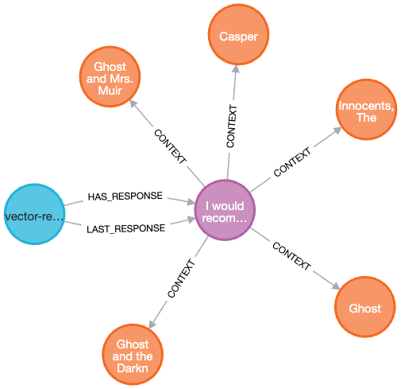

= Using History to Filter Results
:type: lesson
:optional: true
:order: 3

The penultimate step in link:../2-retrieval-chain/[the previous challenge^] used the `saveHistory()` function to create `:CONTEXT` relationships between the `(:Response)` node and any nodes passed to the LLM when generating the answer.

Adding a feedback loop to the application would allow it to exclude answers from the context where it has been suggested for similar enquiries where the response was marked as unhelpful.

// TODO: Move to application, support in application?
[source,typescript]
----
export async function provideFeedback(responseId: string, helpful: boolean): Promise<void> {
  await write(`
    MATCH (r:Response {id: $responseId})
    CALL {
      WITH r
      WITH r WHERE $helpful = true
      SET r:HelpfulResponse
    }
    CALL {
      WITH r
      WITH r WHERE $helpful = false
      SET r:UnhelpfulResponse
    }
  `, { responseId, helpful })
}
----

With this information, you can utilize the `gds.similarity.cosine` function from the link:https://neo4j.com/docs/graph-data-science/current/[Graph Data Science library^] to identify similar questions and exclude nodes that have frequently appeared in responses marked as unhelpful.

[source,typescript]
----
const store = await Neo4jVectorStore.fromExistingIndex(embeddings, {
  // ...
  retrieval_query=`
    OPTIONAL MATCH (node)<-[:CONTEXT]-(r:NegativeResponse)
    WHERE gds.similarity.cosine(r.embedding, $embedding) > 0.9
    WITH node, score, count(r) AS count
    WHERE count <= 10
    RETURN
      node.text AS text, score,
      { url: node.url, title: node.title } as metadata
    ORDER BY score DESC
    LIMIT 5
  `
})
----

Keep in mind that the number of nodes will be reduced, so when creating the retriever, you should set the `k` parameter to be greater than the number of documents you would like to ultimately receive.

.Increasing k
[source,typescript]
----
const retriever = store.asRetriever(20)
----

[TIP]
.Graph Data Science
====
You can learn more about the Graph Data Science library in the link:https://graphacademy.neo4j.com/courses/gds-product-introduction/[Introduction to Graph Data Science course^].
====

read::Mark as read[]

[.summary]
== Summary

In this lesson, you learned how to use user feedback to improve the quality of information passed to the LLM when performing Retrieval Augmented Generation.

In the next lesson, you will learn you will create a tool capable of generating Cypher statements.
