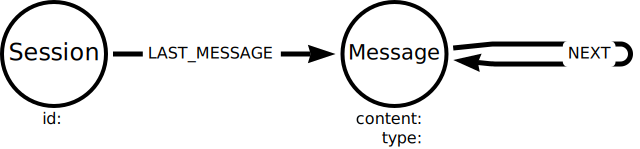

= Storing Conversation History
:order: 6
:type: lesson
:disable-cache: true

Langchain includes functionality to integrate directly with Neo4j, including allowing you to run Cypher statements, query vector indexes and use Neo4j as a conversation memory store.

In this lesson, you will learn how to connect to and use a Neo4j database as a conversation memory store.

Storing conversation history in a Neo4j database allows you to analyze the conversation history to understand trends and improve outcomes.

== Connecting to a Neo4j instance

You must install the `neo4j` Python package to connect to a Neo4j database.

[source,shell]
----
pip install neo4j
----

The following code will connect to a Neo4j database and run a simple query.

[source,python]
----
include::code/connect-to-neo4j.py[]
----

You can connect to the Neo4j sandbox created for you when you joined the course.

Update the code above to use the `url`, `username` and `password` of your Neo4j sandbox.

Connection URL:: [copy]#bolt://{sandbox_ip}:{sandbox_boltPort}#
Username:: [copy]#{sandbox_username}#
Password:: [copy]#{sandbox_password}#

Run the query - you should see data about the movie Toy Story.

The `Neo4jGraph` class is a wrapper to the link:https://neo4j.com/docs/python-manual/current/[Neo4j Python driver^]. 
It simplifies connecting to Neo4j and integrating with the Langchain framework.

=== Schema

When you connect to the Neo4j database, the object loads the database schema into memory - this enables Langchain to access the schema information without having to query the database.

You can access the schema information using the `schema` property.

[source,python]
----
print(graph.schema)
----

[TIP]
.Refreshing the schema
You can refresh the schema by calling the `graph.refresh_schema()` method.

== Conversation History

In the previous lesson, you used the `ChatMessageHistory` component to store conversation history in memory.

[%collapsible]
.Reveal the code
====
[source,python]
----
include::../3.5-memory/code/chat-model-memory.py[tags=**]
----
====

You will now update this program to store the conversation history in your Neo4j sandbox using the `Neo4jChatMessageHistory` component.

=== Session ID

To identify individual conversations, you need to create and assign a session ID to each conversation.

The session ID can be any unique value, such as a link:https://en.wikipedia.org/wiki/Universally_unique_identifier[Universally Unique Identifier (UUID)^].

You can generate a random UUID using the Python `uuid.uuid4` function.

Create a new `SESSION_ID` constant in your chat model program.

[source,python]
----
include::code/chat-model-memory-neo4j.py[tags=session-id]
----

This session ID will be used to identify the conversation in Neo4j.

=== Neo4j Chat Message History

Create a `Neo4jGraph` object to connect to your Neo4j sandbox.

[source,python]
----
include::code/chat-model-memory-neo4j.py[tags=import-neo4j]

include::code/chat-model-memory-neo4j.py[tags=neo4j-graph]
----

Remember to update the connection details with your Neo4j sandbox details.

[%collapsible]
.Click to reveal your Sandbox connection details
====
Connection URL:: [copy]#bolt://{sandbox_ip}:{sandbox_boltPort}#
Username:: [copy]#{sandbox_username}#
Password:: [copy]#{sandbox_password}#
====

Previously the `get_memory` function returned an instance of  `ChatMessageHistory`. 

The `get_memory` function should now return an instance of `Neo4jChatMessageHistory`.
The `session_id` should be passed as a parameter, along with the `graph` connection you just created.

[source,python]
----
include::code/chat-model-memory-neo4j.py[tags=get-memory]
----

Finally, you need to add the `SESSION_ID` to the `config` when you `invoke` the chat model.

[source,python]
----
include::code/chat-model-memory-neo4j.py[tags=invoke]
----

[%collapsible]
.Click to reveal the complete code.
====
[source,python]
----
include::code/chat-model-memory-neo4j.py[tags=**]
----
====

Run the program and have a conversation with the chat model.
The conversation history will now be stored in your Neo4j sandbox.

=== Conversation History Graph

The conversation history is stored using the following data model:

The `Session` node represents a conversation session and has an `id` property.

The `Message` node represents a message in the conversation and has the following properties:

* `content` - The message content
* `type` - The message type: `human`, `ai`, or `system`

The `LAST_MESSAGE` relationship connects the `Session` node to the last `Message` node in the conversation. The `NEXT` relationship connects `Message` nodes in the conversation.

You can return the graph of the conversation history using the following Cypher query:

[source, cypher]
----
MATCH (s:Session)-[:LAST_MESSAGE]->(last:Message)<-[:NEXT*]-(msg:Message)
RETURN s, last, msg
----

You can return the conversation history for a single session by filtering on the `Session.id` property.

[source, cypher]
----
MATCH (s:Session)-[:LAST_MESSAGE]->(last:Message)
WHERE s.id = 'your session id'
MATCH p = (last)<-[:NEXT*]-(msg:Message)
UNWIND nodes(p) as msgs
RETURN DISTINCT msgs.type, msgs.content
----

== Check Your Understanding

include::questions/1-neo4jgraph.adoc[leveloffset=+1]

[.summary]
== Summary

In this lesson, you learned how to use a Neo4j database as a conversation memory store.

In the next lesson, you will learn how to create an agent to give an LLM access to different tools and data sources.
