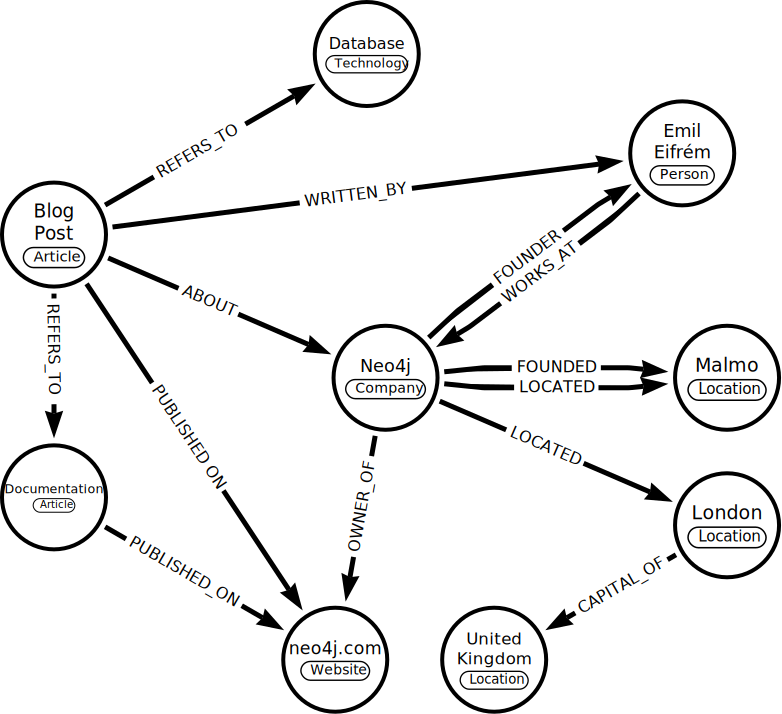
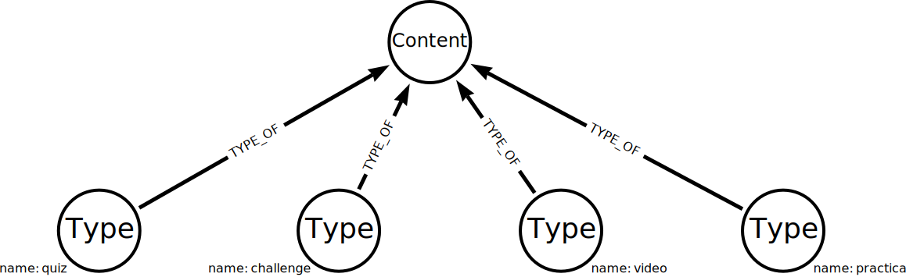
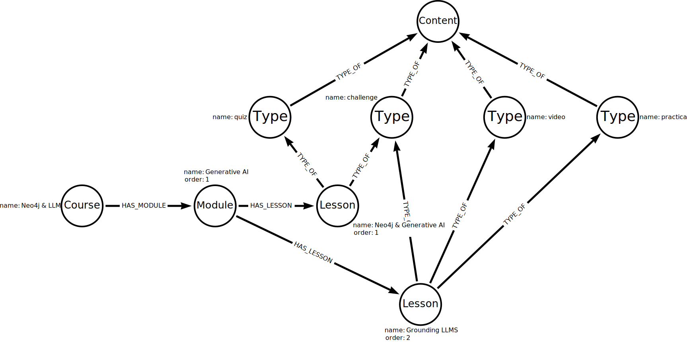

= What is a Knowledge Graph
:order: 1
:type: lesson

What is a knowledge graph
Provide a definition of a knowledge

== A definition

_A knowledge graph is an organized representation of real-world entities and their relationships._ 

Knowledge graphs provide a structured way to represent entities, their attributes, and their relationships, allowing for a comprehensive and interconnected understanding of the information.

You may not be familiar with the term knowledge graph, but you have probably used one. Search engines typically use knowledge graphs to provide information about people, places, and things.

The following knowledge graph could represent Neo4j:

Knowledge graphs can break down sources of information and integrate them, allowing you to see the relationships between the data.

image::images/generic-knowledge-graph.svg[a diagram of an abstract knowledge graph showing how sources contain chunks of data about topics which can be related to other topics]

This integration from diverse sources gives knowledge graphs a more holistic view and facilitates complex queries, analytics, and insights.

Knowledge graphs can readily adapt and evolve as they grow, taking on new information and structure changes.

Neo4j is well-suited for representing and querying complex, interconnected data in Knowledge Graphs.
Unlike traditional relational databases, which use tables and rows, Neo4j uses a graph-based model with nodes and relationships.

== Organizing principles

_A knowledge graph stores data and relationships alongside frameworks known as organizing principles._ 

The organizing principles are the rules or categories around the data that provide structure to the data.
Organizing principles can range from simple data descriptions, for example, describing a GraphAcademy course as `course -> modules -> lessons`, to a complex vocabulary of the complete solution.

Knowledge graphs are inherently flexible, and you can change the organizing principles as the data grows and changes.

The organizing principles to describe the types of lesson content GraphAcademy could look like this:

The organizing principles are stored as nodes in the graph so can be stored alongside the actual data.
For example, mapping the organizing principles to the lesson content in GraphAcademy could look like this:

This integration of knowledge graph and data allows for complex queries and analytics to be performed on the data.

== Creating knowledge graphs

Creating knowledge graphs from unstructured data can be complex, involving multiple steps of data query, cleanse, and transform.

You can use the text analysis capabilities of Large Language Models (LLMs) to help automate knowledge graph creation.

During this course, you will learn how to use LLMs to create knowledge graphs in Neo4j.

== Check Your Understanding

include::questions/1-knowledge-graphs.adoc[leveloffset=+1]

[.summary]
== Lesson Summary

In this lesson, you learned about knowledge graphs and how they are an organized representation of real-world entities and their relationships.

You can learn more in the Neo4j blog post link::https://neo4j.com/blog/what-is-knowledge-graph[What Is a Knowledge Graph?^].

In the next lesson, you will learn about the benefits and challenges of creating knowledge graphs.
