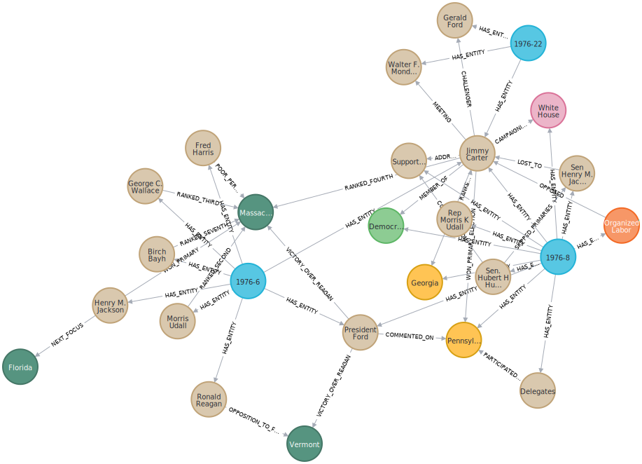
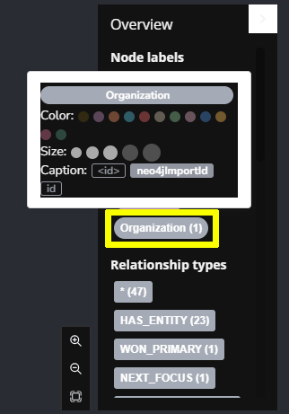
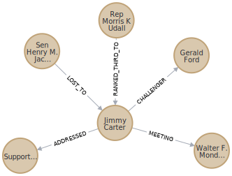

= Explore a Knowledge Graph
:order: 3
:type: lesson
:sandbox: true
:branch: main

The sandbox contains a prebuilt knowledge graph.

The knowledge graph represents just 3 news articles covering the 1976 United States presidential election:

- link:{repository-blob}/{branch}/llm-knowledge-graph/data/newswire/pdfs/1976-6.pdf[1976-6^]: "Jackson wins Massachusetts Democratic primary."
- link:{repository-blob}/{branch}/llm-knowledge-graph/data/newswire/pdfs/1976-8.pdf[1976-8^]: "Carter wins Pennsylvania Democratic primary"
- link:{repository-blob}/{branch}/llm-knowledge-graph/data/newswire/pdfs/1976-22.pdf[1976-22^]: "Jimmy Carter wins Presidency"

[NOTE]
.Learn more about these news articles
====
The 3 articles were taken from the link:https://huggingface.co/datasets/dell-research-harvard/newswire[NewsWire dataset^] that contains 2.7 million unique public domain U.S. news wire articles, written between 1878 and 1977.

The dataset was created to provide researchers with a large, high-quality corpus of historical news articles.
These texts provide a massive repository of information about historical topics and events - and which newspapers were covering them. The dataset will be useful to a wide variety of researchers including historians, other social scientists, and NLP practitioners.

You can view the link:{repository-blob}/{branch}/llm-knowledge-graph/data/newswire/extract_articles.py[Python code which extracted these articles from the dataset^] in the link:{repository-link}[`llm-knowledge-graph-construction` repository^].
====

The knowledge graph maps the relationships between the following entity types referred to in the articles:

- `Person`
- `Location`
- `Organization`
- `Building`
- `Political party`
- `State`

Run this Cypher to reveal how the entities from the articles are related to each other:

[source,cypher]
----
MATCH p=(a:Article)-[:HAS_ENTITY]->(e)-[r]-()
RETURN p
----

You can see that all 3 articles are connected within the graph through the `Person` entity *Jimmy Carter*.

[TIP]
.Node colors and captions
====
You can set the color of nodes and the text displayed by clicking on the node label, selecting a color and a property to use as the caption.

====

The relationships within knowledge graphs allow you to explore how entities are connected and related to each other.

For example, how was *Jimmy Carter* connected to other `Person` entities:

[source,cypher]
----
MATCH (p:Person {id:"Jimmy Carter"})-[r]-(p2:Person)
RETURN p, r, p2
----

You can use the nodes and relationships to understand how different entities are related, for example, `Person` and `State` entities:

[source,cypher]
----
MATCH (p:Person)-[r]-(s:State)
RETURN p, r, s
----

The following query will show you how the entities of a specific article are connected in the knowledge graph:

[source,cypher]
----
MATCH (a:Article {id:"1976-8"})-[:HAS_ENTITY]->(e)

MATCH (e)-[r]-(e2) 
WHERE (a)-[:HAS_ENTITY]->(e2)

RETURN e, r, e2
----

Restricting the entities to only those from a specific article will give you a structured data view of that article.

Take some time to explore the knowledge graph and see how the entities are connected.
Clicking on a node will display its properties.
You can double-click on a node or click to focus on a node, then click the graph icon to expand its relationships.

== Check Your Understanding

include::questions/1-challenger.adoc[leveloffset=+2]

[.summary]
== Summary

In this lesson, you explored a pre-built knowledge graph in Neo4j.

In the next lesson, you will learn more about typical use cases for a knowledge graph.