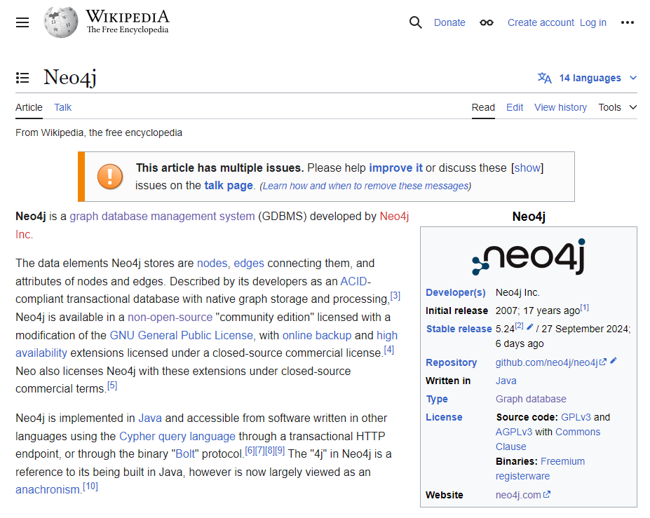

= How to Construct a Knowledge Graph with an LLM
:order: 1
:type: lesson

In this lesson, you will learn the process of constructing a knowledge graph using a Language Model (LLM).

== The construction process

Typically, you would follow these steps to construct a knowledge graph from unstructured text using an LLM:

. Gather the data
. Chunk the data
. _Vectorize_ the data
. Pass the data to an LLM to extract nodes and relationships
. Use the output to generate the graph

=== Gather your data sources

The first step is to gather your unstructured data.
The data can be in the form of text documents, PDFs, publicly available data, or any other source of information.

Depending on the format, you may need to reformat the data into a format (typically text) that the LLM can process.

The data sources should contain the information you want to include in your knowledge graph.

=== Chunk the data

The next step is to break down the data into _right-sized_ parts.
This process is known as chunking.

The size of the chunks depends on the LLM you are using, the complexity of the data, and what you want to extract from the data.

You may not need to chunk the data if the LLM can process the entire document at once and it fits your requirements.

You can learn more about chunking in the GraphAcademy course link:https://graphacademy.neo4j.com/courses/llm-vectors-unstructured/3-unstructured-data/2-chunking/[Introduction to Vector Indexes and Unstructured Data^].

=== Vectorize the data

Depending on your requirements for querying and searching the data, you may need to create *vector embeddings*.
You can use any embedding model to create embeddings for each data chunk, but the same model must be used for all embeddings.

Placing these vectors into a link:https://neo4j.com/docs/cypher-manual/current/indexes/semantic-indexes/vector-indexes/[Vector index^] allows you to perform semantic searches, similarity searches, and clustering on the data.

[TIP]
.Vectors & Similarity Search
You can learn more about similarity search, vectors, and embeddings in the GraphAcademy course link:https://graphacademy.neo4j.com/courses/llm-vectors-unstructured/1-introduction/2-semantic-search/[Introduction to Vector Indexes and Unstructured Data^].

=== Extract nodes and relationships

The next step is to pass the unstructured text data to the LLM to extract the nodes and relationships.

You should provide a suitable prompt that will instruct the LLM to:

- Identify the entities in the text.
- Extract the relationships between the entities.
- Format the output so you can use it to generate the graph, for example, as JSON or another structured format.

Optionally, you may also provide additional context or constraints for the extraction, such as the type of entities or relationships you are interested in extracting.

=== Generate the graph

Finally, you can use the output from the LLM to generate the graph.

You would iterate over the output to create the nodes and relationships within Neo4j.

The entity and relationship types would become labels and relationship types in the graph.
The _names_ would be the node and relationship identifiers.

== Worked example

If you wanted to construct a knowledge graph based on the link:https://en.wikipedia.org/wiki/Neo4j[Neo4j Wikipedia page^], you would:

. **Gather the text from the page.** +
+

. **Chunk the text into paragraphs.**
+
    Neo4j is a graph database management system (GDBMS) developed 
    by Neo4j Inc.
+
    The data elements Neo4j stores are nodes, edges connecting them, 
    and attributes of nodes and edges...

. **Create embeddings for each paragraph.**
+
    [0.21972137987, 0.12345678901, 0.98765432109, ...]

. **Pass the text to the LLM.**
+
Instruct the LLM to identify the entities and relationships in the text:
+

    Your task is to identify the entities and relations requested 
    with the user prompt from a given text. You must generate the 
    output in a JSON format containing a list with JSON objects.
+
The LLM returns the entities and relationships in JSON format:
+
[source, json]
----
[
    {
        "text": (
            "Neo4j is a graph database management system (GDBMS) developed by Neo4j Inc."
        ),
        "head": "Neo4j",
        "head_type": "GraphDatabase",
        "relation": "DEVELOPED_BY",
        "tail": "Neo4j Inc",
        "tail_type": "Company",
    },
    {
        "text": (
            "Neo4j is implemented in Java"
        ),
        "head": "Neo4j",
        "head_type": "Graph Database",
        "relation": "IMPLEMENTED_IN",
        "tail": "Java",
        "tail_type": "ProgrammingLanguage",
    },
    ...
]
----
. **Generate the graph.**
+
Use the data to construct the graph in Neo4j by creating nodes and relationships based on the entities and relationships extracted by the LLM.
+
[source, cypher]
----
MERGE (neo4jInc:Company {id: 'Neo4j Inc'})
MERGE (neo4j:GraphDatabase {id: 'Neo4j'})
MERGE (java:ProgrammingLanguage {id: 'Java'})
MERGE (neo4j)-[:DEVELOPED_BY]->(neo4jInc)
MERGE (neo4j)-[:IMPLEMENTED_IN]->(java)
----

== Check Your Understanding

include::questions/1-steps.adoc[leveloffset=+1]

[.summary]
== Lesson Summary

In this lesson, you learned about how to construct a knowledge graph.

In the next lesson, you will use Neo4j's LLM Graph Builder to experiment with the construction process.