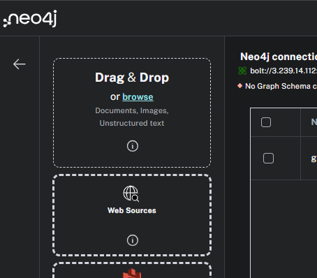
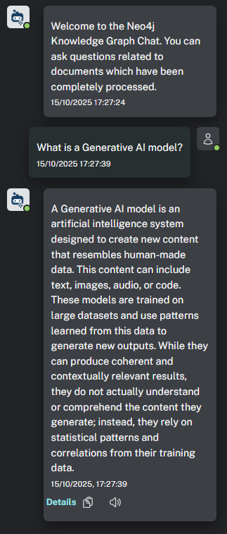

= Neo4j LLM Graph Builder
:order: 2
:type: lesson
:disable-cache: true
:branch: main

In this lesson, you will use the LLM Graph Builder to construct a simple knowledge graph.

== LLM Graph Builder

The link:https://llm-graph-builder.neo4jlabs.com/[Neo4j LLM Graph Builder^] is a tool for turning unstructured data into a knowledge graph.
It automates the same process described in the previous lesson and builds graphs from text.

The LLM Graph Builder includes a chat interface to interact with the graph and explore the data.
The chatbot can use different **Retrieval Augmented Generation** (RAG) approaches to answer questions, including **GraphRAG**, **Vector Search**, and **Text2Cypher**.

You can upload text-based documents and import text directly from Wikipedia and YouTube.

The LLM Graph Builder allows you to configure the LLM model, the types of entities and relationships, and a pre-defined schema.

[IMPORTANT]
The Neo4j LLM Graph Builder is a link:https://neo4j.com/labs/[Neo4j Labs^] project is under active development, and features may change.

You can learn more in the link:https://neo4j.com/labs/genai-ecosystem/llm-graph-builder/[Neo4j LLM Graph Builder documentation^].

== Create a Knowledge Graph

You will use the LLM Graph Builder to create a knowledge graph of the GraphAcademy course content.
You can then ask questions about the course content and explore the relationships between the different topics.

To complete this task, you will need to:

. Connect the LLM Graph Builder to a Neo4j database
. Upload the course content
. Generate the knowledge graph

=== Connect to Neo4j

When you open the link:https://llm-graph-builder.neo4jlabs.com/[Neo4j LLM Graph Builder^], you will be prompted to _Connect to Neo4j_.
The LLM Graph Builder will create your knowledge graph in this database.

kgbuilder::Open Knowledge Graph Builder[]

You can use the Neo4j Sandbox that was created for you when you enrolled in the course:

Protocol:: bolt
URI:: [copy]#{instance-ip}:{instance-boltPort}#
Database:: neo4j
Username:: [copy]#{instance-username}#
Password:: [copy]#{instance-password}#

Ensure you have the correct connection details and connect.

=== Upload the course content

You will use the lessons from the link:/course/llm-fundamentals[Neo4j & LLM Fundamentals^] course.
We have converted the lessons into PDF documents so you can upload them.

Download the link:{repository-raw}/{branch}/llm-knowledge-graph/data/course/pdfs/llm-fundamentals_1-introduction_1-neo4j-and-genai.pdf[PDF file for lesson 1^] - Introduction to Neo4j & GenAI.

Upload the PDF file to the LLM Graph Builder.

The file will uploaded and added to the list of documents.

[TIP]
You can upload multiple documents to the LLM Graph Builder to be processed together.
When creating a knowledge graph, uploading a single document to test the process is often helpful.

Once you have uploaded the document, you can create the knowledge graph using the *Generate Graph* button.

When generating the graph, the LLM Graph Builder runs the steps described in the previous lesson.
The application chunks the data, creates vectors, extracts the nodes and relationships, and creates the graph.

Once the document has completed processing, the knowledge graph will be available for exploration.

[TIP]
.Preview
====
You can preview the graph for a single document by selecting the document and clicking the *Preview Graph* button.

====

=== Query the Knowledge Graph

You can use the built-in chatbot to ask questions about the document's content.

The link:{repository-blob}/{branch}/llm-knowledge-graph/data/course/pdfs/llm-fundamentals_1-introduction_1-neo4j-and-genai.pdf[PDF file for lesson 1^] contains information about Knowledge Graphs, try asking _What is a Knowledge Graph?_.

The chatbot will use the knowledge graph to find the answer.

Review the link:{repository-blob}/{branch}/llm-knowledge-graph/data/course/pdfs/llm-fundamentals_1-introduction_1-neo4j-and-genai.pdf[lesson content^], try asking other questions, and review the response.

== Schema

Currently, the LLM will extract any nodes and relationships in the text.
The graph can become complex even with a single, relatively simple document.

You can view the current schema using the `db.schema.visualization()` function.

[source, cypher]
----
CALL db.schema.visualization()
----

image::images/schema.svg[The schema for the knowledge graph]

This unrestricted schema can help understand granular details in the text.
However, you can focus on specific entities and relationships by defining a schema.

The schema is a set of node labels and relationship types you want to identify within the text.

To define a schema, click the *Graph Enhancement* button.

You can load a pre-defined schema or supply a list of node labels and relationship types.

image::images/define-schema-annotated.png[The schema configuration screen]

Try modifying the schema to include the following node labels:

* Technology
* Concept
* Skill
* Event
* Person
* Object

[IMPORTANT]
You must delete the existing document, re-upload the PDF, and regenerate the graph to apply the new schema.

Experiment with different schema configurations to see how the graph changes.

When you are ready, move on to the next lesson.

read::Continue[]

[.summary]
== Summary

In this lesson, you learned how to create a knowledge graph using the Neo4j LLM Graph Builder.

In the next lesson, you will explore the knowledge graph using Cypher.
