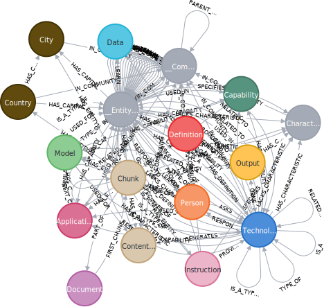
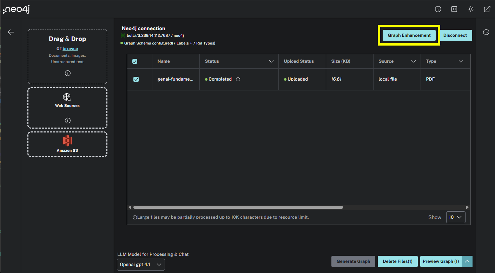
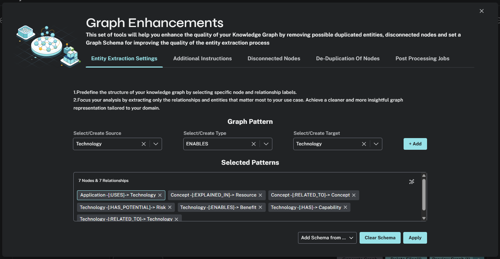

= Customize the schema
:order: 3
:type: lesson
:branch: main

Currently, the LLM will extract any nodes and relationships in the text.
The graph can become complex even with a single, relatively simple document.

You can view the current schema using the `db.schema.visualization()` function.

[source, cypher]
----
CALL db.schema.visualization()
----

This unrestricted schema can help understand granular details in the text.
However, you can focus on specific entities and relationships by defining a schema.

== Define a schema

The schema is a set of graph patterns of node labels and relationship types (`(node)-[RELATIONSHIP]->(node)`), you want to identify within the text.

To define a schema, click the *Graph Enhancement* button.

You can load a pre-defined schema or supply a list graph patterns in the *Entity Extraction Settings*.

Try modifying the schema to include the following graph patterns:

* (Technology)-[:RELATED_TO]->(Technology)
* (Technology)-[:HAS]->(Capability)
* (Technology)-[:ENABLES]->(Benefit)
* (Technology)-[:HAS_POTENTIAL]->(Risk)
* (Concept)-[:RELATED_TO]->(Concept)
* (Concept)-[:EXPLAINED_IN]->(Resource)
* (Application)-[:USES]->(Technology)

[IMPORTANT]
You must delete the existing document, re-upload the PDF, and regenerate the graph to apply the new schema.

Experiment with different schema configurations to see how the graph changes.

== Customization

Through the *Graph Enhancement* feature, you can also customize:

* The prompt used to extract entities and relationships.
* The chunking strategy used to split the document into smaller pieces.
* Deleting disconnected nodes from the graph.
* De-duplicating nodes.
* Fine tuning any post processing of the graph.

When ready, continue to the next lesson where you will upload documents for the complete courses and build the knowledge graph.

read::Continue[]

[.summary]
== Summary

In this lesson, you customized the schema for the knowledge graph.

In the next lesson, you will upload the complete course documents and build the knowledge graph.