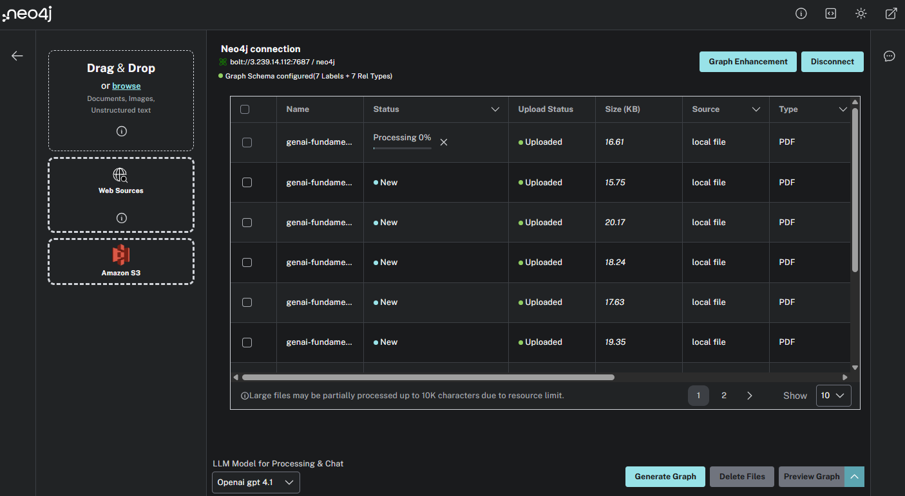

= Complete the Graph
:lesson: challenge
:order: 4
:branch: main

Currently, the graph is built from a single document.

In this challenge, you will upload the complete set of course documents and build the knowledge graph.

You will need to:

. link:{repository-raw}/{branch}/llm-knowledge-graph/data/course/pdfs/genai-fundamentals.zip[Download the generative-ai.zip] file that contains all the lessons from the *Neo4j and Generative AI* course.
. Unzip the file.
. Upload the `genai-fundamentals_*.pdf` files to the LLM Graph Builder.
+

. Generate the knowledge graph.

You can use this Cypher query to view all the documents in the graph:

[source, cypher]
----
MATCH (d:Document)
RETURN d.fileName AS Document, d.createdAt
ORDER BY d.createdAt
----

Explore the graph and use the chatbot to ask questions about the course content, for example:

* _What are knowledge graphs?_
* _Summarise strategies for reducing hallucination?_
* _What are the features of the neo4j_graphrag Python package?_

When you have completed the challenge, move on to the next lesson.

read::Move On[]

[.summary]
== Lesson Summary

In this lesson, you uploaded multiple documents and built a knowledge graph.

In the next module, you will explore the data model, and learn how to query the knowledge graph using Cypher.