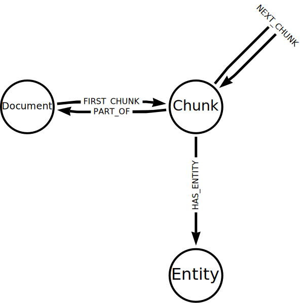
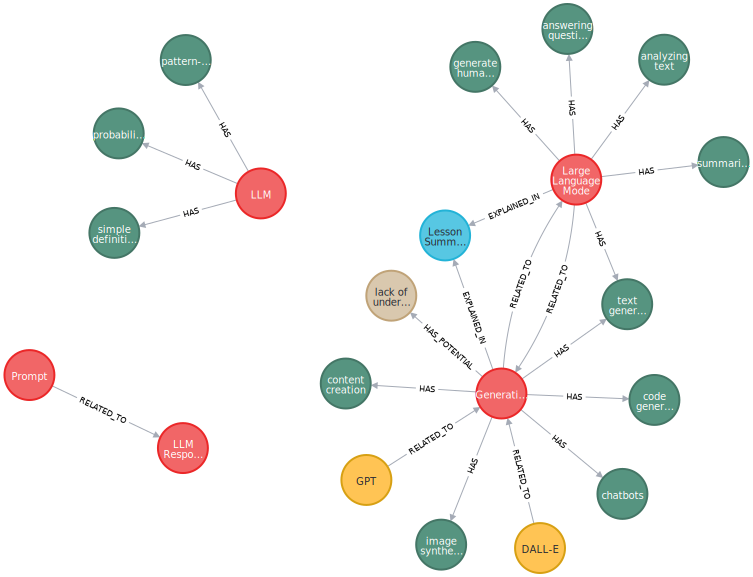
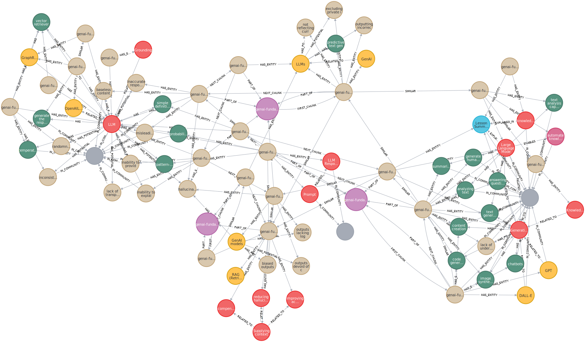

= Explore the Knowledge Graph
:order: 3
:type: lesson
:branch: main

In this lesson, you will explore the knowledge graph created by the LLM Graph Builder.

== Model

The structure created by the LLM Graph Builder is a good template for a knowledge graph that you can use in your projects.

. Each `Document` node represents a document or text source uploaded to the LLM Graph Builder.
. The `Document` is split into `Chunk` nodes, identified by `FIRST_CHUNK` and `PART_OF` relationships.
. The LLM processes the chunks and `Entity` nodes extracted. The graph connects the `Entity` nodes to the `Chunk` nodes using the `HAS_ENTITY` relationship.

The LLM may also extract relationships between the entities, and the graph will hold relationships between the `Entity` nodes.

This model allows you to relate the entities within the knowledge graph to the source documents they refer to.

== Explore

Review this Cypher query before running it. What do you expect to see?

[source, cypher]
----
MATCH (d:Document
    {fileName:'genai-fundamentals_1-generative-ai_1-what-is-genai.pdf'}
    )
MATCH (d)<-[:PART_OF]-(c:Chunk)-[:HAS_ENTITY]->(e)
RETURN e
----

[%collapsible]
.Click here to reveal the result
====
Running this query will return all the entities extracted from the document `genai-fundamentals_1-generative-ai_1-what-is-genai.pdf`.

====

You can modify the query to return the label and ID of the entities.

[source, cypher]
----
MATCH (d:Document
    {fileName: 'genai-fundamentals_1-generative-ai_1-what-is-genai.pdf'}
    )
MATCH (d)<-[:PART_OF]-(c:Chunk)-[:HAS_ENTITY]->(e)
RETURN labels(e) as labels, e.id as entity
----

The results provide detail of the entities extracted from the document.

|===
| labels | entity

| `["Capability"]` | `"content creation"`
| `["Technology", "Concept"]` | `"Generative A"`
| `["Technology"]` | `"GPT"`
| `["Risk"]` | `"lack of understanding"`
| `...` |

|===

The `__Entity__` node label is a generic label applied to all entities to manage indexing and querying.

[IMPORTANT]
The results will vary; an LLM extracted the data, and the results have inherent variability.

By matching a path from the document to the entities, you can see how the entities relate to the document.

[source,cypher]
----
MATCH (d:Document
    {fileName:'genai-fundamentals_1-generative-ai_1-what-is-genai.pdf'}
    )
MATCH p = (d)-[*0..3]-(e)
RETURN p
----

[TIP]
The `[*0..3]` pattern matches paths of up to three relationships between the document and the entities.
Increasing the number will return more complex paths, but the query will take longer.

You can see what documents contain a specific entity.

[source,cypher]
----
MATCH (e:Concept {id: "GraphRAG"})<-[:HAS_ENTITY]-(c:Chunk)-[:PART_OF]->(d:Document)
RETURN DISTINCT d.fileName
----

Take some time to experiment with the data in your knowledge graph.

When ready, continue to the next lesson to learn to query a knowledge graph.

read::Continue[]

[.summary]
== Summary

In this lesson, you explored the knowledge graph's data model and entities.

In the next lesson, you will learn how to techniques for querying knowledge graphs using Cypher.
