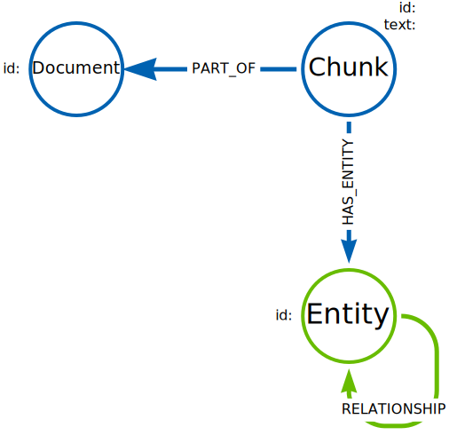
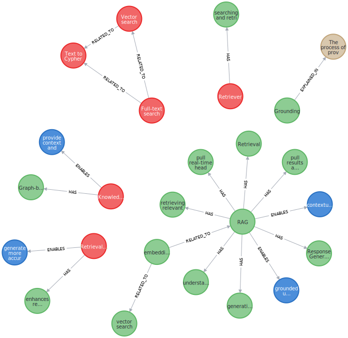

= Querying using Cypher
:order: 2
:type: lesson

The graph generated by an LLM may not conform to a strict schema (depending on how you configured the LLM).
The lack of a strict schema changes how you query the graph.
You may not be looking to find a specific node or relationship, but rather a pattern or structure in the graph.

In this lesson, you will explore examples of how to query a knowledge graph using Cypher.

[TIP]
.Learning Cypher
====
You can link:/courses/cypher-fundamentals/[learn more about Cypher in the Cypher Fundamentals course].
====

The data structure of the graph contains both structured and unstructured elements.

Structured elements include the document and chunks.
Unstructured elements include the entities and relationships extracted from the text.

You can use the structured elements to filter the graph and focus on specific parts of the graph.
The unstructured elements allow you to explore the relationships between entities in the text.

== Entities

The entities in the graph allow you to understand what the text is about.

For example, you can find the most mentioned topics in the graph by counting the number of times a node label (or entity) appears in the graph.

[source, cypher]
----
MATCH ()-[:HAS_ENTITY]->(e)
RETURN labels(e) as labels, count(e) as nodes
ORDER BY nodes DESC
----

A knowledge graph created from link:/course/llm-fundamentals[Neo4j & LLM Fundamentals^] course content contained the following entities:

[cols="2*", options="header"]
|==================================
| labels                    | nodes
| [Capability]              | 189
| [Technology]              | 131
| [Concept]                 | 50
| [Benefit]                 | 44
| [Risk]                    | 35
| ["Technology", "Concept"] | 31
|==================================

[IMPORTANT]
.Inconsistent results
====
LLM's have inherent "randomness" and as such will generate different results, and therefore different entities, each time the graph is created.

As a result, you will see different results in your knowledge graph.
The numbers in these results are just one example.
====

You can drill down into the entity id to gain insights into the content.
For example, you can find the most mentioned `Technology`.

[source, cypher]
----
MATCH ()-[r:HAS_ENTITY]->(e:Technology)
RETURN e.id AS entityId, count(r) AS mentions
ORDER BY mentions DESC
----

The course is about using Neo4j and LLMs with LangChain and OpenAI - this is reflected in the most mentioned technologies:

[cols="2*", options="header"]
|=========================
| entityId      | mentions
| Neo4J         | 10
| vector search | 10
| LLM           | 9
| GraphRAG      | 9
| retriever     | 7
|=========================

== Relationships

The relationships in the graph allow you to understand how entities are connected and the context of the text.

This Cypher query matches all the entities between the chunks and the relationships between them:

[source, cypher]
----
MATCH ()-[:HAS_ENTITY]->(entity)-[r]->(other)<-[:HAS_ENTITY]-()
RETURN DISTINCT type(r) AS relType, count(r) AS number
ORDER BY number DESC
----

[cols="2*", options="header"]
|=======================
| relType       | number
| HAS           | 1242
| RELATED_TO    | 853
| USES          | 290
| ENABLES       | 178
| HAS_POTENTIAL | 158
| EXPLAINED_IN  | 51
|=======================

You can build statements about the content by using the entity and relationship data, for example:

`Technology` `Neo4J` `HAS` `Capability` `Vector search`

This Cypher query uses the entity labels, id, and relationship type to create these statements:

[source, cypher]
----
MATCH ()-[:HAS_ENTITY]->(entity)-[r]->(other)<-[:HAS_ENTITY]-()
RETURN DISTINCT
    labels(entity), entity.id, type(r), labels(other), other.id
----

[cols="5*", options="header"]
|===
| labels(entity) | entity.id                     | type(r)      | labels(other) | other.id
| [Technology]   | GenAI Frameworks              | HAS          | [Capability]  | Retrieval-augmented generation
| [Application]  | GenAI application development | USES         | [Technology]  | Neo4j
| [Technology]   | GenAI Frameworks              | RELATED_TO   | [Technology]  | Neo4j
| [Technology]   | GraphRAG for Python           | HAS          | [Capability]  | Knowledge graph construction
| [Technology]   | GraphRAG pipeline             | ENABLES      | [Benefit]     | more accurate responses
| [Skill]        | Vector Indexes                | USE_IN       | [Technology]  | Neo4J
| [Technology]   | Pip                           | INSTALLS     | [Technology]  | Youtube-Search
|===

This structured output from the content allows you to understand the relationships between entities in the text.

== Documents

The knowledge graph can also show you the connections within the content.
For example, what documents relate to each other.

This Cypher query matches one specific document and uses the entities to find related documents:

[source, cypher]
----
MATCH (d:Document {
    fileName: "genai-fundamentals_1-generative-ai_1-what-is-genai.pdf"
})<-[:PART_OF]-(c:Chunk)
MATCH (c)-[:HAS_ENTITY]->(entity)<-[:HAS_ENTITY]-(otherChunk)
MATCH (otherChunk)-[:PART_OF]->(otherDocument)
WHERE d <> otherDocument
RETURN DISTINCT entity.id, otherDocument.fileName
----

[cols="2*", options="header"]
|===
| entity.id             | otherDocument.id
| Generative AI         | genai-fundamentals_3-knowledge-graphs_1-what-is-a-knowledge-graph.pdf
| Large Language Models | genai-fundamentals_3-knowledge-graphs_2-constructing-knowledge-graphs.pdf
| LLM                   | genai-fundamentals_1-generative-ai_2-considerations.pdf
| LLM                   | genai-fundamentals_4-integrating-neo4j_3-rag.pdf
| hallucination         | genai-fundamentals_1-generative-ai_2-considerations.pdf
|===

The knowledge graph contains the relationships between entities in all the documents.
It is often useful to be able to restrict the output to a specific chunk or document.

This Cypher query restricts the output to a specific chunk or document:

[source, cypher]
----
MATCH (d:Document {
    fileName: 'genai-fundamentals_2-rag_1-what-is-rag.pdf'
})<-[:PART_OF]-(c:Chunk)
MATCH (c)-[:HAS_ENTITY]->(e)

MATCH p = (e)-[r]-(e2)
WHERE (c)-[:HAS_ENTITY]->(e2)

RETURN p
----

Only entities that are related to this document are returned.
The related entities are filtered by collecting a list of the entities (`entityList`) and including them in the final `WHERE` clause.

A path is returned representing the knowledge graph for this document.

You can gain the nodes labels, ids, relationship types by _unwinding_ the path's relationships:

[source, cypher]
----
MATCH (c)-[:HAS_ENTITY]->(e)

MATCH p = (e)-[r]-(e2)
WHERE (c)-[:HAS_ENTITY]->(e2)

UNWIND relationships(p) as rels
RETURN
    labels(startNode(rels))[1] as eLabel,
    startNode(rels).id as eId,
    type(rels) as relType,
    labels(endNode(rels))[1] as e2Label,
    endNode(rels).id as e2Id
----

[cols="5*", options="header"]
|===
| eLabel     | eId                            | relType      | e2Label    | e2Id
| Technology | Retrieval-Augmented Generation | ENABLES      | Benefit    | generate more accurate and tailored answers
| Concept    | Grounding                      | EXPLAINED_IN | Resource   | The process of providing context to an LLM to improve the accuracy of its responses and reduce the likelihood of hallucinations is known as Grounding.
| Technology | Knowledge Graphs               | ENABLES      | Benefit    | provide context and relationships between entities
| Technology | Knowledge Graphs               | HAS          | Capability | Graph-based representations of information
| Technology | embeddings                     | RELATED_TO   | Technology | vector search
|===

== Vector search

The chunks in the knowledge graph can be queried using the vector index to find similar entities.

The LLM Graph Builder created the chunk embeddings using the link:https://ollama.com/library/all-minilm[ollama `all-minilm` model^].

GraphAcademy has loaded some example text and embeddings using the `all-minilm` model so you can you explore vector search.

[source, cypher]
.View example embeddings
----
MATCH (n:Embedding)
RETURN n.text, n.model, n.embedding[0..5] as sample
----

You can use these embeddings to perform a vector search on the chunks in the knowledge graph.

[source,cypher]
----
MATCH (n:Embedding {text:'What is retrieval augmented generation?'})
WITH n

CALL db.index.vector.queryNodes('vector', 5, n.embedding)
YIELD node, score
RETURN node.text, score
----

[cols="2*", options="header"]
|===
| node.text, | score
| "= What is RAG? :order: 1 :type: lesson [.slide] == Retrieval-Augmented Generation Retrieval-Augmented Generation (RAG) is an approach that enhances the responses of LLMs...    | 0.7470729351043701
| = Vector RAG :order: 2 :type: lesson [.slide.discrete] == Vector RAG In the last lesson, you learned about **Retrieval Augmented Generation** (RAG) and the role of retrievers in finding relevant information... | 0.6814607381820679
| (such as documents, databases, or knowledge graphs) to find relevant information based on the user’s query. . **Response Generation**  +  The retrieved information is inserted into the prompt,...     | 0.678839385509491
| = What is Generative AI :order: 1 :type: lesson :slides: true [.slide] == GenAI Generative AI (or GenAI) refers to artificial intelligence systems designed to create new content that resembles human-made data... | 0.6775093078613281
| The high-level process is as follows: . A user submits a query. . The system uses a vector search to find nodes similar to the users query. . The graph is then traversed to find related nodes or entities...     | 0.6728277206420898
|===

[TIP]
.Vectors and Semantic Search
====
You can link:https://graphacademy.neo4j.com/courses/llm-vectors-unstructured[learn more about vectors indexes and semantic search in the Introduction to Vector Indexes and Unstructured Data course^].
====

The detail in the knowledge graph can be added to the results of the vector search to provide more context to the user.

This Cypher query finds the related nodes and relationships, unwinds the relationships, and outputs a single list of the entities and relationships per chunk.

[source, cypher]
----
MATCH (n:Embedding {text:'What is retrieval augmented generation?'})
WITH n

CALL db.index.vector.queryNodes('vector', 5, n.embedding)
YIELD node, score

MATCH (node)-[:HAS_ENTITY]->(e)
MATCH p = (e)-[r]-(e2)
WHERE (node)-[:HAS_ENTITY]->(e2)

UNWIND relationships(p) as rels
WITH node, score, collect(
        [
            labels(startNode(rels))[1],
            startNode(rels).id,
            type(rels),
            labels(endNode(rels))[1],
            endNode(rels).id
        ]
    )
    as kg
RETURN node.text, score, kg
----

[cols="3*", options="header"]
|===
| node.text | score | kg
| = What is RAG? :order: 1 ...  | 0.7470729351043701 | [["Technology", "Retrieval-Augmented Generation", "ENABLES", "Benefit", "generate more accurate and tailored answers"], ["Technology", "Retrieval-Augmented Generation", "HAS", "Capability", "enhances the responses of LLMs by providing them with relevant, up-to-date information retrieved from external sources"], ...]
| = Vector RAG :order: 2 :t... ... | 0.6814607381820679 | [["Technology", "traditional keyword search", "HAS", "Capability", "proximity-based algorithms that find similar words"], ["Technology", "Retrieval Augmented Generation", "HAS", "Capability", "finding relevant information"], ...]
|  (such as documents, data...     | 0.678839385509491 | [["Technology", "RAG", "ENABLES", "Benefit", "contextually aware responses"], ["Technology", "RAG", "ENABLES", "Benefit", "grounded in real, up-to-date information"], ...]
| = What is Generative AI :... | 0.6775093078613281 | ["Technology", "Generative AI", "ENABLES", "Capability", "code generation"],  ["Technology", "GPT", "RELATED_TO", "Technology", "Generative AI"], ...]
| === The high-level process is...    | 0.67282772064208985 | [["Technology", "vector search", "ENABLES", "Benefit", "relevant results used as context for the LLM"], ["Technology", "vector search", "HAS", "Capability", "find nodes similar to the user's query"], ...]
|===

== Communities

The LLM Graph Builder used link:https://neo4j.com/docs/graph-data-science/current/algorithms/leiden/[Graph Data Science Leiden^] algorithm to find communities of entities in the knowledge graph.

You can view the communities by querying the `__Community__` nodes:

[source, cypher]
.Find communities
----
MATCH (n:`__Community__`)
RETURN n.title, n.summary
----

Each community has a relationship to a set of related entities:

[source, cypher]
.View community entities
----
MATCH (n:`__Community__`)<-[r:IN_COMMUNITY]-(e:`__Entity__`)
RETURN n,r,e
LIMIT 100
----

You can use the communities to summarize the entities in the documents:

[source, cypher]
----
MATCH (n:`__Community__`)<-[r:IN_COMMUNITY]-(e:`__Entity__`)
MATCH (e)<-[:HAS_ENTITY]-(c:Chunk)-[:PART_OF]-(d:Document)
RETURN DISTINCT d.fileName, n.title
ORDER BY d.fileName
----

This summary show the main topics covered in each document.

== Explore

Spend some time exploring these queries and the output.

When you are ready, move on to the last lesson and final challenge.

read::Continue[]

[.summary]
== Lesson Summary

In this lesson, you explore some examples of how to gather data from the knowledge graph.

In the next optional challenge, you will upload your own documents and build a knowledge graph from them.
