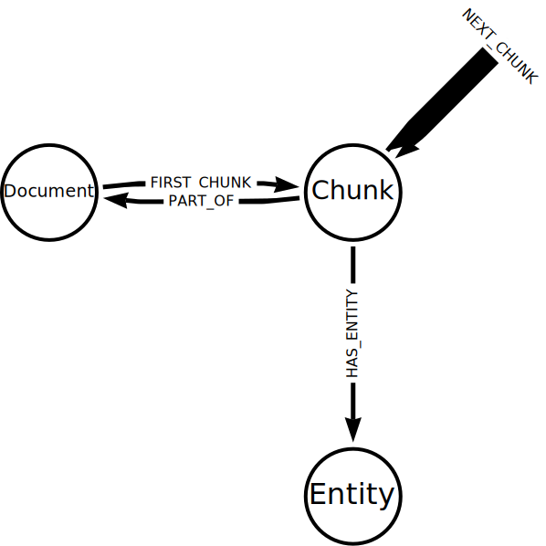

= How the LLM Graph Builder works
:order: 4
:type: lesson
:branch: firstrelease

The LLM Graph Builder follows the process you learned earlier in the course:

. Gather the data
. Chunk the data
. _Vectorize_ the data
. Pass the data to an LLM to extract nodes and relationships
. Use the output to generate the graph

Python and LangChain are predominantly used to build the knowledge graph. 

In this lesson, you will review Python code snippets that complete the above steps.

== Gather the data

The application uses a link:https://python.langchain.com/v0.1/docs/modules/data_connection/document_loaders/[document loader^] to load the PDFs from a directory.

include::{repository-raw}/{branch}/snippets/load_data.py[tag=**]

The `glob` specifies the search path to find the PDFs.

== Chunk the data

The application splits the documents using a link:https://python.langchain.com/v0.1/docs/modules/data_connection/document_transformers/[text splitter^].

include::{repository-raw}/{branch}/snippets/chunk_data.py[tag=**]

This code splits the text into paragraphs (i.e., every time there is a double newline `\n\n`).

You can learn more about chunking in the GraphAcademy course link:https://graphacademy.neo4j.com/courses/llm-vectors-unstructured/3-unstructured-data/2-chunking/[Introduction to Vector Indexes and Unstructured Data^].

== Vectorize the data

The application creates an embedding for each chunk of text and adds them to the graph.

include::{repository-raw}/{branch}/snippets/vectorize_data.py[tag=**]

OpenAI creates the embeddings in this example, but you could use any embedding model.

The code uses the `Neo4Graph.query` method to create `Document` and `Chunk` nodes and store the text and embedding data.

== Extract nodes and relationships

The application uses the LangChain link:https://python.langchain.com/v0.1/docs/use_cases/graph/constructing/#llm-graph-transformer[`LLMGraphTransformer`^], contributed by Neo4j, to extract the nodes and relationships.

The `LLMGraphTransformer` requires an `llm`, in this example, it is using OpenAI's `gpt-3.5-turbo`, but you could use any LLM.

include::{repository-raw}/{branch}/snippets/extract_nodes.py[tag=**]

The `LLMGraphTransformer.convert_to_graph_documents` uses the `llm` to generate a set of graph docs of nodes and relationships.

== Use the output to generate the graph

Finally, the application uses the generated graph documents to create the graph.

The graph documents consist of a set of entity nodes. 
A `Node` representing the `Chunk` and a `HAS_ENTITY` relation is added to each graph document to ensure a link between the generated entities and the source document.

include::{repository-raw}/{branch}/snippets/create_graph.py[tag=**]

It is this process that creates the data model you saw in the previous lesson:

The last step is to pass the graph documents to the `Neo4Graph.add_graph_documents` method to create the nodes and relationships in Neo4j.

When you are ready, move on to the next lesson.

read::Continue[]

In this lesson, you explored the code to build a knowledge graph using an LLM. 

In the next lesson, you will run and adapt a complete Python program to create a knowledge graph.

