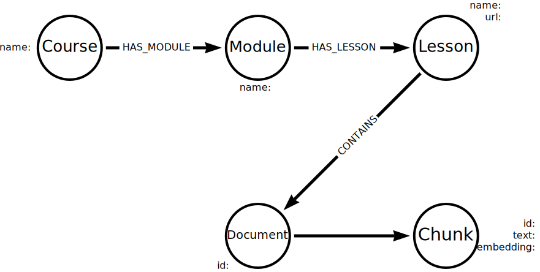

= Build a KG with Python
:order: 5
:type: lesson
:branch: firstrelease

In the previous lesson, you reviewed code snippets required to implement the knowledge graph build process.

In this lesson, you will explore and modify the complete Python code to build a knowledge graph using LangChain.

Open the `llm-knowledge-graph/create_kg.py` file.

[%collapsible]
.View create_kg.py
====
[source,python]
----
include::{repository-raw}/{branch}/llm-knowledge-graph/create_kg.py[tag=**]
----
====

Review the code, you should be able to identify the sections of the code that:

. Gather the data
. Chunk the data
. _Vectorize_ the data
. Pass the data to an LLM to extract nodes and relationships
. Use the output to generate the graph

This is a standard process to build a knowledge graph and can be adapted to suit your use case.

== Documents

The code loads a set of PDF documents in a directory.

[source,python]
----
include::{repository-raw}/{branch}/llm-knowledge-graph/solutions/create_kg_docs.py[tag=loader]
----

Depending on how your documents are stored, you may need to modify the `loader` to load the documents.

LangChain includes integration for different file types and storage.

For example, you can load data from a CSV file using the link:https://python.langchain.com/v0.2/docs/how_to/document_loader_csv/[CSVLoader^].

[source,python]
----
include::{repository-raw}/{branch}/llm-knowledge-graph/solutions/create_kg_docs.py[tag=csv_loader]
----

You can find more information in the LangChain link:https://python.langchain.com/v0.2/docs/how_to/#document-loaders[Document loaders how-to guide^].

== Allowed nodes and relationships

You can modify the code to define a set schema for the knowledge graph by specifying the allowed nodes and relationships.

When using the LLM Graph Builder you modified the schema to only include the following node labels:

* Technology
* Concept
* Skill
* Event
* Person
* Object

To achieve the same thing you need to include the list of labels as `allowed_nodes` when creating the `LLMGraphTransformer` instance.

[source,python]
----
include::{repository-raw}/{branch}/llm-knowledge-graph/solutions/create_kg_allowed.py[tag=allowed_nodes]
----

You can also restrict the relationships by specifying the `allowed_relationships` parameter.

[source,python]
----
include::{repository-raw}/{branch}/llm-knowledge-graph/solutions/create_kg_allowed.py[tag=allowed_relationships]
----

[IMPORTANT]
Restricting the nodes and relationship will result in a more concise knowledge graph.
A more concise may support you in answering specific questions but it could you be missing some information.
Information could be missing because the model will only generate nodes and relationships that are allowed.

== Properties

Currently, the LLM will only extract the nodes and relationships from the text.
You can also instruct it to include properties for the nodes and relationships by specifying the `properties` parameter.

Specifying properties will result in nodes and relationships with additional meta data.
The properties will only be present if the LLM can generate them from the text provided.

In this example, a `name` and `description` property will be added if the values can be determined from the text.

[source,python]
----
include::{repository-raw}/{branch}/llm-knowledge-graph/solutions/create_kg_allowed.py[tag=node_properties]
----

Defining properties allows you to increase the granularity of the knowledge graph at the cost of the build process taking longer.

== Structured data

When generating the knowledge graph, you can also include structured data about the documents.

In this example, the documents are part of a GraphAcademy course and you could extend the graph to include `Course`, `Module`, and `Lesson` nodes.

You can learn more about importing data from unstructured data sources in the GraphAcademy course link:https://graphacademy.neo4j.com/courses/llm-vectors-unstructured/3-unstructured-data/2-chunking/[Introduction to Vector Indexes and Unstructured Data^].

== Generate the graph

When you are ready, run the `create_kg.py` script to generate the knowledge graph.

This query will match the documents and return the first 50 nodes and corresponding relationships:

[source, cypher]
----
MATCH (d:Document)-[*]-(n)
RETURN d,n
LIMIT 50
----

In the next module, you will explore methods of querying the knowledge graph.

Experiment with the `allowed_nodes`, `allowed_relationships`, and `properties` parameters to see how they affect the knowledge graph.

If you want to reset the sandbox and start again - you can delete all the nodes and relationships in the graph by running the following Cypher:

[source, cypher]
.Delete all nodes and relationships
----
MATCH (n) DETACH DELETE n
----

When you are ready, move on to the next lesson.

== Check Your Understanding

include::questions/1-allowed-nodes.adoc[leveloffset=+1]

[.summary]
== Lesson Summary

In this lesson, you learned how to build a knowledge graph using Python and LangChain.

In the next optional challenge, you can upload your own documents and build a knowledge graph from them.