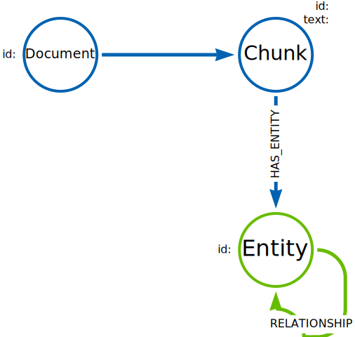
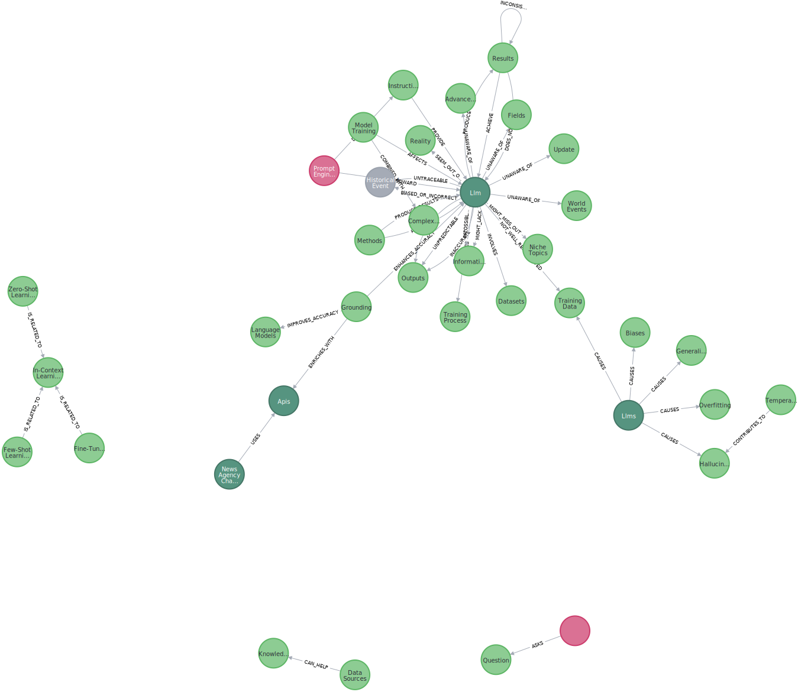

= Querying using Cypher
:order: 1
:type: lesson

The graph generated by an LLM may not conform to a strict schema (depending on how you configured the LLM).
The lack of a strict schema changes how you query the graph.
You may not be looking to find a specific node or relationship, but rather a pattern or structure in the graph.

In this lesson, you will explore examples of how to query a knowledge graph using Cypher.

[TIP]
.Learning Cypher
====
You can link:/courses/cypher-fundamentals/[learn more about Cypher in the Cypher Fundamentals course].
====

The data structure of the graph contains both structured and unstructured elements.

Structured elements include the document, chunks, and other metadata you added to the graph.
Unstructured elements include the entities and relationships extracted from the text.

You can use the structured elements to filter the graph and focus on specific parts of the graph.
The unstructured elements allow you to explore the relationships between entities in the text.

== Entities

The entities in the graph allow you to understand what the text is about.

For example, you can find the most mentioned topics in the graph by counting the number of times an node label (or entity) appears in the graph.

[source, cypher]
----
MATCH ()-[:HAS_ENTITY]->(e)
RETURN labels(e) as labels, count(e) as nodes
ORDER BY nodes DESC
----

A knowledge graph created from link:/course/llm-fundamentals[Neo4j & LLM Fundamentals^] course content contained the following entities:

[cols="2*", options="header"]
|=====================
| labels       | nodes
| [Concept]    | 283
| [Technology] | 110
| [Object]     | 22
| [Skill]      | 13
| [Person]     | 13
| [Event]      | 4
|=====================

[IMPORTANT]
.Inconsistent results
====
LLM's have inherent "randomness" and as such will generate different results, and therefore different entities, each time the graph is created.

As a result, you will see different results in your knowledge graph.
The numbers in these results are just one example.
====

You can drill down into the entity id to gain insights into the content.
For example, you can find the most mentioned `Technology`.

[source, cypher]
----
MATCH ()-[r:HAS_ENTITY]->(e:Technology)
RETURN e.id AS entityId, count(r) AS mentions
ORDER BY mentions DESC
----

The course is about using Neo4j and LLMs with LangChain and OpenAI - this is reflected in the most mentioned technologies:

[cols="2*", options="header"]
|======================
| entityId       | mentions
| Neo4J      | 14
| Llm        | 13
| Langchain  | 8
| Openai     | 4
| Chat Model | 3
|======================

== Relationships

The relationships in the graph allow you to understand how entities are connected and the context of the text.

This Cypher query matches all the entities between the chunks and the relationships between them:

[source, cypher]
----
MATCH ()-[:HAS_ENTITY]->(entity)-[r]->(other)<-[:HAS_ENTITY]-()
RETURN DISTINCT type(r) AS relType, count(r) AS number
ORDER BY number DESC
----

[cols="2*", options="header"]
|=======================
| relType         | number
| USES            | 355
| RELATED_TO      | 287
| GROUPS          | 176
| INTEGRATES_WITH | 130
| PROVIDES        | 122
| USAGE           | 96
|=======================

You can build statements about the content by using the entity and relationship data, for example:

`Technology` `Neo4J` `RELATED_TO` `Concept` `Knowledge Graphs`

This Cypher query uses the entity labels, id, and relationship type to create these statements:

[source, cypher]
----
MATCH ()-[:HAS_ENTITY]->(entity)-[r]->(other)<-[:HAS_ENTITY]-()
RETURN DISTINCT
    labels(entity), entity.id, type(r), labels(other), other.id
----

[cols="5*", options="header"]
|===
| labels(entity) | entity.id          | type(r)                 | labels(other) | other.id
| [Technology]   | Langchain          | RELATED_TO              | [Concept]     | Chains
| [Concept]      | Model Training     | AFFECTS                 | [Technology]  | Llm
| [Concept]      | Grounding          | ENHANCES_ACCURACY       | [Technology]  | Llm
| [Technology]   | Langchain          | SUPPORTS_LANGUAGE       | [Technology]  | Python
| [Technology]   | Langchain          | INTEGRATES_WITH         | [Technology]  | Neo4J
| [Skill]        | Vector Indexes     | USE_IN                  | [Technology]  | Neo4J
| [Technology]   | Pip                | INSTALLS                | [Technology]  | Youtube-Search
|===

This structured output from the content allows you to understand the relationships between entities in the text.

== Documents

The knowledge graph can also show you the connections with the content.
For example, what documents relate to each other.

This Cypher query matches one specific document and uses the entities to found related documents:

[source, cypher]
----
MATCH (d:Document {
    id: "llm-fundamentals_1-introduction_1-neo4j-and-genai.pdf"
})<-[:PART_OF]-(c:Chunk)
MATCH (c)-[:HAS_ENTITY]->(entity)<-[:HAS_ENTITY]-(otherChunk)
MATCH (otherChunk)-[:PART_OF]->(otherDocument)
RETURN DISTINCT entity.id, otherDocument.id
----

[cols="2*", options="header"]
|===
| entity.id             | otherDocument.id
| Training Data         | llm-fundamentals_1-introduction_2-hallucination.pdf
| Context               | llm-fundamentals_4-cypher-generation_1-cypher-qa-chain.pdf
| Large Language Models | llm-fundamentals_1-introduction_1-neo4j-and-genai.pdf
| Model                 | llm-fundamentals_3-intro-to-langchain_4-agents.pdf
| Question              | llm-fundamentals_4-cypher-generation_1-cypher-qa-chain.pdf
| Knowledge Graphs      | llm-fundamentals_1-introduction_2-hallucination.pdf
| Neo4J                 | llm-fundamentals_1-introduction_3-grounding.pdf
| Neo4J                 | llm-fundamentals_1-introduction_1-neo4j-and-genai.pdf
|===

The knowledge graph contains the relationships between entities in all the documents.
It is often useful to be able to restrict the output to a specific chunk or document.

This Cypher query restricts the output to a specific chunk or document:

[source, cypher]
----
MATCH (d:Document {
    id: "llm-fundamentals_1-introduction_2-hallucination.pdf"
})<-[:PART_OF]-(c:Chunk)
MATCH (c)-[:HAS_ENTITY]->(e)
WITH collect(e) as entityList
MATCH p = (e)-[r]-(e2)
WHERE e in entityList and e2 in entityList
RETURN p
----

Only entities that are related to this document are returned.
The related entities are filtered by collecting a list of the entities (`entityList`) and including them in the final `WHERE` clause.

A path is returned representing the knowledge graph for this document.

You can gain the nodes labels, ids, relationship types by _unwinding_ the path's relationships:

[source, cypher]
----
MATCH (d:Document {
    id: "llm-fundamentals_1-introduction_2-hallucination.pdf"
})<-[:PART_OF]-(c:Chunk)
MATCH (c)-[:HAS_ENTITY]->(e)
WITH collect(e) as entityList
MATCH p = (e)-[r]-(e2)
WHERE e in entityList and e2 in entityList

UNWIND relationships(p) as rels
RETURN
    labels(startNode(rels))[0] as eLabel,
    startNode(rels).id as eId,
    type(rels) as relType,
    labels(endNode(rels))[0] as e2Label,
    endNode(rels).id as e2Id
----

[cols="5*", options="header"]
|====================================================================
| eLabel     | eId            | relType  | e2Label | e2Id
| Concept    | Data Sources   | CAN_HELP | Concept | Knowledge Graphs
| Technology | Llms           | USE_FOR  | Concept | Knowledge Graphs
| Concept    | Lesson Summary | EXPLORE  | Concept | Knowledge Graphs
| Technology | Llm            | CAUSE    | Concept | Model
| Person     | User           | ASKS     | Concept | Question
| Technology | Llms           | USE_FOR  | Concept | Knowledge Graphs
|====================================================================

== Vector search

The chunks in the knowledge graph can be queried using the vector index to find similar entities.

This Cypher query generates an embedding for a user query and uses the vector index to find related chunks:

[source,cypher]
----
WITH genai.vector.encode(
    "Why do LLMs get things wrong?",
    "OpenAI",
    { token: "sk-..." }) AS userEmbedding
CALL db.index.vector.queryNodes('chunkVector', 6, userEmbedding)
YIELD node, score
RETURN node.text, score
----

[NOTE]
You will need to update the `token` parameter with your OpenAI API key.

[cols="2*", options="header"]
|===
| node.text, | score
| = Avoiding Hallucination :order:2 type: lesson As you learned in the previous lesson, LLMs can \""ma...    | 0.911712646484375
| === Missing Information The training process for LLMs is intricate and time-intensive often requiri... | 09065704345703125
| Precision in the task description, potentially combined with examples or context, ensures that the m...     | 0.90338134765625
| Large Language Models (LLMs) are often considered \""black boxes\"" due to the difficulty deciphering th... | 0.8992767333984375
| === Grounding Grounding allows a language model to reference external, up-to-date sources or databas...     | 0.87774658203125
|===

[TIP]
.Vectors and Semantic Search
====
You can link:https://graphacademy.neo4j.com/courses/llm-vectors-unstructured[learn more about vectors indexes and semantic search in the Introduction to Vector Indexes and Unstructured Data course^].
====

The detail in the knowledge graph can be added to the results of the vector search to provide more context to the user.

This Cypher query finds the related nodes and relationships, unwinds the relationships, and outputs a single list of the entities and relationships per chunk.

[source, cypher]
----
WITH genai.vector.encode(
    "Why do LLMs get things wrong?",
    "OpenAI",
    { token: "sk-..." }) AS userEmbedding
CALL db.index.vector.queryNodes('chunkVector', 6, userEmbedding)
YIELD node, score

MATCH (node)-[:HAS_ENTITY]->(e)
WITH node, score, collect(e) as entityList
MATCH p = (e)-[r]-(e2)
WHERE e in entityList and e2 in entityList

UNWIND relationships(p) as rels
WITH node, score, collect(
        [
            labels(startNode(rels))[0],
            startNode(rels).id,
            type(rels),
            labels(endNode(rels))[0],
            endNode(rels).id
        ]
    )
    as kg
RETURN node.text, score, kg
----

[cols="3*", options="header"]
|===
| node.text | score | kg
| = Avoiding Hallucination ...    | 0.911712646484375 | [["Technology", "Llm", "CAUSE", "Concept", "Model"], ["Technology", "Llm", "CAUSE", "Concept", "Training Data"],...]
| === Missing Information ... | 09065704345703125 | [["Concept", "Data Sources", "CAN_HELP", "Concept", "Knowledge Graphs"], ["Person", "User", "ASKS", "Concept", "Question"], ,..]
| Precision in the task ...     | 0.90338134765625 | [["Concept", "Question", "CHANGE", "Concept", "Context"], ["Concept", "Question", "CHANGE", "Concept", "Context"], ...]
| Large Language Models (LLMs) ... | 0.8992767333984375 | [["Technology", "Large Language Models", "DESCRIBES", "Concept", "Context"], ["Technology", "Large Language Models", "DESCRIBES", "Concept", "Black Boxes"], ...]
| === Grounding Grounding allows...     | 0.87774658203125 | [["Technology", "Llms", "USE_FOR", "Concept", "Knowledge Graphs"], ["Concept", "Lesson Summary", "EXPLORE", "Concept", "Knowledge Graphs"], ...]
|===

== Explore

Spend some time exploring these queries and the output.

When you are ready, move on to the next module.

read::Continue[]

[.summary]
== Lesson Summary

In this lesson, you explore some examples of how to gather data from the knowledge graph.

In the next module, you will learn how to use an LLM to generate Cypher queries to query the knowledge graph.