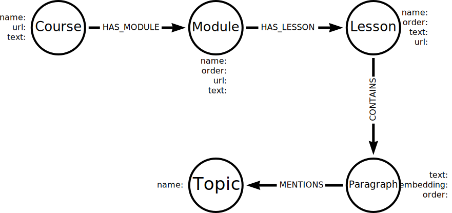

= Getting Started
:order: 1
:type: lesson

Welcome to "Introduction to Vector Indexes and Unstructured Data".

In this course, you will explore the concepts of semantic search, embedding, and vectors. You will learn how to process and index unstructured data, and use vector indexes to search for similar items.

You will explore unstructured datasets and how they can be modeled and indexed in a graph database.

You will create a graph of the unstructured course content from GraphAcademy, extract metadata from the content, and use Cypher to query the data.

You will use Python, Langchain, Neo4j, and OpenAI to process, embed, and index the data.

== What you need

To complete the practical activities in this course, you will need:

* link:https://www.python.org/[Python^], include `pip` to install Python packages
* An link:https://platform.openai.com[OpenAI API key^]
* A Neo4j sandbox database 

include::{shared}/courses/importing-data/sandbox.adoc[]

read::Ready![]

[.summary]
== Lesson Summary

You are ready to get started with the course.