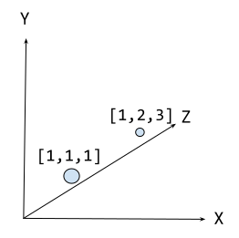

= Vectors 

How semantic search uses vectors.

What are embeddings.

What are vectors.

Vectors are a fundamental concept in linear algebra. Vectors are used to represent data in a way that is easy to manipulate and analyze. 

In this lesson, you will learn how vectors are used in semantic search.

== What are vectors?

Vectors are simply a list of numbers. For example, the vector `[1, 2, 3]`` is a list of three numbers, and could represent a point in three-dimensional space.

Vectors can be used to represent many different types of data, including text, images, and audio.

The number of dimensions in a vector is called the **dimensionality** of the vector. For example, a vector with three numbers has a dimensionality of 3. A vector with 100 numbers has a dimensionality of 100.

It is very common to use vectors with a dimensionality of hundreds and thousands in machine learning and natural language processing (NLP).

== What are embeddings?

When referring to vectors in the context of machine learning and NLP the term "embedding" is typically used. An embedding is a vector that represents the data in a way that is useful for a specific task.

For example, in the previous lesson, you looked at an embedding for a movie plot. This embedding was a vector that represented the plot of a movie in a way that was useful for finding similar movies.

Each dimension in a vector can represent a particular semantic aspect of the word or phrase. When multiple dimensions are combined, they can convey the overall meaning of the word or phrase.

For example, the word "apple" might be represented by an embedding with the following dimensions:

* fruit
* technology
* color
* taste
* shape

When applied in a search context, the vector for "apple" can be compared to the vectors for other words or phrases to determine the most relevant results.

You can create embeddings in various ways, but one of the most common methods is to use a **large language model**.

For example, the embedding for the word "apple" is `0.0077788467, -0.02306925, -0.007360777, -0.027743412, -0.0045747845, 0.01289164, -0.021863015, -0.008587573, 0.01892967, -0.029854324, -0.0027962727, 0.020108491, -0.004530236, 0.009129008,` ... and so on.

[%collapsible]
.Reveal the completed embeddings for the word "apple"!
====
[source]
----
include::apple-embedding.adoc[]
----
====

[NOTE]
.Embedding models
====
This embedding was created by OpenAI's `text-embedding-ada-002` embedding model which converts text into a vector of 1,536 dimensions.

LLM providers typically expose API endpoints that convert a _chunk_ of text into a vector embedding.
Depending on the provider, the shape and size of the vector may differ.
====

While possible to create embeddings for individual words, it is more common to create embeddings for entire sentences or paragraphs. The meaning of a word can also change based on its context. For example, the word _bank_ will have a different vector in _river bank_ than in _savings bank_.

Semantic search systems can use these contextual embeddings to understand user intent.

Embeddings can represent more than just words. They can also represent entire documents, images, audio, or other data types. They are instrumental in the operation of many other machine-learning tasks.

== How are vectors used in semantic search?

You can use the _distance_ or _angle_ between vectors to gauge the semantic similarity between words or phrases.

Words with similar meanings or contexts will have vectors that are close together, while unrelated words will be farther apart.

This principle is employed in semantic search to find contextually relevant results for a user's query.

A semantic search involves the following steps:

. The user submits a query.
. The system creates a vector representation (embedding) of the query. 
. The system compares the query vector to the vectors of the indexed data.
. The results are scored based on their similarity.
. The system returns the most relevant results to the user.

== Vectors and Neo4j

Vectors are the backbone of semantic search. They enable systems to understand and represent the complex, multi-dimensional nature of language, context, and meaning.

Since the v5.11 release, Neo4j has a link:https://neo4j.com/docs/cypher-manual/current/indexes-for-vector-search/[Vector search index^], allowing you to query for nodes based on their vector representations.

In the next lesson, you will learn about unstructured data and how vectors can help you understand and find information.

== Check Your Understanding

include::questions/1-question.adoc[leveloffset=+1]

[.summary],
== Lesson Summary

In this lesson, you learned about vectors, embeddings and how they are used in semantic search.

In the next lesson, you will learn about unstructured data and how vectors can help you understand and find information.