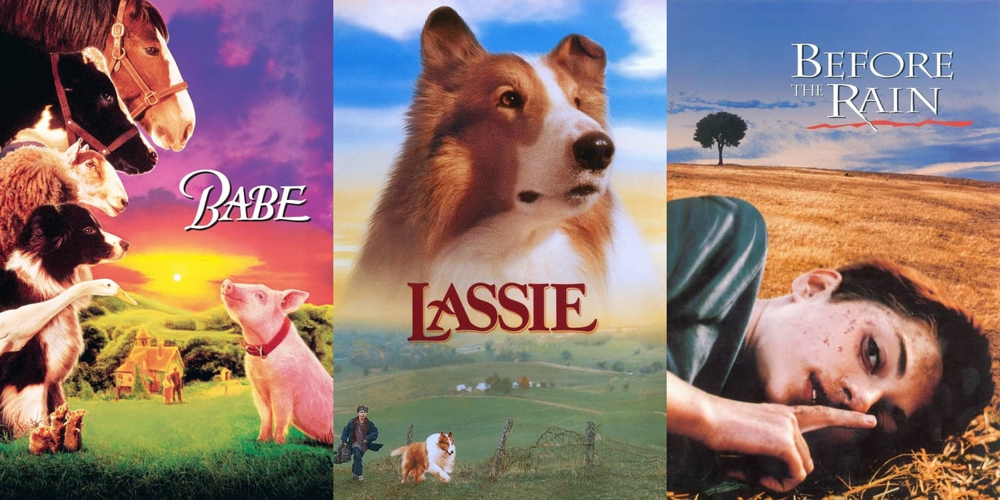

= Searching images
:order: 6
:type: lesson
:sandbox: true
:optional: true

In previous lessons, you learned how vectors and embeddings can represent data in different formats. You used embeddings and a vector index to find similar text.

In this lesson, you will explore a dataset of movie posters and see how you can use vectors and embeddings to find similar images.

== Movie posters

GraphAcademy has loaded a dataset of movie posters into the sandbox.
Each movie has a URL to a poster image:

[source, cypher]
MATCH (m:Movie {title: 'Toy Story'}) 
RETURN m.title, m.poster

image:https://image.tmdb.org/t/p/w440_and_h660_face/uXDfjJbdP4ijW5hWSBrPrlKpxab.jpg[Toy Story movie poster,width=250,align=center]

The data also contains embeddings for each poster:

[source, cypher]
MATCH (m:Movie {title: 'Toy Story'}) 
RETURN m.title, m.posterEmbedding

[NOTE]
.Creating the embeddings
====
We used the link:https://openai.com/research/clip[OpenAI Clip Model^] to create the poster embeddings.

The link:{repository-raw}/main/solutions/poster_embeddings.py[`solutions/poster_embeddings.py`^] program in the link:{repository}[llm-vectors-unstructured^] repository created the embeddings by downloading the posters and passing them to the clip model.
====

== Similar posters

In the same way, you can use a vector index to find similar text; you can use a vector index to find similar images.

[source, cypher]
----
MATCH (m:Movie{title: 'Babe'})

CALL db.index.vector.queryNodes('moviePosters', 6, m.posterEmbedding)
YIELD node, score

RETURN node.title, node.poster, score;
----

While the posters may be similar, the movies may not be. The embeddings are of the images, not the movie content.

Pick a different movie and write a similar Cypher query to find similar posters.

[source, cypher]
.Find all movies
----
MATCH (m:Movie)
RETURN m.title
----

read::Continue[]

[.summary]
== Lesson Summary

In this lesson, you explored using vectors and embeddings to find similar images.

In the next module, you will learn how to create embeddings and vector indexes.
