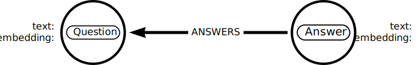
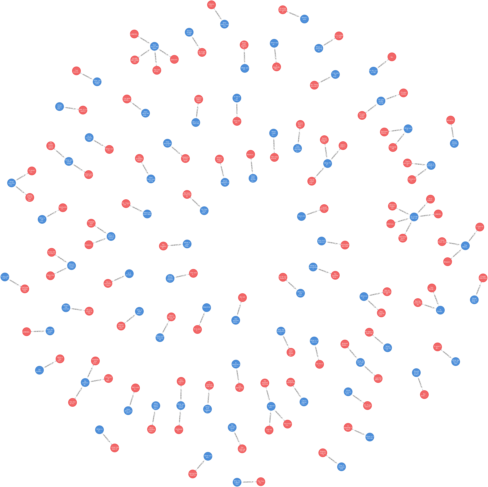

= Creating embeddings

How to use an LLM to create text embeddings.

Review a Python program that uses langchain and openai

Download embeddings for the quora questions dataset and add them to a Neo4j database

Understand how embeddings can be created and stored in Neo4j

In this lesson, you will learn how to create embeddings using a large language model (LLM) and load them into a Neo4j database.

== Creating embeddings

Publicly available Large Language Models (LLMs) will typically have an API that you can use to create embeddings for text.

For example, OpenAI has an API that you can use to create embeddings for text.

The following Python program uses the OpenAI API and Python library to create embeddings for text.

[source, python]
----
from openai import OpenAI

llm = OpenAI(api_key="sk-...")

response = llm.embeddings.create(
        input="Text to create embeddings for",
        model="text-embedding-ada-002"
    )

print(response.data[0].embedding)
----

You should be able to identify:

* The `OpenAI` class requires an API key to be passed to it.
* The `llm.embeddings.create` method is used to create an embedding for a piece of text.
* The `text-embedding-ada-002` model is used to create the embedding.
* The `response.data[0].embedding` attribute is used to access the embedding.

[NOTE]
====
To run this program you will have to:

. Install the `openai` Python package:
+
[source, bash]
----
pip install openai
----
. link:https://platform.openai.com[Create an account with OpenAI^], setup billing, and create an API key.
====

// TODO - add how to create embeddings using Cypher - when there is some consistency in the functions apoc.ml, genai.vector.encode, etc.

== Questions and Answers Dataset

During this module, you will use a link:https://huggingface.co/datasets/toughdata/quora-question-answer-dataset[dataset of questions and answers from Quora^].

The dataset contains 1000 random questions and answers.

[IMPORTANT]
====
The original Quora dataset is unfiltered and contains questions and answers that some may find offensive or inappropriate. 
The dataset used in this course is filtered for sensitive content.
However, some content you may find inappropriate may still exist.
Please be aware of this when working with the dataset.

The dataset was filtered by asking an LLM (OpenAI's GPT-4) to analyze the text for any "sensitive content". 
You can view link:https://github.com/neo4j-graphacademy/llm-vectors-unstructured/blob/main/quora_filter.py[the code that filtered the data^] in the link:https://github.com/neo4j-graphacademy/llm-vectors-unstructured[llm-vectors-unstructured repository^].
====

The OpenAI `text-embedding-ada-002` model was used to create embeddings for the questions and answers in the dataset. 
Using these embeddings you can find similar questions and answers.

The link:https://data.neo4j.com/llm-vectors-unstructured/Quora-QuAD-1000-embeddings.csv[`Quora-QuAD-1000-embeddings.csv`^] file contains the embeddings for the questions and answers in the dataset.

The file has the following structure:

[source, csv]
----
question,answer,question_embedding,answer_embedding
"The question","The answer","[0.1, 0.2, 0.3, ...]","[0.4, 0.5, 0.6, ...]"
----

You can view the link:https://github.com/neo4j-graphacademy/llm-vectors-unstructured/blob/main/quora_embeddings.py[Python code that created the file and the embeddings^] in the link:https://github.com/neo4j-graphacademy/llm-vectors-unstructured[llm-vectors-unstructured repository^].

[%collapsible]
.Click here to reveal the code
[source, python]
----
include::{repository-raw}/main/quora_embeddings.py[]
----

== Load into Neo4j

You will load the data into two nodes, `Question` and `Answer`, with a relationship, `ANSWERED_BY`. The `Question` and `Answer` nodes will store the original `text` and an `embedding` as properties.

Review the following Cypher statement will load the data into Neo4j and create the nodes and relationships:

[source, cypher]
----
LOAD CSV WITH HEADERS
FROM 'https://data.neo4j.com/llm-vectors-unstructured/Quora-QuAD-1000-embeddings.csv' AS row

MERGE (q:Question{text:row.question})
WITH row,q
CALL db.create.setNodeVectorProperty(q, 'embedding', apoc.convert.fromJsonList(row.question_embedding))

MERGE (a:Answer{text:row.answer})
WITH row,a,q
CALL db.create.setNodeVectorProperty(a, 'embedding', apoc.convert.fromJsonList(row.answer_embedding))

MERGE(q)-[:ANSWERED_BY]->(a)
----

You should be able to identify:

* That the file is loaded using the `LOAD CSV` command.
* The `Question` and `Answer` nodes are created using the `MERGE` command.
* The `embedding` property is set using the `setNodeVectorProperty` function.
* The `apoc.convert.fromJsonList` function converts the embedding string to a list of numbers.
* The `ANSWERED_BY` relationship is created between the `Question` and `Answer` nodes.

Run the statement to load the data into Neo4j.

You can check the data was loaded correctly by viewing the `Question` and `Answer` nodes:

[source, cypher]
----
MATCH (q:Question)-[r:ANSWERED_BY]->(a:Answer)
RETURN q,r,a
LIMIT 100
----

You should see `Question` and `Answer` node connected with the `ANSWERED_BY` relationship.

]

Select a node to view the `text` and `embedding` properties.

== Check Your Understanding

include::questions/1-verify.adoc[leveloffset=+1]

[.summary],
== Lesson Summary

In this lesson, you learned how to create embeddings and loaded a dataset of questions and answers into a Neo4j database.

In the next lesson, you will learn how to create vector indexes to query embeddings.