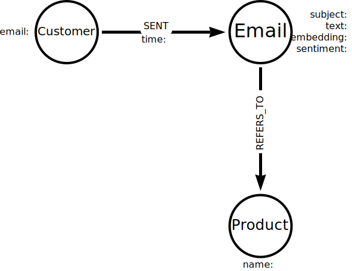
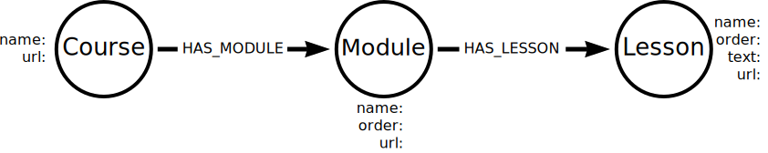

= Structured and Unstructured Data
:order: 1
:type: lesson

As you have learned in previous lessons, a key challenge in data science is making sense of unstructured data.
In this lesson, you will explore a strategy for storing unstructured data in a graph.

Vector indexes and embeddings go some way to allow you to search and query unstructured data, but they are not a complete solution.
You can use the metadata surrounding the unstructured data to help make sense of it.

Imagine the following use case. You want to analyze customer emails to:

- Understand the customer sentiment (are they happy or unhappy?)
- Identify any products or services

You could represent this data in a graph of `Email`, `Customer`, and `Product` nodes.

An import for this process would have to:

. Extract the email metadata (date, sender, recipient, subject)
. Embed the email text
. Extract the customer sentiment using a vector index
. Search for references to products or services in the email text

By importing the unstructured data into a graph, you can use the known relationships between the data to help make sense of it.

For example, you could use the graph to answer questions like:

- What products are customers talking about positively in their emails?
- Are there times in the year when customers are more likely to complain?
- What are customers saying about a particular product?

== Course data

During this module, you will use Python and LangChain to import the text of a GraphAcademy course into Neo4j.

GraphAcademy represents courses as a graph of `Course`, `Module`, and `Lesson` nodes. A course has modules, and a module has lessons.

A simplistic view of the graph would look like this:

The link:https://github.com/neo4j-graphacademy/courses[GraphAcademy course content^] is in a public GitHub repository. We write courses in plain text link:https://asciidoc.org/[AsciiDoc^] that is parsed and displayed on the GraphAcademy website.

The course content is unstructured, but you can make sense of it by using the metadata (the course structure), embeddings, and vector indexes

View link:https://github.com/neo4j-graphacademy/courses/blob/main/asciidoc/courses/llm-vectors-unstructured/modules/3-unstructured-data/lessons/1-structured-unstructured/lesson.adoc?plain=1[this lesson's content on GitHub^] and note the following:

. The lesson content is written in plain text and is unstructured.
. The file name is `lesson.adoc`.
. All lessons have the same file name.
. The directory structure denotes the course (`llm-vectors-unstructured`), module (`3-unstructured-data`), and lesson (`1-structured-unstructured`).

You will use these files and directory structure to create the graph of the course content.

== Check Your Understanding

include::questions/1-metadata.adoc[leveloffset=+2]

[.summary]
== Lesson Summary

In this lesson, you learned how unstructured data can be enhanced using associated metadata. You explored a strategy for storing unstructured data in a graph and how GraphAcademy stores the course content.

In the next lesson, you will learn about how to deal with large amounts of unstructured content.