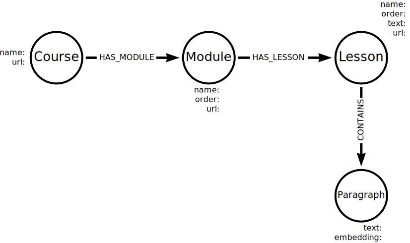

= Chunking
:order: 2
:type: lesson

When dealing with large amounts of data, breaking it into smaller, more manageable chunks is helpful. This process is called chunking.

Smaller pieces of data are easier to work with and process. Embedding models also have size (token) limits and can only handle a certain amount of data. 

Embedding large amounts of text may also be less valuable. For example, if you are trying to find a document that references a specific topic, the meaning maybe lost in the whole document. Instead, you may only need the paragraph or sentence that contains the relevant information.

In this lesson, you will explore strategies for chunking and storing data in a graph.

== Strategies

There are countless strategies for splitting data into chunks, and the best approach depends on the data and the problem you are trying to solve.

It may be that the unstructured data you are working with is already in a format that is easy to split. 
For example, if you were looking to chunk an API's technical documentation, you could split the data by method, endpoint, or parameter.

Alternatively, you may be working with a collection of unrelated PDF documents, and splitting by section, paragraph, or sentence may be the only choice.

Strategies for splitting data include:

- Size - Splitting data into equal-sized chunks.
- Word, Sentence, Paragraph - Breaking down text data into individual sections.
- N-Grams - Creating chunks of _n_ consecutive words or characters.
- Topic Segmentation - Dividing text into sections based on topic changes.
- Event Detection - Identifying specific events or activities.
- Semantic Segmentation - Dividing data regions with different semantic meanings (objects, background, etc).

Overlapping chunks, so the end of one chunk is the start of the next, can help to capture context and relationships between chunks.

[NOTE]
.Other data formats
====
Chunking is not limited to text data. You can also chunk data in other formats, such as images, audio, and video. For example, you could split an image into smaller sections or divide an audio file into equal-length parts.
====

It may also be helpful to combine multiple strategies. 
For example, you could split a document into paragraphs and then further split each paragraph into topic changes - this would allow you to store and query the data at different levels of granularity.

== Storing Chunks

How you store the chunks depends on the data, what the chunks represent, and how you intend to use the data.

It is a good idea to name the nodes and relationships in a way that makes it easy to understand the data and how it is related.
For example, if you split a set of documents by paragraph, you could name the nodes `Documents` and `Paragraph` with a relationship `CONTAINS`. 
Alternatively, if you split a document by an arbitrary size value or character, you may simply use the node label `Chunk`.

You can store embeddings for individual chunks and create relationships between chunks to capture context and relationships.

You may also want to store metadata about the chunks, such as the position in the original data, the size, and any other relevant information.

When storing the course content, you will create a node for each `Paragraph` chunk and a relationship `CONTAINS` between the `Lesson` and `Paragraph` nodes.

== Check Your Understanding

include::questions/1-chunksize.adoc[leveloffset=+1]

[.summary],
== Lesson Summary

In this lesson, you learned about strategies for chunking and storing data in a graph.

In the next lesson, you will use Python and Langchain to chunk the course content and store the data in Neo4j.