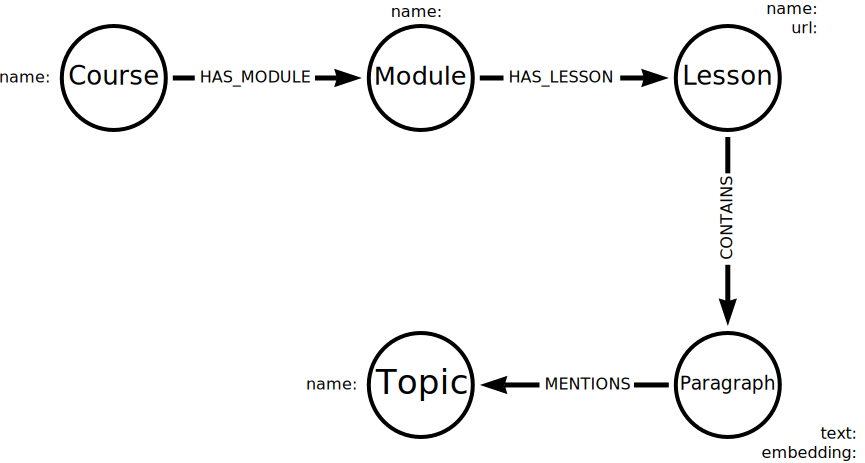

= Extract Topics
:order: 6
:type: challenge
:sandbox: true
:branch: main

In the last lesson, you built a graph using metadata to understand the course content and the relationships between the content and lessons.

In this lesson, you will add topics from the unstructured lesson content to the graph.

== Topics

Topics are a way to categorize and organize content. 
You can use topics to help users find relevant content, recommend related content, and understand the relationships between different pieces of content.
For example, you can find similar lessons based on their topics.

There are many ways to extract topics from unstructured text.
You could use an LLM and ask it to summarize the topics from the text.
A more straightforward approach is to identify all the nouns in the text and use them as topics.

To hold the topic data, you should extend the data model to include a new node type, `Topic`, and a new relationship, `MENTIONS`.

== Extract nouns

The Python NLP (natural language processing) library, link:https://textblob.readthedocs.io/en/dev/[textblob^], can extract noun phrases from text.
You will use it to extract the topics from the lesson content.

You can extract the topics using the `Textblob.noun_phrases` method.

Open and run the `llm-vectors-unstructured/extract_topics.py` program:

[source, python]
----
include::{repository-raw}/{branch}/llm-vectors-unstructured/extract_topics.py[]
----

It will return a list of topics in the input.
In this case, the topics `'extract topics', 'textblob'`.

[TIP]
====
You may find changing the default link:https://textblob.readthedocs.io/en/dev/advanced_usage.html[Noun Phrase Chunker^] used by TextBlob improves results for your data.
====

== Update the Graph

Your task is to update the `build_graph.py` program you created in the last lesson to: 

. Extract topics from the lesson content.
. Add Topics and relationships to the graph.

[%collapsible]
.View the code from the last lesson
====
[source, python]
----
include::{repository-raw}/{branch}/llm-vectors-unstructured/solutions/build_graph.py[tag=**]
----
====

First, update the `get_course_data` function to extract topics from the lesson content.
Add the topics to the `data` dictionary using the `TextBlob.noun_phrases` method:

[source, python]
----
include::{repository-raw}/{branch}/llm-vectors-unstructured/solutions/build_graph_topics.py[tag=import_textblob]

include::{repository-raw}/{branch}/llm-vectors-unstructured/solutions/build_graph_topics.py[tag=get_course_data]
----

Next, update the `create_chunk` function to add the topics to the graph:

[source, python]
----
include::{repository-raw}/{branch}/llm-vectors-unstructured/solutions/build_graph_topics.py[tag=create_chunk]
----

The `topics` are returned as a list from the `TextBlob.noun_phrases` method.
The `FOREACH` clause iterates over the list, creating a `Topic` node and a `MENTIONS` relationship between the `Paragraph` and `Topic` nodes.

[%collapsible]
.View the complete code
====
[source, python]
----
include::{repository-raw}/{branch}/llm-vectors-unstructured/solutions/build_graph_topics.py[tag=**]
----
====

Run the program to update the graph with the topics extracted from the lesson content.

== Query topics

You can use the topics to find related lessons.
For example, all the lessons that contain the topics "semantic search":

[source, cypher]
----
MATCH (t:Topic{name:"semantic search"})<-[:MENTIONS]-(p:Paragraph)<-[:CONTAINS]-(l:Lesson)
RETURN DISTINCT l.name, l.url
----

You can list the topics and the number of lessons that mention them to understand the most popular topics:

[source, cypher]
----
MATCH (t:Topic)<-[:MENTIONS]-(p:Paragraph)<-[:CONTAINS]-(l:Lesson)
RETURN t.name, COUNT(DISTINCT l) as lessons
ORDER BY lessons DESC
----

By adding topics to the graph, you can use them to find related content.

Topics are also _universal_ and can be used to find related content across content from different sources.
For example, if you added technical documentation to this graph, you could use the topics to find related lessons and documentation.

Combining data from different sources and understanding their relationships is the starting point for creating a knowledge graph.

When you have added topics to the graph, click Complete to finish this lesson.

read::Complete[]

[.summary]
== Lesson Summary

In this lesson, you learned how to extract topics from unstructured text and add them to a graph.

In the next optional challenge, you can add more data to the graph.
