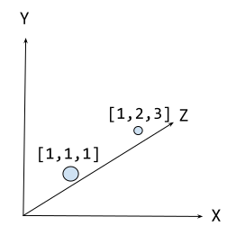

= Semantic Search, Vectors, and Embeddings
:order: 2
:type: lesson

Generative AI systems often use vectors and embeddings to represent and understand data.

== What are Vectors?

Vectors are simply a list of numbers.

For example, the vector `[1, 2, 3]` is a list of three numbers and could represent a point in three-dimensional space.

Vectors can be used to represent many different types of data, including text, images, and audio.

Using vectors with a dimensionality of hundreds and thousands in machine learning and natural language processing (NLP) is common.

== What are Embeddings?

When referring to vectors in the context of machine learning and NLP, the term "embedding" is typically used. 

In this context, an embedding is simply a way to map complex data (like words or sentences) into vectors that can be processed by machine learning algorithms.

For example, an embedding for the word "apple" might be `0.0077788467, -0.02306925, -0.007360777, -0.027743412, -0.0045747845, 0.01289164, -0.021863015, -0.008587573, 0.01892967, -0.029854324, -0.0027962727, 0.020108491, -0.004530236, 0.009129008,` ... and so on. This is just one example of what an embedding might look like. The exact numbers will depend on the specific model and dataset being used.

Specialized machine models can be used to generate these embeddings for words and phrases in a language.

These models are trained on large amounts of text data, learning to represent each word or phrase with a vector that captures its meaning across many dimensions. 

== Semantic Search

Semantic search is a very common use case for embeddings in machine learning systems.

Semantic search allows a user to retrieve text from a database based on its semantic similarity with their query.

This works by converting search queries into embeddings using an embedding model, then finding the most similar text in a database by comparing these query vector representations to those of all texts in the database.

Semantic search is often contrasted with traditional keyword search, which depends on exact-match keywords or proximity-based algorithms that find similar words.

For example, using semantic search with a user query like "Apple iPhone" would likely return results about Apple's iPhone.

Whereas a keyword search like "apple iphone" would likely return results containing the word "Apple" which could include information about the fruit.

image:images/Apple-tech-or-fruit.png[An apple in the middle with a tech icons on the left and a food on the right,width=700,align=center]

== How are vectors used in semantic search?

You can use the _distance_ or _angle_ between vectors to gauge the semantic similarity between words or phrases.

image::images/vector-distance.svg[A 3 dimensional chart illustrating the distance between vectors. The vectors are for the words "apple" and "fruit",width=700,align=center]

Words with similar meanings or contexts will have vectors that are close together, while unrelated words will be farther apart.

This principle is employed in semantic search to find contextually relevant results for a user's query.

== Continue

When you are ready, you can move on to the next task.

read::Move on[]

[.summary]
== Summary

You learned about semantic search, vectors, and embeddings.

Next, you will use a Neo4j vector index to find similar data.